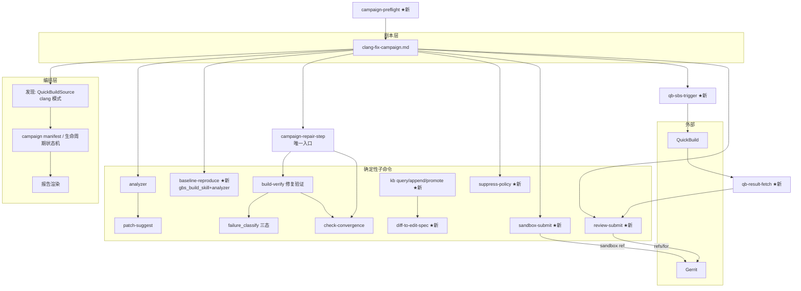

# clang-fix-campaign 项目设计文档

## 0. 元信息

- 版本:**v1.5.18-FROZEN(实现输入版)**
- 创建时间:2026-07-29 最近修订:2026-08-06
- 状态:**Frozen**(2026-08-06,change_45 第二轮 delta 闭环裁决;Frozen 后
  任何设计修改必须走 R1 并新建 `change_46.md` 或后续编号,禁止静默改写)
- **冻结裁决记录**:change_39 将 CK-API-01/CK-IDX-01 改为可执行规则,
  change_40 将 CK-API-01 的解析原语从 `ast.parse` 修正为
  `compile(..., "exec")`,使重复形参立规事故可被解释器直接拒绝;
  §4.2 已重写为真实 Python skeleton,权威 P4.5 prompt 已唯一化并以
  SHA-256 锁定;checker 四规则及失败 fixture 是 P4.5 开工前的 P0 闸门。
- 变更提案(`docs/clang-fix-campaign/design_changes/`):`change_1.md`(代码视角首审)、
  `change_2.md`(双 key/表/契约纠偏)、`change_3.md`(可执行 SQL、QB 表拆分、
  arch 严格白名单、清理接口冻结)、`change_4.md`(guard/workspace 按原文校正)、
  `change_5.md`(QB 请求序、外键完整性、arch 前置门、key 编码)、
  `change_6.md`(多轮 link、arch 落库、baseline 真实 API、释放时机、
  结果内容绑定)、`change_7.md`(部分 PASS 释放、RESULT 写入 API、
  arch 拒绝原子化)、`change_8.md`(campaign_rounds 权威表、
  释放规则一致、QB gate 收紧)、`change_9.md`(edit_spec hash 重绑定、
  manual 硬化、释放 API)、`change_10.md`(保守预留、释放 API 强语义、
  副本布局)、`change_11.md`(attempt 级预算、HELD 状态)、
  `change_12.md`(max_rounds 落库、三 release API、拒绝矩阵)、
  `change_13.md`(预算简化为 build-verify 调用计数)、
  `change_14.md`(双闸 round+invocation、重试必重新消费、
  WORKTREE_LOST 入白名单)、`change_15.md`(create_round 顺序契约、
  kickoff 重写、P11 双闸)、`change_16.md`(BEGIN IMMEDIATE、wrapper 雏形、
  外部契约同步)、`change_17.md`(repair-step 全链、身份校验、
  EF-5 重写)、`change_18.md`(参数来源、校验前置、孤儿对账、进程锁)、
  `change_19.md`(窄修订:三 arch baseline、step 顺序、
  payload 契约)、`change_20.md`(baseline 三态、reason 枚举、
  步骤重排)、`change_21.md`(synthetic evidence、secondary 豁免、
  payload 补全)、`change_22.md`(本轮:**adopt_secondary_target_with_convergence 原子 API**、
  **gate_view per-arch 聚合**、null 清零)、`change_23.md`(adoption 语义、
  TOCTOU 核验、**§7.13 契约面同步清单**)、`change_24.md`(本轮:
  **convergence 合并进 repair-step**、fingerprint schema、文本损坏修复)、
  `change_25.md`–`change_31.md`(逐轮内容见文末"闭环与变更记录"台账)、
  `change_32.md`(**本轮:v1.5.8 双 review 合并修正**——①唯一索引重锚为
  "凡携带 `invocation_event_id` 的 CONVERGENCE 唯一"(v1.5.7 谓词豁免
  `verdict='n_a'`,而 **PASS 事件的 verdict 恰为 n_a**,最常见路径整个
  逃逸唯一性);②`invocation_event_id` 端到端接通(consume 返回 receipt、
  payload 契约补字段、append_event 事务绑定校验、孤儿扫描改按 invocation
  锚定);③`result` 枚举条件化(补 `n_a` 合法路径);④冻结 API 重复形参
  语法修复;⑤HELD guard 绑定 arch;⑥CI evidence 三元组 CHECK;
  ⑦secondary primary-first 冻结;⑧P4.5 终态副本泄漏窗口显式化)、
  `change_33.md`(**本轮:v1.5.9**——①BLOCKER:崩溃恢复死路修复——
  v1.5.8 把孤儿 invocation 补写放在第 1 步、PASS 对账放第 3 步,
  重入时补写抢占唯一槽、PASS relink 必撞 IntegrityError(探针复现);
  冻结为第 3 步**联合对账**:relink 先行、补写殿后、双侧唯一否则
  HELD 不猜;②预检失败必须落 HELD status(否则 v1.5.8 契约下
  rebaseline 授权不可达);③M7 人工恢复枚举算法显式化;
  ④change_31/32 与主文同步收口,**主文为唯一权威**)、
  `change_34.md`(**本轮:v1.5.10**——①B1:联合对账冻结原子 API
  `reconcile_pass_and_invocations`(单事务重查+判定+落库,禁止
  wrapper 先查后写);②B2:删除 a 分支/6b 的"补偿"承诺——link 表
  无 invocation 列、不可实现,半状态按 StateInconsistent;③B3:
  previous 预检移至联合对账之后(恢复优先,PASS 不被旧 evidence
  缺失挡死);④乙-M3:a/b 出口前执行 d(跨轮残余探针实锤);
  ⑤乙-M4:人工恢复算法修正(补 ROUNDS_EXHAUSTED、arch 目录层))、
  `change_35.md`(**本轮:v1.5.11**——①B1:联合对账改 (unit, arch)
  全 round **逐组配对**(v1.5.10 用当前 round 的 S_pass 给历史 round
  判"无匹配"是跨组污染,历史合法 PASS 被误 orphan 挡死,探针实锤);
  新增 h 分支(历史组含未 link PASS → 冻结不补写);②B2:PASS
  payload 确定性重建规则逐字段冻结(actual_changed_paths 由 worktree
  git diff 重算,无源字段不猜转 c);③M5:a 分支事务化出口
  branch='state_inconsistent_held'(异常会回滚吞 HELD);④M3:
  ReconcileResult 补 verification_id;⑤M4:第 1 步基线校验收窄为
  元数据、不读 evidence 文件;⑥M6:泄漏窗口段旧路径写法统一)、
  `change_36.md`(**本轮:v1.5.12**——①B1:S_pass round 归属算法
  冻结(edit_spec_sha256 反查 campaign_rounds,零/多命中不猜转 c;
  同 edit_spec 多轮重试合法可构造,探针实锤);②B2:**h 分支撤销**、
  全部 round 组统一 b/b'/c(v1.5.11 的 HELD(orphan_pass) 是终态,
  "relink 通道保留"实际不可达——唯一配对+身份全验的 relink 是补完
  被中断的写入,不是猜);附带**对账前移至 create_round 之前**
  (relink 出口不产生空 round)、a 分支扩至任意 round;③乙-M1:
  出口优先级冻结(HELD > 成功 > proceed);④乙-M3:锁粒度对齐
  (unit, arch);⑤乙-M4:payload `at`=重建时刻、原始时间经
  verification_id 回查;⑥乙-M5:git diff 钉死 --no-renames -z;
  ⑦乙-M2:第 1 步 conf/src_clean 冗余拦截删除)、
  `change_37.md`(**本轮:v1.5.13——v1.5.12 快照作废、从未落盘,由
  本版直接取代**:①丙-B3:a 分支"任一 round"扩展**收回**至当前
  edit_spec(双方 review 同判 BLOCKER——跨轮短路使新 spec 的三 arch
  聚合永久缺员、unit 死锁,且不计费绕过双闸);历史组 relink 定性为
  **补账不授出口**,branch 仅由当前组决定;②丙-B2:归属零命中改
  忽略+non_campaign 清单(ORPHAN_PASS 契约必填 round,零命中写事件
  必猜;campaign 对非己方记录无管辖权);多命中改
  state_inconsistent_held(UNIQUE(unit, edit_spec_sha256) 物理禁止
  同 spec 占两轮,探针实锤——v1.5.12"合法可构造"有误);③丙-B4:
  ReconcileResult 拆当前/历史双维度(current_verification_id 单列,
  stdout PASS 仅由其装配;historical_relinks 结构化清单);
  ④丙-B1:落盘断层记账——快照即交付物,目标机落盘属发布闸门)、
  `change_38.md`(**本轮:v1.5.14**——①丁-B1:v1.5.12 的对账前移
  **撤销**、恢复 create_round → 对账原序(前移旁路了 round 身份
  权威:同 hash 占新轮的调用可在对账步命中 linked_already 直接
  exit 0,UNIQUE/连续性/ref/闸一全部不执行;前移动机已被"补账不授
  出口"消解——**支撑裁量的前提消失,裁量随之复审**);②丁-M4:
  新增 a0 全 round link↔CONVERGENCE 完整性预检(历史半状态会被 d
  掩盖成"正常孤儿",探针实锤),并冻结为"恰一条 +
  unit/round/arch/invocation 精确绑定",非仅存在性检查;
  ③丁-M2:§3.4 未链接 PASS 选择
  规则与归属算法统一、find_unlinked_pass 去 round 形参;④丁-M3:
  stdout JSON 固定新增 reconciliation{other_round_relinks,
  non_campaign_verification_ids} 与 warnings[](含非空元素 schema 与确定性
  排序;单 JSON 契约不破);
  ⑤丁-M5:historical_relinks 更名 other_round_relinks、DoD 字段名
  同步;⑥丁-NIT:聚合职责边界——reconcile 不触发聚合,齐备性推进
  归编排层)、`change_39.md`(**本轮:v1.5.15**——CK-API-01 改为
  全 Python fence `ast.parse` + fence 外裸签名扫描;CK-IDX-01 改为
  唯一权威 prompt 索引 token 非空子集检查;双旧 prompt 归档、
  prompt SHA 落盘闸门与 checker fixture/Ruff 发布闸门)、
  `change_40.md`(**本轮:v1.5.16**——CK-API-01 解析原语改为
  `compile(..., "exec")`,以覆盖重复形参的编译期语义检查;prompt
  裁决链头/SHA/后续编号同步)、`change_44.md`(**本轮:v1.5.17**——
  R14 三方评审闭环:unit 级 canonical edit_spec、previous evidence
  PASS/rebaseline 锚点、ROUNDS_EXHAUSTED 写入者、FK 物理前提、
  CommonMark fence、残留副本恢复、错误码/HELD reason/状态白名单与
  stdout 文本一致性)、`change_45.md`(**本轮:v1.5.18**——R14 第二轮
  delta 闭环:处置声明须正文 diff/grep 自证;D2/D3/D5/D6/D8/D9/D10
  正文回填;orphan/state-inconsistent HELD 终态边;canonical edit_spec
  唯一临时文件 + hard-link 原子发布;checker 对真文档执行 Python fence
  非空与未闭合 fence 检查)、旧条目:(**底层参数权威来源冻结**、校验先于
  建 round、**孤儿 PASS reconciliation**、副本目录进程级互斥)
- **变更提案的 supersede 关系**(评审时必读):`change_13` 的两条结论已被
  `change_14` **推翻**——①"仅 invocation 单闸"→ 改为 **round+invocation
  双闸**;②"崩溃后 resume 不重复计费"→ 改为 **重试必重新消费**。
  阅读 change_13 须同时读 change_14。
- 撤销冻结简史:v1.3.1 曾被开发者仲裁冻结;Codex 以**代码视角**评审
  (前六轮评审方均只读文档)连续三轮发现设计与实现的契约冲突,按 R1
  撤销冻结并逐轮修订至本版。
- 前置文档:tizen-ci-triage v3.1 设计、三态改造(a7d01da/cd05c6b)、
  概念设计 v0.1、v1.0-draft 两份交叉评审意见

## 1. 需求理解

### 1.1 核心目标

为 GCC→Clang 迁移战役提供**无人值守**的批量修复流水线:失败包发现 →
基线复现 → 修复循环(三 arch)→ sandbox push(触发 QuickBuild 复验)→
【QB 复验 PASS 后】refs/for 提评审 → 知识库回写 → 战役报告。
安全由物理机制而非 AI 纪律保证;人闸下移至 Gerrit 评审(终审)。

### 1.2 用户与场景

- 用户:FatTank(PM/架构/终审);runner 为测试机 Cline;实现方 Codex/Claude Code。
- 场景:clang 战役周期性对失败 build 跑 campaign;sandbox 分支供 QuickBuild
  manifest 重触发;QB 复验通过的包由 review-submit 提交 Gerrit 评审。

### 1.3 范围

**In Scope**
- ci_triage 新子命令/扩展:sandbox-submit、**review-submit**、
  **qb-sbs-trigger、qb-result-fetch(门 2 自动触发与取证,v1.3)**、
  diff-to-edit-spec、kb(query/append/promote)、baseline-reproduce
  (既有工具组合,非 build-verify 模式,见 D-6)、
  suppress-policy checker
- campaign 发现层、campaign manifest/生命周期状态机(§3.6)、
  新 workflow 剧本 `.clinerules/workflows/clang-fix-campaign.md`
- 对抗测试组(含 TOCTOU);三个 standard arch

**Out of Scope**
- 现有三个 workflow 的任何改动(隔离声明见 3.1;campaign 剧本**引用**
  explore 骨架 2.2 第 1-4 步,第 5 步人闸由剧本自身自动 gate 替换——读而不改)
- **campaign 循环内自动 refs/for**(refs/for 只能由 review-submit 在 QB 复验
  PASS 证据下执行,可在战役后批量跑)
- **QuickBuild 后台轮询**(触发自动化 ≠ 轮询:结果获取为按需一次性
  fetch,无后台进程)。人工 UI 触发 + 人工装配 qb_result 降级为
  fetch 不可用时的 fallback,不再是主路径(v1.3,EF-5 定案修正)
- Gerrit 自动 merge、KB status 自动升级、KB demote 工具、emulator/gcov arch、
  多包并行

### 1.4 假设与未决问题

- [ASSUMPTION] A1:cherry-pick 走 diff→edit_spec 转换器,不改 build-verify 入口。
- [ASSUMPTION] A2(v1.1 收紧):**refs/for gate 为纯机器判定**:
  `fix_strategy_final ∈ {code, cherry_pick}` ∧ reproduced ∧ 状态机达
  SANDBOX_QB_PASS(含 QB 结果与 derived_commit 的物理绑定校验)。
  `fix_strategy_final = suppress` 一律 sandbox only,本期无例外。
- [ASSUMPTION] A3:KB 三级 status(NEW→CI_VERIFIED→MERGED),NEW 不参与匹配。
- [ASSUMPTION] A4(v1.4.1):**双闸**——`max_rounds` 默认 **3**(限 AI 修订
  次数/edit_spec 版本数)、`max_build_invocations` 默认 **9**(限计算成本)。
  两者均在 campaign 启动时冻结写入 `campaign_units`,由各自 API 从 DB 读取
  校验(见 §3.4);运行时不接受传参——保守起步值(无战役统计数据前不放宽;
  无人环下 needs_confirmation 降格使 convergence 纠偏比有人环慢,上限从紧);
  可配置,首轮战役后按降级率/轮次分布数据复核(走 R1 变更)。
- [ASSUMPTION] A5-b(v1.4.10):固定 sandbox 分支名隐含**"一个 gerrit repo
  对应一个 spec/unit"**;同 repo 多 spec 会撞同一分支。本期按此假设执行,
  该情形并入 EF-5/EF-6 观察项;若出现,需按包细分分支名(走 R1)。
- [ASSUMPTION] A5:sandbox 分支默认 `sandbox/lhmax2025/clang`(分支在各
  Gerrit repo 命名空间内,跨包不冲突;同 repo 重跑 force 覆盖 = 最新为准,
  Change-Id 保 Gerrit 侧幂等)。命名约束已按 EF-6 关闭(使用者指定 + 权限保证);QB 对固定分支名的要求随 EF-5 观察,
  若需按包细分则升版走 R1。commit message
  `Fix build error for clang compiler: <brief>` + 溯源 trailer。
- [ASSUMPTION] A6:kb 数据 `tizen-ci-triage/kb/`;代码 ci_triage.kb 模块。
- [ASSUMPTION] A7:git 走 subprocess 参数列表,不引入 GitPython。
- [ASSUMPTION] A8:campaign 文档树 `docs/clang-fix-campaign/` 命名空间。
- [ASSUMPTION] A9:参考流程五条硬编码策略 seed 化入库,内容经开发者审定。
- [ASSUMPTION] A10:fix_strategy_final 由 edit_spec 内容**机器推导**
  (§3.7),不采信 AI 自报。
- [ASSUMPTION] A11(v1.3.6 重写:**request-first 取证模型**):
  qb-sbs-trigger 只由聚合校验产出 SBS_TARGET(命令行不可直传),并写入
  `campaign_qb_requests(request_id, sbs_target)` + 一条 `SUBMITTED` 事件;
  **qb_build_id 不要求在触发时可得**——若触发响应即带,追加 `BUILD_BOUND`
  事件,否则由 qb-result-fetch 经 request_id 或 qb_build_id 补齐;
  qb-result-fetch 追加 `RESULT` 事件并把 `sbs_target_echo` 与该请求的
  `sbs_target` 比对,不符 → REJECTED_QB_BINDING_MISMATCH;
  review-submit 只消费该 unit **两级最新**的 RESULT(先 request_seq 最大,
  再该请求内 event_id 最大),旧请求的迟到事件不能取代新请求 →
  否则 REJECTED_QB_SUPERSEDED。
- [ASSUMPTION] A12(v1.2):**derived commit 四要素固定**——message
  (含 brief)、author/committer 身份、author/committer 日期在首次
  sandbox-submit 时生成并写入 state DB;所有重跑复用存量,不重新生成。
  derived_commit_sha 因此可复算,重跑断言与存量相等(幂等与 A11 绑定的
  稳定性前提)。
- [ASSUMPTION] A13(v1.2):review-submit 的 gate 字段(reproduced、
  fix_strategy_initial/final、policy_verdict、edit_spec_ref 等)**单一
  真相源为 state DB**;fix_strategy_final 在 gate 时从 edit_spec 内容
  现场重推并与存量交叉核对,不一致即拒(存量仅作审计)。
- [RESOLVED 2026-07-29] EF-1:clang 战役 build 发现形态——**现有覆盖**。
  overview id 由用户在启动模板提供;arch 页名前缀即现有已知形态;
  manifest/base_commit 照常可得(FatTank 确认)。P9 锁定 ~100 行档
  (入口参数化 + 回归测试)。
- [OPEN→已关闭] EF-2:**代码即答案**(edit_spec_guard.py:37-38 显式拒绝
  空 edits)= 判据 B。处置见 §4.1 基线复现(决策 D-6:改由
  gbs_build_skill + analyzer 组合完成,不改 build-verify)。
- [OPEN] EF-3:Gerrit 对非 hook 确定性 Change-Id 的接受度(sandbox 实测)。
  **应急方案(实测失败时)**:降级为 commit-msg hook 生成 Change-Id,
  但以 submission_key 为键缓存入 state DB 复用,保住幂等;届时走 R1 变更。
- [OPEN→已关闭] EF-4:conf = 模板 + build 页 Variables 表两 URL
  (Base/Profile,已钉死具体 snapshot),三 arch 共用一份。**残项已完成
  (2026-07-30 实测)**:Open3D + gbs_llvm.conf,depsolve 通过、编译推进
  297s、FAIL 于 clang 特征诊断 `-Werror,-Wc2y-extensions`(clang-22 新增),
  = 判据 A,conf 可用且错误可本地复现。
- [OPEN] EF-5(四项残余实验,**整体为 P5Q 开工门**,非冻结阻塞):
  ①Basic Auth 轻端点探活(候选 /rest/version 类;configuration path
  解析为第二步,不与探活耦合)②一次真实 REST 提交:响应形态与
  request_id→build_id 的确定性映射(设计已双态兼容,映射方式须实测定案)
  ③SBS build 页的状态字段/SBS_TARGET 回显/arch 覆盖 ④"accepting SBS"
  语义:门 2 PASS 判据 = SBS build 自身 PASS 还是须被母 TRIGGER accept。
- [OPEN→已关闭] EF-6:分支用户由使用者指定且权限保证;覆盖微测并入
  P12 首次真实 push;QB 侧固定名问题随 EF-5 实验一并观察。

## 2. 技术栈与约束

### 2.1 语言 / 框架 / 版本
> 环境事实(v1.3.2 实测):开发机无 `python` 命令,一律使用 `python3`
> 或 `.venv/bin/python`;本文档所有示例命令按此理解。
Python 3.12;pytest(存量约 750 测试);标准库 + PyYAML>=6.0.1;ruff 沿用。

### 2.2 部署环境
实现与 UT 在开发机(GitHub PR 工作流,R10 预检);集成/真机在测试机
(gbs + clang conf + Gerrit SSH),R13 记录实际命令输出。

### 2.3 关键依赖
> 实测事实(v1.3.2):`ci_triage.verify.build_verify` **直接 import
> `gbs_patch_suggest.formatter`**(formatter 属 patch-suggest 包,非独立
> CLI);因此运行环境必须安装 gbs_patch_suggest,系统 python3 通常没有
> ——一律用仓库 `.venv/bin/python`。campaign-preflight 须把
> "gbs_patch_suggest 可导入"列为检查项。

内部:ci_triage 既有模块、gbs_analyzer、gbs_patch_suggest(既是 CLI 也是
build-verify 的直接依赖;
formatter --check 为机械校验——唯一性/字节匹配,无人环适用,人眼 gate 从来
在 workflow 层而非 formatter 层)。外部命令:git、gbs、ssh(subprocess;
新增三方依赖须走 R2)。

## 3. 架构设计

### 3.1 系统架构图

隔离声明:只新增不修改现有三 workflow;共享确定性子命令层与 state DB 机制;
campaign 独立 `--state-root`;denied 语义与现有 workflow 完全一致不可越过。



**三道物理门(v1.1 起门 2 为硬 gate)**:
门1 本地 build-verify 三 arch(Git-object 绑定)→ 门2 QuickBuild sandbox
复验(**refs/for 的前置条件**,凭 A11 绑定证据)→ 门3 Gerrit 人工评审。

### 3.2 模块划分

| 模块 | 位置 | 职责 | 新/改 |
|---|---|---|---|
| submission_identity | ci_triage/submission_identity.py | submission_key、确定性 Change-Id | 新 |
| aggregate | ci_triage/aggregate.py | 三 arch record 聚合校验(§3.4 扩展绑定) | 新 |
| derive_commit | ci_triage/derive_commit.py | commit-tree 派生 | 新 |
| sandbox_submit | ci_triage/sandbox_submit.py + CLI | 聚合→policy→dirty→派生→白名单→push sandbox→写回 | 新 |
| review_submit | ci_triage/review_submit.py + CLI | QB 结果绑定校验(A11)→质量 gate(A2)→push refs/for | 新 |
| campaign_rebaseline | ci_triage/campaign_rebaseline.py + CLI | HELD(reason=previous_evidence_missing)的恢复路径(§4.1):重跑 baseline → 新 REPRODUCE + rebaselined CONVERGENCE 同事务 → 状态迁回 | 新(**P6**,与 baseline-reproduce 同 Phase) |
| campaign_repair_step | ci_triage/campaign_repair_step.py + CLI | 修复轮的唯一入口(§4.1 **九步**,v1.5.14 恢复原序):锁 → 只读身份校验 → create_round → **联合对账(原子 API,全 round 逐组补账,当前组定出口)** → **previous 预检** → 计费 → build_verify → **6a convergence+adoption(FAIL)** / 6b link(PASS) → 释放锁;additive wrapper,安全核心零修改 | 新(**P4.5**) |
| campaign_preflight | ci_triage/preflight.py + CLI | A0 输入/凭据/探针的机械化校验(v1.3.1,评审双方合流建议):config 键齐全、conf 存在且无 /reference/、state-root 空、分支名、QB_PASSWORD/QB_COOKIE 已导出(值不回显)、Gerrit SSH 探针、QB REST 探活;输出脱敏 JSON | 新 |
| qb_trigger(含 fetch) | ci_triage/qb_trigger.py + CLI | 门 2 自动触发与取证:SBS REST 提交、sandbox 绑定硬 gate、按需结果拉取与回显比对 | 新(v1.3) |
| suppress_policy | ci_triage/suppress_policy.py | forbidden/allowed 确定性判定 + fix_strategy_final 推导(§3.7) | 新 |
| baseline_reproduce | ci_triage/baseline.py + CLI | **组合既有工具**:gbs_build_skill 编译干净副本 → gbs_analyzer 产 evidence_local → reproduce.check;**不改 build_verify**(D-6) | 新 |
| reproduce | ci_triage/reproduce.py | 复现判据(§3.3 第 2 步的 identity 定义) | 新 |
| diff2edit | ci_triage/diff2edit.py + CLI | diff → edit_spec;unsupported 显式报错 | 新 |
| kb | ci_triage/kb/ + CLI | 学习闭环(§3.5):T1/T2、双记录型、dedupe、原子写 | 新 |
| discovery(clang) | sources.py 扩展 | clang build 页抓取(EF-1) | 改(加法) |
| campaign 状态机 | 编排扩展 | §3.6 生命周期、独立 state-root、报告字段 | 改(加法) |
| workflow 剧本 | .clinerules/workflows/clang-fix-campaign.md | 无人环剧本 | 新(纯文本) |

### 3.3 数据流

1. 发现:build_id → 失败 units → campaign manifest(独立 state-root)。
   **CI evidence 锚点的建立(v1.5.5 明确顺序,乙-M1)**:`primary_arch` 与
   `ci_evidence_*` 均为 `campaign_units` 的 NOT NULL 列,而前者是后者的
   输入 ⇒ **发现层必须在调用 `create_unit` 之前**先完成:
   ①解析 failed_arches → ②按固定优先序定出 primary_arch → ③按该 arch
   取 CI 失败日志 → ④analyzer 产 evidence 落盘 → ⑤算 sha256 →
   ⑥**一次 `create_unit` 同事务写入全部列**(不存在"先建 unit 再补列",
   append-only 且无 UPDATE)。以下沿用该顺序:
   ①按 primary_arch 取该包的 CI 失败日志 → ②调 `gbs_analyzer` 产出
   evidence_CI 并落盘到 `<campaign_ws>/<unit_hash>/ci_evidence.json`
   → ③计算其原始字节 sha256 → ④**在 `create_unit` 的同一事务内**写入
   `ci_evidence_ref` / `ci_evidence_sha256`。
   **口径**:锚点是 **unit 级、按 primary_arch 生成的单份**(CI 各 arch
   日志不同,但 campaign 只用 primary 的 CI evidence 作复现判据基准;
   secondary 的 REPRODUCE 以本地 baseline 为准,不再比对 CI)。
   **孤儿 unit 防护**:analyzer 失败 → 不创建 unit(fail-closed),
   记 discovery 报告,人工处理。
2. 基线复现(**v1.4.7 定案:三 arch 各做一次,判据分 primary/secondary**):
   每 arch 一次 `baseline-reproduce`,产出一条 REPRODUCE 事件,
   **`outcome` 三态**(取代原 bool `ok`):
   - `matched` —— 本地错误与 CI evidence 的 identity 一致(复现成立)
   - `different_failure` —— 编译 FAIL 但错误不同(仍产出 evidence_local)
   - `baseline_pass` —— **基线编译 PASS**(该 arch 在 CI 上本就 PASS 或
     已被上游修好;**无失败 evidence,但仍产出 synthetic 空基线文件**,
     `evidence_local` 指向它、`evidence_sha256` 必填,`synthetic_zero_error=true`)
   **secondary 三态的可执行判据(v1.5.7,M5——此前只说"不比对 CI",
   却未定义 secondary 如何产生 `matched`/`different_failure`)**:
   secondary 无 CI evidence 可比(锚点是 unit 级、按 primary 生成),故其
   `outcome` 由**本地基线结果自身**决定:
   - 编译 PASS → `baseline_pass`;
   - 编译 FAIL **且** 其 primary fingerprint 与 **primary_arch 的
     REPRODUCE**(即 CI 复现基准)的 primary fingerprint **相同** →
     `matched`(同一根因跨 arch 复现);
   - 编译 FAIL 且 fingerprint 不同 → `different_failure`。
   **顺序冻结(v1.5.8,M8——此前 secondary 判据依赖 primary 的
   REPRODUCE fingerprint,却未规定 primary 必须先完成,三 arch 乱序
   执行时 secondary 分类无依据)**:
   - secondary 的 baseline-reproduce **必须在 primary_arch 的 REPRODUCE
     事件已存在后执行**;不存在 → exit 4
     `REJECTED_PRIMARY_BASELINE_MISSING`,**不写任何事件**(可待
     primary 完成后重跑,非终态);
   - primary 的 REPRODUCE 为 `baseline_pass`(synthetic 零错误,
     **无 primary fingerprint 可比**)时,secondary 编译 FAIL 一律判
     `different_failure`(无基准即无 matched);
   - 剧本按 primary → secondaries 的固定顺序编排,但顺序由上述
     **CLI 前置校验物理保证**,不靠剧本纪律。
   payload 的 `ci_evidence_sha256_used` 对 secondary **取 unit 级锚点值**
   (表示"本 unit 的 CI 基准",非"本 arch 比对过 CI")。
   **secondary `different_failure` 的 convergence 语义(v1.4.8,B2——
   实现约束,非可选)**:该 arch 的基线里本就有一组"与 CI 不同的错误";
   primary 修好后**首次**在该 arch 跑 build-verify 时,若这组错误原样保留,
   既有 `check-convergence` 会因**指纹与错误数完全相同**返回 `stalled`
   (convergence.py 现行判据),导致**尚未尝试修 secondary 错误就终止整包**。
   故冻结:**该 arch 的首次 stalled convergence 可豁免一次**(v1.4.10:
   语义由"首次 build"改为"首次 stalled"——前者需要 invocation↔result
   绑定记录才可证,当前 state 库没有;后者由 adoption 事件的存在性即可
   完整判定)——campaign 将这组基线错误**升级为该 arch 的 active repair
   target**,视作 `advance`;**该 arch 第二次 stalled 起**恢复正常判据。
   豁免**每 arch 至多一次**,
   由 `adopt_secondary_target_with_convergence()` 在 **BEGIN IMMEDIATE 内原子判定并插入**
   (返回 True 才豁免)。**v1.5.0:该判定已合并进 `campaign-repair-step`
   第 6a 步(锁内消费内存结果),剧本无需也不得单独调用任何 convergence
   命令,更不得用通用 append_event 直写该事件。**
   **判据**:**primary 必须 `matched`**,否则整包终止
   (`NOT_REPRODUCED`);**secondary 三态皆可接受**,只记录不阻断。
   **状态推进**:`BASELINE_REPRODUCED` 需**三个 arch 的 REPRODUCE 事件
   全部落库**且 primary 为 `matched` 才进入(否则修复循环会在次 arch
   首轮找不到事件)。
   步骤:analyzer(CI log)→ evidence_CI;
   baseline-reproduce(gbs_build_skill 编译干净副本 → gbs_analyzer)
   → 每 arch 一条 REPRODUCE(outcome 三态,evidence_local 与 sha256
   三态均有;`baseline_pass` 用 synthetic 空基线);**primary 非 `matched`
   → NOT_REPRODUCED 跳过整包;secondary 三态皆继续**(§3.3 第 2 步)。
   **reproduce identity(显式定义)**:package、arch、**toolchain_profile**、
   失败 phase、diagnostic_code/diagnosed_flag、normalized_file、anchor
   (复用 convergence identity 语义)+ 记录 gbs_conf_sha256;
   **error_count 不作判据**,偏差记 `error_count_drift` 告警字段进报告。
3. 修复循环(**双闸**:创建新 round 前 `已有 round 数 < max_rounds`,
   超限 → RoundsExhausted;每次 build-verify 调用前
   `invocations_used < max_build_invocations`,超限 → BudgetExhausted;
   两者均导向 `ROUNDS_EXHAUSTED` 终态——该状态名保留兼容,
   **实际含义 = 任一预算闸耗尽**;模型见 §3.4):
   修法来源按 §3.5 分层:①T1 先例 cherry-pick(D2E)——**D2E unsupported
   时不 skip,降级到 ②并携带 T2 策略上下文**;②新修复生成
   (patch-suggest context + explore 骨架 2.2 第 1-4 步 + T2 上下文);
   ③受约束抑制(过 §3.7 policy;触发即 final=suppress)。
   edit_spec vN 先过 suppress-policy(forbidden 即拒,不进 build-verify)。
   **三 arch 执行策略(默认串行短路)**:主 arch(CI 失败 arch)先行;
   FAIL → 不跑其余,进分类/收敛;PASS → 依次跑其余两 arch,任一 FAIL 即
   该 round 失败进分类/收敛(denied→停;stalled/regressed→停;advance→下轮;
   convergence 按 arch 独立 evidence 历史,只比同 arch)。
4. 三 arch 全 PASS(LOCAL_3ARCH_PASS)→ sandbox-submit(**只推 sandbox**)
   → kb append(status=NEW,含 initial/final、reused_from、dedupe_key)
   → **qb-sbs-trigger(v1.3,门 2 自动触发)**:硬 gate = 状态 ≥
   SANDBOX_PUSHED ∧ sandbox_push_ref 存在 ∧ REST 提交紧前远端 sandbox
   ref 实时解析 == derived_commit_sha,任一不符 →
   REJECTED_SANDBOX_NOT_BOUND;SBS_TARGET 仅由聚合校验产出拼装,
   命令行不可直传;写 `campaign_qb_requests(request_id, sbs_target)` +
   `SUBMITTED` 事件(同事务);响应若含 qb_build_id 则追加 `BUILD_BOUND`;
   后续由 qb-result-fetch 追加 `RESULT`(append-only,永不 update)。
5. 【QB 出结果后】qb-result-fetch(--request-id | --qb-build-id)按需一次性
   装配 qb_result 并做 sbs_target_echo 比对 → review-submit 消费该 unit
   **最新** QB 记录 → A2 质量 gate → push refs/for(Change-Id 幂等)。
   fetch 不可用时降级:人工按同 schema 装配,比对逻辑不变。
6. 报告由 manifest + state DB 渲染。

核心不变量:同一 base_commit + 同一累积 edit_spec ⇒ verified_tree_sha 与
arch 无关;push 的 derived_commit 的 tree == 聚合一致的 verified_tree_sha。

### 3.4 数据模型 / Schema

**修改边界(v1.3.3 措辞修正)**:"零修改"仅指**安全核心文件**——
`state/db.py`、`state/keys.py`、`state/records.py`、`verify/build_verify.py`、
`verify/edit_spec_guard.py`、既有三个 workflow 及其测试:**一行不改**。
允许 **additive** 修改的既有文件(仅新增,不改既有行为,须在 PR 中逐项
说明):`cli.py`(注册新子命令)、`sources.py`(clang 发现模式)、
编排层(campaign 编排入口)、`verify/workspace.py`(仅新增按 marker
重建 handle 的公开安全清理 API)。

**既有表零修改(代码事实驱动)**:`verification_records` 有
`CHECK (result='PASS')` 且**只存 PASS**;`db.py` 无 update 助手、纯 append;
`submissions` 主键为 submission_key(一 key 一行,容不下多事件)。因此
campaign **不扩展、不回写任何既有行**,改为新增独立 append-only 表,
经 `StateDatabase.connect()` 之后执行自身 `CREATE TABLE IF NOT EXISTS`
(对 db.py 零改动)。既有 `worktree_path` 列即 TOCTOU 所需工作区路径来源
(不进 CLI 参数)。

**campaign 新增表(schema 版本 `campaign/v1`,append-only,无 update)**:
```sql
CREATE TABLE IF NOT EXISTS campaign_units (
  campaign_unit_key        TEXT PRIMARY KEY,
  ci_system                TEXT NOT NULL,
  source_build_id          TEXT NOT NULL,   -- 原始失败 build(v1.3.4 更名)
  project                  TEXT NOT NULL,
  branch                   TEXT NOT NULL,
  spec_name                TEXT NOT NULL,
  base_commit              TEXT NOT NULL,
  submission_identity_key  TEXT NOT NULL,   -- Change-Id 身份(不含 build/arch)
  toolchain_profile        TEXT NOT NULL,   -- baseline/identity 校验依据
  ci_evidence_ref          TEXT,            -- **unit 级** CI evidence 锚点,
  ci_evidence_sha256       TEXT,            -- 发现阶段 create_unit 一次性写入。
                                            -- v1.5.7(B3):改 nullable ——
                                            -- **仅 arch 拒绝的 unit 可为 NULL**
                                            -- (与 primary_arch 同一规则:
                                            -- arch gate 在 analyzer 之前,
                                            -- 该 unit 从不进入基线/修复)。
                                            -- `create_unit` 必须非空;
                                            -- `create_arch_rejected_unit` 置 NULL
  primary_arch             TEXT,            -- 页名原样;**仅 arch 拒绝的 unit
                                           -- 可为 NULL**
  max_rounds               INTEGER NOT NULL CHECK (max_rounds >= 1),
                                           -- 闸一:edit_spec 版本数上限(默认 3)
  max_build_invocations    INTEGER NOT NULL CHECK (max_build_invocations >= 1),
                                           -- 闸二:build-verify 调用数上限
                                           -- (默认 9 = 3 轮 × 3 arch)
  failed_arches            TEXT NOT NULL,   -- JSON 数组,CI 上失败的全部 arch
  created_at               TEXT NOT NULL,
  schema_version           TEXT NOT NULL,
  -- v1.5.8(M6):三元组"全空或全非空"此前只写在列注释与 API 约定,
  -- DB 仍可写出半空元组(如 primary_arch 有值而 ci_evidence_* 为 NULL)。
  -- 改为 CHECK 物理保证;跨表语义"只有 arch 拒绝的 unit 允许全空"
  -- 仍由事务 API(create_unit / create_arch_rejected_unit)保证。
  CHECK (
    (primary_arch IS NULL AND ci_evidence_ref IS NULL
      AND ci_evidence_sha256 IS NULL)
    OR
    (primary_arch IS NOT NULL AND ci_evidence_ref IS NOT NULL
      AND ci_evidence_sha256 IS NOT NULL)
  )
);

CREATE TABLE IF NOT EXISTS campaign_gate_events (
  event_id          INTEGER PRIMARY KEY AUTOINCREMENT,
  campaign_unit_key TEXT NOT NULL,
  round_index       INTEGER,         -- 提为真实列(CONVERGENCE /
  arch_norm         TEXT,            -- BUILD_INVOCATION 等必填,其余可空);
                                     -- payload_json 中同名字段须与之一致
  verdict           TEXT,            -- v1.5.8:CONVERGENCE 必填;**不再参与**
                                     -- 唯一索引谓词(见下,B1 修正)
  invocation_event_id INTEGER,       -- v1.5.8:CONVERGENCE 关联的
                                     -- BUILD_INVOCATION.event_id;
                                     -- **仅 reason='rebaselined'(非
                                     -- invocation outcome)可为 NULL**;
                                     -- 其余(6a/6b 实质 outcome、orphan
                                     -- 补写、apply/analyzer/toolchain
                                     -- failed、previous_evidence_missing)
                                     -- 一律必填(§3.4 payload 契约)
  event_type        TEXT NOT NULL,   -- REPRODUCE|BUILD_INVOCATION|ORPHAN_PASS|
                                     -- POLICY|CONVERGENCE|SECONDARY_TARGET_ADOPTED|
                                     -- DERIVE|PUSH|KB|REVIEW|
                                     -- WORKSPACE_CLEANUP|WORKSPACE_RELEASE
  payload_json      TEXT NOT NULL,   -- **各 event_type 的必填字段见 §3.4
                                     -- "gate 事件 payload 契约"**
  created_at        TEXT NOT NULL,
  FOREIGN KEY (campaign_unit_key) REFERENCES campaign_units (campaign_unit_key)
);
-- v1.5.6(甲-B1):改用**真实列**而非 json_extract 表达式索引。
-- 理由(探针实测):①表达式索引依赖 JSON1,旧版/精简版 SQLite 上
-- `ensure_schema` 会**建表失败**;②json_extract 结果**类型敏感**——
-- payload 里 round_index 写成 1 与 "1" 会被视为不同键,唯一约束形同虚设。
-- v1.5.7(B1 修正,历史):唯一性锚在 **invocation** 而非 (round, arch),
-- 但谓词写为 `verdict <> 'n_a'`——只约束实质 verdict。
-- v1.5.8(B1 再修正,外部 review 实锤):**PASS 事件的 verdict 恰为
-- `n_a`**(§4.1 6b:result=PASS, verdict=n_a),orphan 补写/apply/
-- analyzer/toolchain 结果亦然 ⇒ 旧谓词把**最常见的 PASS 路径与全部
-- 占位路径**整个放出唯一性,同一 invocation 可落多条 PASS;且"orphan
-- 补写幂等受索引约束"的既有表述在旧谓词下**无物理支撑**。
-- 规则(v1.5.8):①**凡携带 invocation_event_id 的 CONVERGENCE 唯一**
--   ——每个 BUILD_INVOCATION 恰好一条 outcome(实质、PASS、orphan 补写
--   同权,谁先落谁占槽,与 §3.4 v1.5.4 不变量"恰好一条"逐字对齐);
-- ②不携带 invocation_event_id 的事件(仅 reason='rebaselined')不参与
--   唯一性,其合法性由 payload 契约的 reason 白名单约束(§3.4);
-- ③崩溃重试新增 BUILD_INVOCATION ⇒ 新 invocation_event_id ⇒ 不撞键;
--   合法序列"补 orphan(占旧槽)→ 重试(新 invocation)→ 实质 outcome
--   (占新槽)"仍然通过。
-- 探针实锤(2026-08-04,内存 SQLite,change_32 附录):旧谓词下
--   "同 invocation 双 PASS(verdict=n_a)"落库**成功**(逃逸确认);
--   新谓词下双 PASS / PASS 后补实质 / 双实质均 IntegrityError,
--   合法 orphan→重试序列与 rebaselined(NULL)多条均通过。
-- 探针实锤(2026-08-04 第二轮,change_33 附录):本索引下**孤儿补写
--   先于 PASS relink** 会把崩溃恢复路径(consume 已计费、PASS record
--   已写、link 前崩溃)堵成 IntegrityError 死路——补写与 relink 的
--   顺序是契约(§4.1 第 3 步联合对账,relink 先行、补写殿后)。
CREATE UNIQUE INDEX IF NOT EXISTS ux_convergence_per_invocation
  ON campaign_gate_events (invocation_event_id)
  WHERE event_type = 'CONVERGENCE' AND invocation_event_id IS NOT NULL;
CREATE INDEX IF NOT EXISTS ix_gate_unit_type
  ON campaign_gate_events (campaign_unit_key, event_type, event_id);

CREATE TABLE IF NOT EXISTS campaign_status_log (
  log_id            INTEGER PRIMARY KEY AUTOINCREMENT,
  campaign_unit_key TEXT NOT NULL,
  status            TEXT NOT NULL,
  reason            TEXT,
  arch_norm         TEXT,            -- v1.5.8(M5):arch 作用域的状态行
                                     -- (HELD 的各写入方均为 per-arch 路径)
                                     -- 必填;unit 级状态(终态/阶段迁移)
                                     -- 为 NULL。rebaseline 按 `--arch`
                                     -- 执行,若不落 arch,arch A 的 HELD
                                     -- 理由会错误授权 arch B rebaseline;
                                     -- P4.5 后不再 ALTER,故本列此刻进入
  created_at        TEXT NOT NULL,
  FOREIGN KEY (campaign_unit_key) REFERENCES campaign_units (campaign_unit_key)
);
CREATE INDEX IF NOT EXISTS ix_status_unit
  ON campaign_status_log (campaign_unit_key, log_id);

-- v1.3.9:round 的**权威记录**(解掉"round_index 定义 vs 唯一键"的自相矛盾)
CREATE TABLE IF NOT EXISTS campaign_rounds (
  campaign_unit_key TEXT NOT NULL,
  round_index       INTEGER NOT NULL CHECK (round_index >= 1),  -- edit_spec 版本序
  edit_spec_ref     TEXT NOT NULL,      -- 该版本 edit_spec 的落盘路径
  edit_spec_sha256  TEXT NOT NULL,      -- **原始字节** sha256
  created_at        TEXT NOT NULL,
  PRIMARY KEY (campaign_unit_key, round_index),
  UNIQUE (campaign_unit_key, edit_spec_sha256),      -- 同内容不得占两个 round
  UNIQUE (campaign_unit_key, round_index, edit_spec_sha256),  -- 供 FK 引用
  FOREIGN KEY (campaign_unit_key) REFERENCES campaign_units (campaign_unit_key)
);
-- **预算模型:build-verify 调用计数(v1.4.0 简化定案)**。
-- 演进与放弃理由:v1.3.10"启动 gbs 前写事件"→ 黑盒调用内无该时点;
-- v1.3.11"round 级预留 + apply_failed 抵消"→ 次 arch 抵消可绕过;
-- v1.3.12/13"attempt + cancel 谓词"→ 两个致命问题:①"禁止同 round 重复
-- reserve"与"按 attempt 计费"互斥,**不存在合法执行序列**;②cancel 判据
-- (calling_arch / failure_stage)全部来自调用方传参,DB 无 invocation→arch
-- 绑定(`BuildVerifyResult` 本身不含 arch),"不依赖调用方纪律"的承诺
-- **无法兑现**。
-- **改定(牺牲精度换可实现与可自证)**:
--   0) **双闸(v1.4.1)**:计算成本与 AI 修订次数是两件事,各设一闸——
--      **闸一 `max_rounds`(默认 3)**:创建新 round(新 edit_spec 版本)前
--      校验 `已有 round 数 < max_rounds`,超限 → RoundsExhausted;
--      **闸二 `max_build_invocations`(默认 9)**:每次调用 build_verify 前
--      校验,超限 → BudgetExhausted。
--      理由:仅限调用数时,若每轮 primary 都 FAIL(串行短路,每轮只耗 1 次
--      调用),9 次调用可产生 **9 个 edit_spec round** —— AI 修订次数失控。
--   1) 调用预算单位 = **一次 build-verify 调用**(不是"轮")
--   2) `campaign_units.max_build_invocations`(默认 **9** = 3 轮 × 3 arch)
--      冻结入库;`invocations_used` = BUILD_INVOCATION 事件计数
--   3) 每次调用 build_verify **之前**,同一事务内(**事务必须以
--      `BEGIN IMMEDIATE` 开启——v1.4.3**):读 DB 上限 →
--      `invocations_used >= 上限` → BudgetExhausted(不插事件)→
--      否则插入 `BUILD_INVOCATION{round_index, arch_norm}`
--   4) **无 cancel、无 attempt、无抵消**:apply_failed 同样计费
--      (代价是浪费一次配额,换取杜绝全部抵消类绕过与不可自证谓词)
--   5) **崩溃语义(v1.4.1 冻结)**:`BUILD_INVOCATION` **一旦写入即永久
--      消费**;崩溃后的任何重试都是**新调用,必须重新消费一次**
--      (不引入 invocation_id / outcome 状态机——那正是上一版被否的复杂度)。
--      正确不变量是:**事件插入失败则绝不启动 build_verify**
--      (而非"漏写只会少算"——少算等于放宽剩余额度,方向是错的)。
--      崩溃三时点均按此处理:事件后-进程启动前 / build 中 / 结果返回后-
--      状态落库前,重试一律重新计费。
--   6) payload 的 arch_norm 由编排层从目标 arch 派生(审计用途,非安全判据)
-- **诚实声明**:这是**强流程约束**而非物理隔离——绕过 campaign 编排层
-- 直接调 build_verify 仍可不计费;它防失控循环,不防蓄意规避。

CREATE TABLE IF NOT EXISTS campaign_verifications (
  link_id                 INTEGER PRIMARY KEY AUTOINCREMENT,  -- v1.3.7:支持多轮
  campaign_unit_key       TEXT NOT NULL,
  arch_raw                TEXT NOT NULL,   -- record 原样值(页名形态)
  arch_norm               TEXT NOT NULL,   -- 严格白名单映射结果
  verification_id         TEXT NOT NULL UNIQUE,  -- 一份 record 只属一个 unit
  round_index             INTEGER NOT NULL,      -- 该 PASS 属于第几轮
  edit_spec_sha256        TEXT NOT NULL,         -- 聚合按此分组
  campaign_schema_version TEXT NOT NULL,
  created_at              TEXT NOT NULL,
  UNIQUE (campaign_unit_key, arch_norm, round_index),   -- v1.3.9 恢复:round
                                                        -- 已由 edit_spec 版本唯一确定
  FOREIGN KEY (campaign_unit_key, round_index, edit_spec_sha256)
    REFERENCES campaign_rounds (campaign_unit_key, round_index, edit_spec_sha256),
    -- v1.3.10:三元复合 FK,**物理禁止** link 的 hash 与 round 漂移
  FOREIGN KEY (campaign_unit_key) REFERENCES campaign_units (campaign_unit_key),
  FOREIGN KEY (verification_id) REFERENCES verification_records (verification_id)
);
-- **round 语义定案(v1.3.9 自洽版)**:`round_index` = **edit_spec 版本序**
-- ——每次 edit_spec 内容变化即**开一个新 round**(含 apply_failed 后的
-- 修订),因此**同一 round_index 下 edit_spec_sha256 恒定唯一**,
-- "同 round 不同 hash"是**非法**的(v1.3.8 曾据此设唯一键,与本定义
-- 自相矛盾,已废止)。预算与版本分离:apply_failed 修订**开新 round_index
-- 但同样消耗一次调用预算**(v1.4.0)。停机判据是
-- **invocations_used < max_build_invocations**(与 round_index 无关)。
-- `campaign_rounds` 是 round→edit_spec 的**唯一权威来源**;
-- gate 的首写不可变字段**不含 edit_spec_ref**(它按 round 变化)。
-- 多轮语义:一个 unit 可在多轮各 arch 产生 PASS(如 R1 aarch64 PASS
-- 而 armv7l FAIL,R2 修改后 aarch64 再 PASS)。**聚合取"同一
-- edit_spec_sha256 下三个 arch 齐备"的那一组**,而非"每 arch 一条";
-- 历史 link 保留供审计。

-- QB 请求与事件拆两张表,避免"append-only × 唯一索引"冲突。
-- **事件顺序约束(v1.3.6)**:同一 request 内 `SUBMITTED → BUILD_BOUND? → RESULT*`;
-- RESULT 必须关联已存在 request;同 request 的多个 BUILD_BOUND 若 qb_build_id
-- 冲突 → StateInconsistent;**"最新"语义两级**:先取该 unit 中
-- `request_seq` 最大的请求,再取该请求内 `event_id` 最大的 RESULT——
-- **旧请求后补的事件永远不能取代新请求**(防 retrigger 后旧请求反超)。
CREATE TABLE IF NOT EXISTS campaign_qb_requests (
  request_seq       INTEGER PRIMARY KEY AUTOINCREMENT,  -- 单调请求序(v1.3.6)
  request_id        TEXT NOT NULL UNIQUE,               -- 一请求一行,不可变
  campaign_unit_key TEXT NOT NULL,
  sbs_target        TEXT NOT NULL,
  created_at        TEXT NOT NULL,
  FOREIGN KEY (campaign_unit_key) REFERENCES campaign_units (campaign_unit_key)
);
CREATE INDEX IF NOT EXISTS ix_qb_req_unit
  ON campaign_qb_requests (campaign_unit_key, request_seq);

CREATE TABLE IF NOT EXISTS campaign_qb_events (
  event_id      INTEGER PRIMARY KEY AUTOINCREMENT,
  request_seq   INTEGER NOT NULL,      -- 只经请求关联 unit(v1.3.6:删除冗余
                                       -- campaign_unit_key,杜绝跨 unit 错绑)
  event_type    TEXT NOT NULL CHECK (event_type IN ('SUBMITTED','BUILD_BOUND','RESULT')),
  qb_build_id   TEXT,                  -- SBS 复验 build(≠ source_build_id)
  status        TEXT,                  -- RESULT 事件的**不可变快照**(下同)
  accepted      INTEGER,
  sbs_target_echo   TEXT,              -- v1.3.7:固化,不再只存于外部 JSON
  per_arch_status_json TEXT,           -- v1.3.7:规范化后的快照
  qb_result_sha256  TEXT,              -- v1.3.7:结果文件内容哈希
  qb_result_ref TEXT,
  degraded      INTEGER NOT NULL DEFAULT 0,
  created_at    TEXT NOT NULL,
  FOREIGN KEY (request_seq) REFERENCES campaign_qb_requests (request_seq)
);
CREATE INDEX IF NOT EXISTS ix_qb_ev_req ON campaign_qb_events (request_seq, event_id);
CREATE INDEX IF NOT EXISTS ix_qb_ev_build ON campaign_qb_events (qb_build_id);
```
读取语义:任何 gate 字段 = 该 campaign_unit_key 下**最新**对应 event 的 payload
(与既有 `get_latest_status_row` 的"取最新行"惯例一致);首写字段
(A12 四要素)一经写入,后续写入必须与既有值相等,否则
REJECTED_STATE_INCONSISTENT。并发:单写者串行(多包并行 Out of Scope);
迁移:仅新增表,不 ALTER 既有表;`schema_version` 列随行落库,
未来变更以新表 + 版本号处理,不改历史行。

**聚合校验绑定字段(v1.3.3 按真实 record 列改定)**:字段映射(设计名 →
`verification_records` 真实列):`package` → **`spec_name`**;
`gerrit_path` → **`project`**;`edit_spec_canonical_sha256` →
**`edit_spec_sha256`**(注意:真实实现存的是 **edit_spec 文件原始字节的
sha256**,不是 canonical JSON 哈希;campaign 三 arch 复用**同一个文件**
故天然相等,设计中一律弃用 "canonical" 措辞);另可用 `canonical_diff_sha256`。
**record schema 版本列不存在 → 该约束删除**(改由 campaign 侧
`campaign_verifications` 关联行记录 campaign schema 版本)。
**arch 严格白名单映射(v1.3.4,D-9=A;禁用前缀 regex)**:
`VerificationRecord.arch` **原样保存 CLI 输入**,现行调用方传 GBS Report
页名形态。campaign 沿用页名形态调用(D-9=A),聚合前按**穷举白名单**映射:
```
standard-aarch64 → aarch64   standard-armv7l → armv7l   standard-x86_64 → x86_64
其余一切(含 standard_gcov-*、emulator-*)→ 直接拒绝 REJECTED_ARCH_NOT_ALLOWED
```
**不得用 `^(standard|standard_gcov|emulator)-` 之类泛化前缀剥离**——那会让
`{standard-aarch64, standard-x86_64, standard_gcov-armv7l}` 归一化后"恰好"
凑齐三个 CPU 而通过聚合,而 gcov 是不同 profile、不同包集合,正是 BACKLOG
已警惕的假 PASS。arch_raw/arch_norm 双列记入 campaign_verifications。
三 record 须同时满足——全 PASS;
`verified_tree_sha` 两两相等;`base_commit` 相等;`spec_name`/`project`
相等;`edit_spec_sha256` 相等;`gbs_conf_sha256` 相等;
**归一化后**的 arch 集合恰为目标集合 {aarch64, armv7l, x86_64}。
任一不符 → REJECTED_ARCH_AGGREGATE_MISMATCH,reasons 逐项列出具体差异
(如 `arch1 tree=abc… arch2 tree=def…`)。

**campaign unit gate 状态记录(v1.2,写入 state DB,单一真相源,A13)**:
`reproduced` + basis 摘要、`fix_strategy_initial/final`、
`policy_verdict` + `policy_hits[]` + **`round_index`(v1.3.10:policy 事件
必须绑定 round,否则多轮时"最新 policy"未必属于最终 aggregate round)**、
**`edit_source_kind`
(t1_cherry_pick | generated | suppress,由剧本按修法来源写入)**、
`message_brief`、`author_identity`、
`author_date` / `committer_date`、`derived_commit_sha`、
`sandbox_push_ref`、`qb_result_ref`。
**写入时机(v1.2.1 定案)**:由 sandbox-submit **内部**在 suppress-policy
通过后、derive_commit 之前写入(reproduced 等前段字段由编排层在对应阶段
写入同一记录);review-submit 读取时任一字段缺失 →
REJECTED_STATE_INCONSISTENT。manifest 渲染这些字段但不是其来源;
review-submit **只从 state DB 读取**,不接受 workflow 临时状态或 AI 自报。

**derived commit 确定性(v1.2,A12)**:commit sha 由
tree + parent + message + 身份 + 日期共同决定;五要素中 tree/parent 来自
聚合校验,其余三项首次生成即入 state DB,重跑复用并断言
derived_commit_sha 与存量相等,不等即 REJECTED_STATE_INCONSISTENT。

**campaign manifest 单元字段**:`reproduced`、`error_count_drift`、
`baseline_evidence{arch: path}`、`invocations_used`、`kb_precedent_ref`、
`fix_strategy_initial/final`、`sandbox_pushed`、`qb_result_ref`、
`review_url`、`skip_reason`(均由 state DB 记录渲染)。

**kb 记录 schema(clang_kb/v1)**:字段全集(record_type、initial/final、
reused_from、package/gerrit_path/files/error_lines/fix_summary/confidence/
quickbuild_id/baseline_commit/verified_tree_sha/verified_archs/sandbox_branch/
gerrit_url/change_ref/change_id/status/created_at/promoted_at)基础上新增:
`error_signature_raw` + `error_signature_normalized` +
`normalizer_version`(归一化**复用 convergence 的归一化实现**,版本随记,
防两套规则漂移导致复现判据与 KB 匹配精神分裂)、`toolchain_profile`、
`change_ref`(须匹配 `^refs/changes/\d{2}/\d+/\d+$`);
**`gerrit_url` 降级为纯展示字段,永不作为执行来源**(T1 fetch 安全见 §3.5);
`confidence` 为 informational only——不参与 T1/T2 资格、promote、
review gate、suppress policy,仅可作 T2 排序末位 tie-breaker;
`dedupe_key = sha256(package + gerrit_path + baseline_commit +
verified_tree_sha + diagnosed_flag + toolchain_profile +
error_signature_normalized)`(七元:同包同 tree 下多个 failure pattern
各存一条)。append 遇 dedupe_key 已存在 → 返回既有 id,不重复写。
存储:temp 写入 + fsync(file) + 原子 rename + fsync(父目录);
**文件锁** `kb/.lock`(fcntl.flock):append/promote 全流程持排他锁
(读→校验→写 temp→rename),query 免锁;promote 保持记录顺序不变、
同态重复 promote 为 no-op、降级一律拒绝。

**edit_spec guard 契约(v1.3.2,代码事实;campaign 一律经此 guard,
不自建结构校验)**:`schema_version` 必须为
`"gbs_patch_suggest/edit-spec/v1"`;`patch_name` 必填非空字符串;
`edits` **必须非空列表**;每条 edit 的 `file`/`old`/`new` 必填
(file 非空、old 非空、new 可为空串)、`line` 若给必须为正整数;
路径规则(**v1.3.5 按 `edit_spec_guard.py` 原文校正**):NFC 归一化;
空路径拒;绝对路径拒;`\` 转 `/` 后 `posixpath.normpath`,结果为
`""`/`"."`/`".."`/以 `../` 开头者拒;任一路径段为 `..` 者拒;
**任一路径段为 `.git` 者拒**;**逐段符号链接检查——符号链接本身不禁,
但其 `resolve()` 结果必须仍在 worktree 内,越界才拒**(v1.3.4 曾误写为
"任一段是符号链接即拒",系按二手引述转写之误);最终 `resolve()` 必须
在 root 内;目标**必须已存在**、**不得是目录**、**必须是普通文件**。
匹配规则(`_locate_edit`):
- **未给 `line`**:`old` 必须在该文件中出现且**全文件唯一**(出现两次
  即拒:"not unique without a line anchor")。
- **给了 `line`**:`line` 不得超出文件行数;从该行起始位置起 `find(old)`,
  找不到即拒;**当 `old` 不含换行时,命中位置必须落在该行内**(超出下一行
  起点即拒);`old` 含换行时允许自该行起始位置起向后匹配。
同文件多条 edit 的命中区间(start, start+len(old))**不得重叠**。
P7 产物必须全部满足;DoD 要求经**真实 guard** 校验通过,不得自建校验。
P7(diff-to-edit-spec)产物必须满足全部约束;P4.5 suppress_policy 在
guard 之上做语义判定,不重复实现结构校验。

**发现阶段 arch 前置门(v1.3.6,B3)**:真实 discovery 默认覆盖五个 arch
(含 emulator/gcov)。campaign **在建 unit 之前**先过 arch 门:该包的
`failed_arches` 若**含任一非白名单 arch**(gcov/emulator/未知),
**整个 unit 终止为 `REJECTED_ARCH_NOT_ALLOWED`**,不进入基线复现——
安全取向:宁可不修,也不能声称修好了一个仍有未验证 arch 的包。
**落库方式(v1.3.7 定案)**:仍**创建 unit**(否则 status_log 的外键无处
可落、报告也看不到该包),`primary_arch` 置 NULL(该列因此可空,且**只有
arch 拒绝的 unit 允许为 NULL**),随即写入终态
`REJECTED_ARCH_NOT_ALLOWED`;不进入基线与后续任何阶段。
`failed_arches` 按固定优先序**规范化存储**(不依赖抓取顺序)。

**gate 事件 payload 契约(v1.4.9 全量冻结)**——`payload_json` 不再是自由
字典,各类型必填字段如下;查询规则一并冻结:

| event_type | 必填字段 | 选取规则 |
|---|---|---|
| `REPRODUCE` | `arch_norm`, **`outcome` ∈ {matched, different_failure, baseline_pass}**, **`evidence_local`(路径,**三态均必填**)**, **`evidence_sha256`(文件原始字节,必填)**, **`synthetic_zero_error`(bool;`baseline_pass` 时为 true)**, `gbs_conf_sha256`, `ci_evidence_sha256_used`(v1.5.3:记录本次实际使用的 CI evidence hash,须等于 unit 级锚点), `build_log`, `basis` | 按 `arch_norm` 过滤 → 取 **event_id 最大**的一条(**不论 outcome**) |
| `BUILD_INVOCATION` | `round_index`, `arch_norm` | 计数用,见预算模型。**不变量(v1.5.4,v1.5.8 收紧锚定)**:每条 BUILD_INVOCATION 最终应有**恰好一条 CONVERGENCE 引用其 event_id**(锚定单位是 invocation 本身,不再是 (round, arch));缺失 = 进程在 build 后崩溃且未落 outcome ⇒ **重入时经 §4.1 第 3 步联合对账处置(v1.5.9)**:有精确匹配的未 link PASS → **relink 落座该槽**;无匹配 PASS → 补写 `CONVERGENCE(result=n_a, verdict=n_a, reason=orphan_invocation, invocation_event_id=该条 BUILD_INVOCATION 的 event_id)`(补写占据该 invocation 的唯一槽——`ux_convergence_per_invocation` 物理保证同一 invocation 不再落第二条 outcome;后续重试消费**新的** BUILD_INVOCATION,其实质 outcome 关联新 invocation_event_id,与补写事件各占各槽、审计链完整)(预算不退)。**补写时机(v1.5.9,B1 重排——v1.5.5 定在"第 1 步只读校验"、v1.5.8 沿用,经探针证伪:补写先行会把"PASS record 已写、link 前崩溃"的那个 invocation 抢先写成 orphan 占掉唯一槽,第 3 步 PASS relink 必撞 IntegrityError,合法恢复路径死路)**:补写移入 **§4.1 第 3 步联合对账的 d 子步**——PASS 侧对账(relink)完结后,仅对**其所在 round 组已证无未 link PASS(v1.5.11 逐组配对;v1.5.12:h 分支撤销,全部组统一 b/b'/c 规则,唯一配对即 relink、歧义才 c)** 的残余无 outcome invocation 补写;扫描条件仍为"存在 BUILD_INVOCATION 事件、但无任何 CONVERGENCE 的 invocation_event_id 引用其 event_id"(v1.5.8 锚定,防跨轮遮蔽);补写走 `append_event` 且受 `ux_convergence_per_invocation` 约束(先查后写,已存在则幂等跳过;v1.5.8 更正:此前误写旧索引名 `ux_convergence_once`(历史))。**该补写不改变 invocations_used**(预算按 BUILD_INVOCATION 计,与 CONVERGENCE 无关),故不存在"补写导致预算漂移" |
| `ORPHAN_PASS` | `round_index`, `arch_norm`, `verification_id`, `worktree_path`, `reason`(`link_failed`/`hash_mismatch`/`worktree_damaged`/**`ambiguous`**/`no_free_invocation_slot`), `detected_at` | **去重**:同 `verification_id` 已有 ORPHAN_PASS 则不重复写(幂等);释放 API 按 `worktree_path` 枚举 |
| `POLICY` | `round_index`, `verdict`, `hits[]`, `fix_strategy_initial/final`, `edit_source_kind` | 取权威 event_type 的最新一条(§4.2 gate_view) |
| `DERIVE` | `message_brief`, `author_identity`, `committer_identity`, `author_date`, `committer_date`, `derived_commit_sha`, `verified_tree_sha` | 取最新一条;A12 四要素为**首写不可变**(二次写入值不等 → StateInconsistent) |
| `PUSH` | `ref`, `ref_class`(`sandbox`/`review`), `pushed_sha`, `result`(`ok`/`failed`), `url`(可空), `at` | 取最新一条;sandbox 与 review 各自独立取 |
| `KB` | `kb_id`, `dedupe_hit`(bool), `status`(写入时恒为 `NEW`), `at` | 取最新一条 |
| `REVIEW` | `outcome`(`pushed`/`manual`/`ineligible`), `review_url`(可空), `degraded`(bool), `qb_event_id`(可空), `at` | 取最新一条;`manual` 时 degraded 必为 true |
| `CONVERGENCE` | `round_index`, `arch_norm`, **`invocation_event_id`:除 `reason='rebaselined'` 置 null 外一律必填**;与真实列同名同值,`append_event` 校验其指向同 unit/round/arch 的 BUILD_INVOCATION。**普通 `append_event` 禁止写 `result=PASS`;PASS 只能经 `link_verification_with_convergence` 原子 API 写入。** `result` ∈ {`PASS`,`FAIL`,`n_a`};`verdict` ∈ {`advance`,`stalled`,`regressed`,`denied`,`n_a`};`previous_basis` ∈ {`reproduce`,`prev_build`,`synthetic_zero`,`none`};`at` 必填。`reason` ∈ {`orphan_invocation`, `rebaselined`, `apply_failed`, `analyzer_failed`, `toolchain_failed`, `previous_evidence_missing`} → `result/verdict=n_a`;其余 build outcome 为 PASS/FAIL。字段规则:`rebaselined` 的 `invocation_event_id=null`,`actual_changed_paths=[]`,`previous_basis=none`,`verification_id=null`;d 补写及 apply/analyzer/toolchain/previous-missing 的 `actual_changed_paths=[]`(若 apply 已知实际路径则用确定性列表),`previous_basis=none`,`verification_id=null`;PASS 的 evidence null、verification_id 必填;FAIL 的 evidence path/hash 必填且 verification_id null。**未列出的 result/verdict/reason/previous_basis 组合一律 `PayloadSchemaError`,不得静默接受。** | 按 `(arch_norm)` 取 event_id 最大的一条;其 evidence binding 供下一轮作 previous |
| `SECONDARY_TARGET_ADOPTED` | `arch_norm`, **`adopted_fingerprint`(单数;Stage 1 为 primary singleton,全文统一用单数)**, **`baseline_error_count` / `current_error_count`**, **`baseline_truncated` / `current_truncated`**(均须为 false), `expected_reproduce_event_id`, `at` | 每 arch 至多一条;存在即豁免已用 |
| `HELD_REASON`(枚举,非事件;v1.5.6 冻结) | `campaign_status_log.reason` 在 status==HELD_FOR_INVESTIGATION 时**必须**取自:`previous_evidence_missing`(仅此值可 rebaseline)/ `orphan_pass` / `aggregate_mismatch` / `edit_spec_rebind_mismatch` / `state_inconsistent` / `verification_mismatch` / `worktree_dirty` / `suppress_policy_recheck` / `link_mismatch` | 写入方:6a previous 校验、第 3 步对账、聚合校验、review-submit 重绑定、link 一致性校验;取用方:`campaign-rebaseline` |
| `WORKSPACE_CLEANUP` / `WORKSPACE_RELEASE` | `paths[]`, `reason`;**`confirmed_by` 为可选字段,仅 `release_held_worktrees` 写入时必填**(v1.4.10:另两个 release API 不接收该入参,若列为无条件必填会被自己的 validator 拒绝) | 审计用 |

**`adopted_fingerprint` 的来源与 schema(v1.5.0 冻结)**:
- **来源 = 本次 stalled 的 current evidence 的指纹集合**(**不是**取自
  REPRODUCE 事件——那样 §4.2 的核验 ③ 会恒真空转,"首次 stalled"就松开成
  "任何原因的首次 stalled 都豁免");核验 ③ 因此是"**当前错误集仍等于该
  arch 的基线错误集**"这一原始豁免条件的可证形态。
- **可复用的只有三元组定义**(v1.5.1 收窄措辞):convergence.py 现有
  `_primary_fingerprint`(**单个** primary 错误)与 `_Fingerprint.identity`
  三元组,**不存在全错误集的指纹集合 API** ⇒ 集合提取是**新增共享
  extractor**(置于 campaign 侧,复用三元组定义,禁止另定义 identity)。
- **成员提取算法(v1.5.2 改定:Stage 1 只用 primary singleton)**:
  **[PENDING-SOURCE:P4.5 开工首日核对 —— v1.5.7 更正权威来源]**
  上一版让实现方去核 **analyzer 的 evidence schema**,**查错了地方**:
  fingerprint 的真实语义在 **`verify/convergence.py` 的
  `_primary_fingerprint`**——file 取 `normalized_file` 或 `file`;
  diagnostic code 有三个候选字段并可从 message 的 warning option 兜底;
  anchor 有 `source_anchor`/`symbol`/snippet hash/message token **多级
  fallback**。只看 analyzer schema 会让 campaign adoption 与
  `check_convergence` **算出不同 fingerprint**。
  **冻结方案**:campaign **直接调用 `_primary_fingerprint`**,
  **禁止自行实现字段选取与 fallback**;核对产出为"该函数签名"的结论。
  **helper 落点预答(v1.5.8,消除实现者的二选一)**:**不提取公共
  helper**——提取若落在 convergence.py 属修改既有文件(不在 additive
  名单,须走 R2/R11),收益不抵流程成本;冻结为 **campaign 侧
  `from ci_triage.verify.convergence import _primary_fingerprint`
  (import 私有函数,不违反零修改名单)+ parity 测试锁定**:对同一
  REPRODUCE 样例,campaign 侧计算值与 check-convergence 输出**逐字节
  一致**(私有函数语义漂移时测试即红,补上"依赖私有 API"的脆弱性)。以下 `primary_error` 的字段名
  (`normalized_file`/`diagnostic_code`/`anchor` 是否即三元组的键)须以
  **analyzer 源码原文**为准;本设计只冻结**语义**(identity 三元组 =
  归一化文件 + 诊断码 + 锚点)。
  上一版写"遍历 clusters 的 locations"**不可实现**——evidence packet 里
  每个 cluster 只带 `locations_sample` + `locations_truncated`(元素仅
  event/file/line/column,**没有 diagnostic_code 与 anchor**),完整
  `locations` 在**独立 sidecar**且**未被 REPRODUCE 的 hash 绑定**。
  故 Stage 1 冻结为:**集合 = {primary_error 的 identity 三元组}**
  (单元素;primary 在两侧 evidence 中均可直接取得且已被 hash 绑定)。
  代价:核验 ③ 退化为"primary 相同"而非"全错误集相等"——**这与 stalled
  的判定基准(primary + 错误数)一致**,不再有基准差异;
  **额外收紧**:adoption 另要求**两侧 error_count 相等**,以补回"错误集
  未变"的近似判据。
  **截断保护**:任一侧 evidence 的 `truncated`/`locations_truncated` 为真
  → **禁止 adoption**(记 reason=`truncated_evidence`),并把该标志写入
  adoption payload。
  Stage 2 若需真正的全集比较,须先让 analyzer 输出原生 fingerprint 或把
  sidecar 的 path/hash 纳入事件绑定(走 R1)。
- **基准差异(v1.5.3 如实更正,甲-M4)**:现有 stalled 比较的是完整
  `_Fingerprint`——**identity 三元组 + attributes(kind + normalized
  message)**,再比 error_count;而核验 ③ 目前只比 identity 三元组 +
  error_count。**故两者并非同一基准**:可能出现 identity/count 相同而
  attributes 不同却通过 ③ 的情形。**冻结取舍**:③ **同样比较完整
  `_Fingerprint`(含 kind 与 normalized message)**——复用 convergence 的
  `_Fingerprint` 构造,不另定义;如此二者基准真正一致。

**synthetic 空基线 evidence(v1.4.9)**:`baseline_pass` 时
baseline-reproduce **仍产出一份真实文件** `<output-dir>/empty_baseline.json`
并把其路径与 sha256 写入 REPRODUCE(与另两态**同构**,repair-step 无需
特判"从哪找文件")。其 JSON schema 冻结为 analyzer evidence 的最小合法形状:
**冻结值与序列化(v1.4.9,M1)**:`schema_version` 取 analyzer 的真实值
**`evidence_packet/v1`**;文件内容为下列对象的
`json.dumps(obj, sort_keys=True, separators=(",", ":"), ensure_ascii=False)`
**加一个末尾换行 `\n`**,并以 **`serialized.encode("utf-8")`** 落盘
(hash 基于原始字节,编码与序列化方式均须冻结):
```json
{"schema_version":"evidence_packet/v1","synthetic":true,
 "reason":"baseline_pass","primary_error":null,
 "error_clusters":{"schema_version":"error_clusters/v1","clusters":[],
                   "truncated":false},"cascade_summary":"",
 "root_cause_candidates":[]}
```
repair-step 使用前**重算该文件原始字节 sha256 并与事件记录比对**,
不符 → `REJECTED_BASELINE_EVIDENCE_MISMATCH`(exit 4),不计费不 build。

**未链接 PASS 的候选与归属规则(§4.1 第 3 步对账依据;v1.5.14,
丁-M2 与 §4.1 归属算法统一——旧文以 (unit, round_index, arch) 直接
选择,与"record 无 round 列"的事实矛盾,系两套算法并存)**:
候选 = `verification_records` 中按 **failure_key + arch** 匹配的未
链接 record;**round 归属**经 `record.edit_spec_sha256` 反查
`campaign_rounds`(恰一命中归组;零命中 → non_campaign 清单,无
事件无 HELD;多命中 → state_inconsistent_held,§4.1 ③④)。组内
命中**多条**未链接 PASS → **一律不自动选取**,全部记 ORPHAN_PASS
(reason=`ambiguous`)并置 HELD_FOR_INVESTIGATION。**联合校验(缺一即视为不可复用)**:record 的
`verified_tree_sha` / `edit_spec_sha256` 与本次一致;`worktree_path` 存在;
protected marker 完好;`git -C <worktree> rev-parse HEAD^{tree}` ==
`verified_tree_sha`;worktree 非 dirty。

**primary_arch 选取与多 arch 失败**:发现层**先按包聚合**
(campaign_unit_key 不含 arch,同包多 arch 失败属**同一个 unit**);
`failed_arches[]` 记全部失败 arch;`primary_arch` 按**固定优先序**
`standard-aarch64 > standard-armv7l > standard-x86_64` 取失败集合中第一个
——确定性选取,避免同 unit 因发现顺序不同写入不同 primary_arch 而触发
StateInconsistent。primary_arch 决定(v1.4.7 更正:基线**三 arch 都做**,
primary 只决定**判据是否阻断**):判据归属、derive 用哪份
record 的 worktree_path。

**双层 key 与 Change-Id 派生(代码事实驱动)**:
既有 `build_failure_key` 含 **arch 与 build_id**(keys.py),三 arch 产生
三个不同 failure_key;且**同一修复在不同 CI build 上重跑会得到不同
failure_key → 不同 Change-Id → Gerrit 重复 change**,这使"跨会话幂等"
的原承诺不成立。故分两层:
- **arch 级 verification key** = 既有 `build_failure_key`(含 arch、
  build_id),用途不变,既有代码零改动。
- **编码规则(v1.3.6,消歧)**:两个 key 均**不得用裸 `"/".join`**——
  `project="platform/a", branch="b/c"` 与 `project="platform/a/b",
  branch="c"` 会撞成同一串。一律用**规范 JSON 数组**编码:
  `json.dumps([...], separators=(",",":"), ensure_ascii=False)`,
  字段顺序固定。DoD 须含固定向量 + **上述碰撞反例**的区分断言。
- **campaign_unit_key**(状态机主键,**含 source_build_id、不含 arch**):
  字段序 `[ci_system, source_build_id, project, branch, spec_name, base_commit]`
  ——一个 CI build 内的一个包失败实例;不同 build 的同包失败是**不同
  unit**(v1.3.3 修正:原单一 campaign_key 一键两用会使不同 build 的
  状态/QB event 串单元,且 campaign_units 主键容不下第二个 build_id)。
- **submission_identity_key**(Change-Id 身份,**不含 build/arch**):
  字段序 `[ci_system, project, branch, spec_name, base_commit]`——
  身份维度由包+基线承担,内容维度由 verified_tree_sha 承担
  (同一修复跨 build 重跑 → 同一 Change-Id → Gerrit 新 patchset 而非
  重复 change)。
- **submission_key 复用既有函数**
  `build_submission_key(failure_key=<submission_identity_key>,
   verified_tree_sha=…)`
  = `sha256(f"{key}:{tree_sha}")`——**字节公式与既有实现完全一致
  (含 ":" 分隔符),不另立协议**。
- `change_id = "I" + sha1(submission_key)`。

### 3.5 clang-knowledge-db 学习闭环子系统

**匹配分层**:
- **T1(精确先例,cherry-pick 候选)**——全部满足:
  `record_type = instance`(显式过滤,seed 的 status 语义不使其漏入)、
  `status ≥ CI_VERIFIED`、`package` 相等、**`gerrit_path` 相等**
  (package 名与仓库路径不恒等价:改名/同源多包/历史路径,T1 宁保守)、
  `diagnosed_flag` 相等、`root_cause_category` 相等、`warning_flags`
  集合相等、`toolchain_profile` 相等、`error_signature_normalized` 相等。
  **T1 先例内容若为 suppression,复用后 final 仍按内容推导为 suppress
  (§3.7 内容优先),复用合法但结果 sandbox only。**T2 不要求 gerrit_path。
  baseline_commit/源码版本**不作硬键**(跨版本复用是 cherry-pick 的价值;
  陈旧先例的安全网是物理的:D2E 产物仍走 formatter + build-verify,
  源码漂移在 apply 阶段硬失败并降级到 ②)。版本差异记入报告。
- **T2(策略参考)**:`diagnosed_flag` 或 `root_cause_category` 匹配
  (instance + seed)→ fix_summary/strategy 注入修复生成,不搬 diff。
- 匹配不到 → 纯 ②。**NEW 永不参与任何 tier。**

**双记录型**:instance(实例,完整溯源,与 verification record 经
verified_tree_sha 互链);seed(类别策略,人工审定入库,只参与 T2;
instance 必填字段置 null)。

**cherry-pick 取材(v1.2.1 安全定案)**:fetch URL **一律由
`config.gerrit_ssh_base + gerrit_path` 派生,gerrit_path 取 T1 匹配键
一致的那份**;change_ref 过格式白名单(`^refs/changes/…`);KB 记录中的
gerrit_url 永不作为执行来源(被污染的记录不能成为任意外连入口——与
ref 白名单同一原则)。剧本命令:`git fetch <派生URL> <change_ref>` +
`git diff` → D2E。

**T2 限流与排序(v1.2.1)**:默认 limit 5;稳定排序:
seed+类别精确 > seed+flag > MERGED instance+类别精确 > CI_VERIFIED
instance;confidence 仅末位 tie-breaker。seed 优先的理由:人工审定的
类别策略比 instance 的包内偶然性更适合跨包泛化。

**修法轨迹**:fix_strategy_initial(首选)/ fix_strategy_final
(§3.7 机器推导);code→suppress 分歧即降级,报告标红,gate 按 A2。

**溯源链**:cherry-pick 成功的新 instance 记 reused_from;
坏先例可沿链人工排查(demote 工具本期 Out of Scope)。

**增长循环**:每包 sandbox 后 append(NEW)→ 战役后对照 QB/Gerrit 状态
人工 promote(campaign 收尾统一执行,剧本写明时机)→ 池扩大。

### 3.6 包生命周期状态机(完整转移表)

幂等锚点:campaign 单元键 = campaign_unit_key(§3.4,含 build_id、不含 arch);round 产物键 =
edit_spec_sha256(原始字节);sandbox push 幂等 = 远端 ref 已指向
derived_commit_sha 则直接置 SANDBOX_PUSHED;review 幂等 = Change-Id
(Gerrit 协议层);kb 幂等 = dedupe_key。resume 通则:重启后读 state DB
最后状态,按下表"进入条件"重新验证所需产物存在性,产物缺失回退到能
重建它的最近状态(append-only,回退=追加新记录)。

| 状态 | 进入条件 | 关键产物 | 出口 |
|---|---|---|---|
| DISCOVERED | 发现层产出 unit | manifest 单元 | → CI_EVIDENCE_READY;失败码 FETCH_* |
| CI_EVIDENCE_READY | analyzer 对 CI log 成功 | evidence_CI | → BASELINE_RUNNING |
| BASELINE_RUNNING | baseline build 启动 | — | → BASELINE_REPRODUCED / NOT_REPRODUCED(终) |
| BASELINE_REPRODUCED | **三个 arch 的最新 REPRODUCE 事件齐备且 primary 的 outcome=`matched`**(v1.4.8) | **per-arch map**:`{arch_norm: {outcome, evidence_local, evidence_sha256}}` | → REPAIR_ROUND_RUNNING |
| REPAIR_ROUND_RUNNING | edit_spec vN 过 policy | edit_spec vN、逐 arch result | → LOCAL_3ARCH_PASS / DENIED(终) / STALLED(终) / REGRESSED(终) / ROUNDS_EXHAUSTED(终);apply_failed 修订**开新 round_index,且同样消耗一次调用预算**(v1.4.0) |
| LOCAL_3ARCH_PASS | 聚合校验通过 | 三 PASS record + 一致 tree_sha | → SANDBOX_PUSHING |
| SANDBOX_PUSHING | sandbox-submit 启动 | derived_commit_sha | → SANDBOX_PUSHED / SANDBOX_PUSH_FAILED(可重入:重跑 sandbox-submit,幂等锚点接管) |
| SANDBOX_PUSHED | push 成功或幂等命中 | push_result + Gerrit sandbox ref | → KB_APPENDED |
| KB_APPENDED | kb append 成功或 dedupe 命中 | kb id | → QB_REQUESTED(v1.3:自动触发) |
| QB_REQUESTED | REST 提交成功,request_id/request_seq 已知(qb_build_id 可未知) | request_id, request_seq | → QB_TRIGGERED(qb_build_id 确定后)/ QB_SUBMIT_FAILED(可重入) |
| QB_TRIGGERED | qb_build_id 已知并落 BUILD_BOUND 事件 | qb_build_id | → SANDBOX_QB_PENDING |
| SANDBOX_QB_PENDING | 等待 QB 复验(campaign 内终态) | — | 【qb-result-fetch 驱动】→ SANDBOX_QB_PASS / SANDBOX_QB_FAILED(终,报告+人工) |
| SANDBOX_QB_PASS | fetch/降级结果过 A11 绑定与 PASS 判据(v1.3.1:含 accept 参数化与 per_arch 可选校验;降级记 degraded) | qb_result_ref | → REVIEW_PUSHING(若 A2 gate 通过)/ REVIEW_INELIGIBLE(终:suppress 或 gate 不满足,报告标注) |
| REVIEW_PUSHING | review-submit 执行 | — | → REVIEW_PUSHED(终)/ REVIEW_PUSH_FAILED(可重入,Change-Id 幂等) |
| REVIEW_PUSHED | refs/for 成功 | review_url | 终态 |
| (提前释放) | ①进入下一 round(edit_spec 变化)时,**上一 round 的 partial-PASS 副本**;②修复循环终态失败(denied/stalled/regressed/rounds_exhausted)时该 unit 全部副本 | — | 释放 + WORKSPACE_RELEASE(v1.3.10 措辞订正:①**不是**终态;②denied/stalled/regressed/rounds_exhausted **是**修复循环终态;两者同为"终态前不释放"的显式例外) |
| (终态释放) | **仅** REVIEW_PUSHED / REVIEW_INELIGIBLE(确定不再需要副本) | — | campaign 经 `release_terminal_worktrees(state_db, campaign_unit_key)` 枚举并逐份解除保护 + 写 WORKSPACE_RELEASE event;此后副本可被磁盘压力回收 |
| (终态保留) | REVIEW_MANUAL(打印的 push 命令形如 `git -C <worktree> push …`,**依赖副本存在**)、SANDBOX_QB_FAILED(仍可 --retrigger,之后 review-submit 仍需副本做 TOCTOU) | — | **不自动释放**,保留至人显式确认/cleanup 命令(v1.3.7 修正) |
| WORKTREE_LOST | PASS 后遭 REJECTED_WORKTREE_MISSING:**一份或多份必需副本丢失**(常见:主 arch 丢失而另两份仍受保护) | 拒绝原因 + `surviving_worktrees[]` | **终态**;**幸存副本按 HELD 同规格保留待查**,仅经 `campaign-release-worktrees` 显式释放(v1.4.0 修正:此前误设为"无副本可释放") |
| HELD_FOR_INVESTIGATION → REPAIR_ROUND_RUNNING(v1.5.4 恢复边) | `campaign-rebaseline` 成功:仅当 HELD 的 reason == `previous_evidence_missing`(其余 reason 一律拒),且新 REPRODUCE 与 `CONVERGENCE(verdict=n_a, reason=rebaselined)` **同事务**落库 | 新 REPRODUCE + rebaselined CONVERGENCE | 回到修复循环;**该 arch 的 SECONDARY_TARGET_ADOPTED 不重置**(豁免不因 rebaseline 复活)。`orphan_pass` / `state_inconsistent` 等 HELD 是终态,只能人工带外修库并带外写状态复位,不经 repair-step/rebaseline CLI 恢复 |
| HELD_FOR_INVESTIGATION(入口二,v1.4.6) | **单 arch** 的 orphan PASS:link 失败 / hash 不符 / 副本受损 / 多条歧义 / 无空闲 invocation 槽 | ORPHAN_PASS 事件(含 verification_id、worktree_path、reason)+ 该受保护副本 | **终态**;副本保留待查,经 `campaign-release-worktrees` 显式释放 |
| REJECTED_ARCH_NOT_ALLOWED | 发现阶段失败 arch 不在白名单 | unit + 终态 status | 终态;不得进入 repair-step |
| HELD_FOR_INVESTIGATION(入口一) | 三 arch 均 PASS 后遭**异常信号类**拒绝(REJECTED_ARCH_AGGREGATE_MISMATCH / REJECTED_EDIT_SPEC_REBIND_MISMATCH / REJECTED_STATE_INCONSISTENT / REJECTED_VERIFICATION_MISMATCH / REJECTED_WORKTREE_DIRTY / 重查出的 REJECTED_SUPPRESS_POLICY) | 三份 protected 副本 + 拒绝原因 | **终态**;副本保留待查,仅经显式 CLI 释放(v1.3.12) |
| REVIEW_MANUAL | 降级路径(**最新 request 无 RESULT 行**):已打印 push 命令,工具未推 | 打印的命令 + degraded=true | **终态**。人自行执行后如需入档,由人回填一条 REVIEW 事件,但**该回填不改变 degraded=true 的事实,也不得作为第一方 push 的等价证据**;KB promote 时不得据此按第一方路径计,报告永久标注 manual |

(NOT_REPRODUCED / DENIED / STALLED / REGRESSED / ROUNDS_EXHAUSTED /
SANDBOX_QB_FAILED / REVIEW_INELIGIBLE 均为带 skip_reason 的终态,进报告。)

**QB 触发幂等与 retrigger(v1.3)**:QB 状态枚举——非终态
{QUEUED, RUNNING, WAITING};终态成功 {PASS};终态失败
{FAIL, ERROR, CANCELLED, TIMEOUT, NOT_FOUND}。规则:gate 记录已有
request/build 且状态 ∈ {非终态, PASS} → 不重复提交;状态 ∈ 终态失败 →
**同样不自动重提**(失败可能是真实回归,不无限打 QB),须显式
--retrigger;--retrigger **追加**新 request/build 记录,永不覆盖旧记录
(审计轨迹完整);review-submit 消费最新记录(A11)。

### 3.7 suppress policy(确定性判定,替代"非无理抑制")

**fix_strategy_final 机器推导(v1.2:内容优先于来源,防 T1 suppression
旁路)**,严格按序:
1. edit_spec 命中 forbidden 形态 → verdict=forbidden,**任何 ref 都不推**
2. edit_spec 内容含 allowed suppress 形态 → **final=suppress**
   (即使来源是 T1 cherry-pick——先例是抑制,复用结果就是抑制)
2.5(v1.3,A15)source_kind == suppress → **final=suppress**(短路,
   不再进入后续判据:自报只许收紧不许放宽,兜住内容检测的覆盖缺口)
3. 否则,**source_kind == t1_cherry_pick**(调用方传入,来源是
   workflow/state 事实,同步写入 gate 记录的 edit_source_kind)→
   final=cherry_pick
4. 否则 → final=code
**source_kind 的信任分析(v1.3.1 修订)**:source_kind=suppress 是
**单向收紧信号**(短路为 final=suppress,兜住内容检测覆盖缺口);
source_kind=t1_cherry_pick/generated **不授予任何 suppress 豁免**——
是否 suppress 仍优先由内容检测(第 1-2 步)决定;剧本必须保证受约束
抑制路径传 source_kind=suppress(P11 赋值规则)。谎报的残余影响面仅
cherry_pick/code 两个同为 review-eligible 类别间的审计错位,不触及
任何 gate。
KB 记录中的 fix_strategy_final 仅作审计对照;gate 一律现场重推,
存量与重推不一致 → REJECTED_STATE_INCONSISTENT(记录篡改也骗不过 gate)。

**suppress 检测覆盖(v1.2 扩展,最小集)**:
- `-Wno-<flag>`、`-Wno-error=<flag>`(单 flag 降级)
- `#pragma clang diagnostic ignored` / `#pragma GCC diagnostic ignored`
- 诊断关闭进入 add_compile_options / CMAKE_C_FLAGS / CMAKE_CXX_FLAGS /
  spec CFLAGS 的任何追加
注:`[[maybe_unused]]`、`(void)var`、显式初始化等**局部源码修改归为
code**(改代码消除警告,不是关警告)。

**forbidden 形态(任一命中即拒,连 sandbox 都不推)**:
- 新增整类 `-Wno-error`(无 =flag 限定)或删除既有 `-Werror`
- **全局作用域**的任何 suppress 追加:spec 全局 CFLAGS/CXXFLAGS、CMake
  顶层共享变量、无 target 限定的 add_compile_options
- 删除源文件、移除 add_executable/add_library/测试 target
- 纯删除型 edit(old 非空、new 为空)且无等价替换——保守判定,误杀走
  人工复核(报告列出),不放行
**allowed 形态**:单一精确 `-Wno-<flag>` 或 `-Wno-error=<flag>` +
target 级作用域(`target_compile_options(<t> PRIVATE …)` 或等效
per-target 变量);源内 pragma ignored(计 suppress,记 policy hit)。
**gate 联动(A2)**:final=suppress ⇒ sandbox only(即使 allowed);
final ∈ {code, cherry_pick} ⇒ 具 review 资格。

## 4. 接口契约(冻结,开发阶段不得修改)

### 4.1 对外 API(CLI 子命令)

````
python -m ci_triage sandbox-submit
    --verification-ids <id1,id2,id3> --state-db <path> --config <path>
    --sandbox-branch <sandbox/<user>/<name>> [--message-brief "<text>"]
  # 只推 sandbox。分支名须过 git check-ref-format 且匹配
  # ^sandbox/[A-Za-z0-9._-]+(/[A-Za-z0-9._-]+)*$
  # message_brief(v1.2.1,A12 配套):state DB 尚无存量时 --message-brief
  # 必填,缺失 → INVALID_ARGS;已有存量时忽略新传入值,一律复用存量
  stdout JSON: { action, aggregate{...reasons[]}, policy_verdict,
                 change_id, derived_commit_sha, push{ref,result,url},
                 error_code|null }
  exit: 0 成功;2 参数错;4 校验拒绝(聚合/policy/白名单/dirty);5 push 失败

python -m ci_triage campaign-release-worktrees   # v1.3.12 新增(人显式释放)
    --state-db <path> --campaign-unit-key <key> --confirmed-by <who>
  # 唯一的人工释放入口,委托 campaign_lifecycle.release_held_worktrees;
  # 仅 HELD_FOR_INVESTIGATION / REVIEW_MANUAL / SANDBOX_QB_FAILED /
  # WORKTREE_LOST 可用;不接受路径参数(API 自行枚举)
  exit: 0;2;4 ReleaseNotAllowed

python -m ci_triage campaign-repair-step   # v1.4.9 八步契约(取代 v1.4.3 的
                                           # campaign-build-verify(历史):后者只封了
                                           # "先计费"一节,不闭环)
    --campaign-unit-key <key> --state-db <path> --config <path>
    --round-index <n> --edit-spec <path> --arch <arch_raw 页名形态>
    [--wall-timeout <s>]
  # **存在理由**:纯文本剧本无法为"建 round → 计费 → build → link PASS"
  # 提供运行时保证;内部 Python API 剧本也调不到。本命令**拥有整条链**,
  # 是修复轮编译的**唯一入口**。
  # **执行顺序(v1.5.1:**九步 0–5 / 6a / 6b / 7**,失败即停;
  # 顺序本身是契约,且正文按此物理排列)**:
  #   **0) 取进程锁**(见下"进程级互斥")——**先于任何状态写入、
  #      create_round 与预算消费**;持有至 link/ORPHAN 记录完成后释放。
  #      workspace 目录不存在时先 `mkdir -p` 再建锁文件(仅创建锁所需
  #      父目录,不预建 iter_N)
  #   1) **只读校验先行**:所有**不依赖 round 插入**的校验。最新 unit
  #      status 必须属于可执行白名单(当前为 REPAIR_ROUND_RUNNING);
  #      HELD/终态一律 exit 4,不得靠剧本纪律旁路。只有
  #      `previous_evidence_missing` HELD 可由独立 `campaign-rebaseline`
  #      CLI 恢复;`orphan_pass` / `state_inconsistent` 等 HELD 为终态,
  #      仅允许人工带外修库并带外写状态复位,repair-step 不提供恢复旁路。
  #      **(v1.5.10,B3:previous evidence 预检自本步移出,见第 4 步——
  #      v1.5.3 把预检放在这里,早于第 3 步联合对账;合法恢复场景
  #      "PASS record 已写、link 前崩溃、旧 previous evidence 随后丢失"
  #      重入时会在本步先进 HELD,**根本到不了 relink**——已经成功的
  #      PASS 被一次与其无关的旧 evidence 缺失挡死。预检只在真的要
  #      发起新 build 时才有意义)**
  #      必须在 `create_round` **之前**完成——arch 白名单、unit 存在性与
  #      各身份字段、edit_spec 可读且 realpath/hash 自洽、
  #      **基线 REPRODUCE 事件存在(v1.5.11,M4:
  #      仅校验事件与元数据身份,不读取 evidence 文件**——文件级
  #      存在性+hash 校验随第 4 步预检与第 5 步调用前校验执行;
  #      在此读文件会重现 B3 形态:恢复路径(relink)不依赖基线
  #      evidence,不得被其缺失挡死**)**。
  #      **(v1.5.12,乙-M2 同构收窄:conf hash 与 src_clean HEAD 两项
  #      文件系统读取自本步删除**——relink 路径既不 build 也不碰
  #      conf/src_clean,崩溃后 conf 被改或 src_clean 受损不得挡死
  #      合法恢复;两者在第 5 步调用前本就有权威校验(conf sha256 ==
  #      REPRODUCE 记录 → REJECTED_CONF_DRIFT;src_clean 三重联合校验
  #      → REJECTED_IDENTITY_MISMATCH),第 1 步的副本是冗余且有害的
  #      提前拦截**)**。任一不符 →
  #      REJECTED_IDENTITY_MISMATCH,**不建 round、不计费、不 build**
  #      (否则非法调用会白占闸一配额,连续错误即可耗尽 max_rounds)
  #   2) 将调用方 edit_spec 原始字节落到 **unit 级 canonical 路径**
  #      `<campaign_ws>/<unit_hash>/rounds/round_<N>/edit_spec.json`。落盘
  #      必须使用同目录唯一临时文件:先完整写入并 flush/fsync,再以
  #      `os.link(temp, canonical)` 原子发布;目标已存在(EEXIST)时只做
  #      hash 一致性比对,一致视为幂等,不一致拒绝。禁止直接以
  #      `O_CREAT|O_EXCL` 打开 canonical 后分离 write,否则并发读取可见
  #      半文件、进程崩溃会留下零字节 canonical 永久锁死该 round。再以
  #      该路径调用 `create_round`(BEGIN IMMEDIATE;幂等三元身份;闸一 max_rounds;
  #      序号连续性)——同一 round 重入为 no-op;随后复核 round 记录与
  #      本次 edit_spec 三元一致,逐项比对本次调用的目标——
  #      **(v1.5.14,丁-B1:v1.5.12 的"对账前移至本步之前"撤销、
  #      恢复 create_round → 对账原序。前移使 round 身份权威被旁路:
  #      `--round-index 2 --edit-spec round1_hash` 会在对账步
  #      把旧 hash 当"当前组"命中 linked_already 直接 exit 0,
  #      UNIQUE 同 hash 拒占新轮、序号连续性、ref 绑定、闸一
  #      max_rounds 全部不执行。前移的原始动机(历史 relink 出口留
  #      空 round)已被 change_37"补账不授出口"消解——historical
  #      relink 走 proceed 照建 round;仅 HELD 出口可能留空 round,
  #      而 HELD 下 campaign 已冻结,可接受。**成功出口永远不得先于
  #      round 权威绑定**)**
  #        · (v1.4.10 删除"project/branch/spec/base_commit 与 DB 一致"
  #          一条:这些参数**本就取自 DB**(见第 5 步权威来源),与 DB 比对
  #          恒真,是 change_17→18 的编辑残留)
  #        · **用 DB 派生参数算出的 failure_key 必须等于第 3 步对账所用的
  #          键**(真正有意义的自洽断言)
  #        · unit 级 canonical edit_spec 的 realpath 与 sha256 必须等于
  #          该 round 记录;**edit_spec_ref 不得含 arch 层**。per-arch
  #          副本只作 build 输入,不得成为 round 身份
  #        · arch 经严格白名单映射(arch_raw 是合法入参,映射失败即拒;
  #          不存在"与 DB 目标比对"——arch 无 DB 来源)
  #        · `iter_index` **由 round_index 派生**,workspace_root 由
  #          `(unit_hash, arch_norm)` 派生(§4.2 布局),**不接受外部指定**
  #      任一不符 → REJECTED_IDENTITY_MISMATCH(exit 4),**不计费、不 build**
  #   3) **联合对账(v1.5.9,B1 重排——含孤儿 PASS reconciliation 与
  #      孤儿 invocation 补写;v1.4.6:**必须排在预算消费之前**——
  #      否则"已有 PASS 的重试不计费"这条与计费顺序自相矛盾)**:
  #      `build_verify` 会**先独立**写 PASS record + GERRIT_READY +
  #      protected marker,wrapper 之后才 link ⇒ 两者之间存在崩溃窗口,
  #      会留下**未关联的 protected PASS,且其所属 invocation 无
  #      outcome**。**v1.5.9 探针实锤的死路**:v1.5.8 把孤儿 invocation
  #      补写放在第 1 步、PASS 对账放在第 3 步——重入时补写先把该
  #      invocation 写成 orphan_invocation 占掉唯一槽,第 3 步 b 分支
  #      再补 link + PASS CONVERGENCE(必须引用同一 invocation)即撞
  #      IntegrityError,**合法崩溃恢复路径永久不可达**(v1.5.7 谓词下
  #      n_a 不占槽反而能通过——这是 A1 收紧引入的回归)。
  #      故冻结为**单一联合对账、固定子序**:
  #      先扫描两个集合(**作用域 v1.5.11,B1:(unit, arch) 的全部
  #      round,按 round 分组**——v1.5.10 把 S_pass 锚在当前 round、
  #      d 却跨 round 扫描,探针实锤:历史 round 的合法未 link PASS
  #      对当前 round 的 S_pass 不可见,其 invocation 被 d 误判
  #      "无匹配 PASS"抢先 orphan 占槽,**该 PASS 永久无法 relink**。
  #      用当前 round 的 PASS 集合给历史 round 判"无匹配"是跨组污染;
  #      判定一律**组内配对**):
  #      S_pass(r) = round r 的未 link PASS record。
  #      **round 归属算法(v1.5.12,B1——未 link 的 PASS record 没有
  #      round 列,campaign link 的 round_index 又只在 link 后存在,
  #      "round r 的未 link PASS"此前无可实现定义)**:
  #        ①候选 = 按 failure_key + arch(raw→norm 映射后)匹配的
  #          未 link record;
  #        ②归属 = 以 `record.edit_spec_sha256` 反查本 unit 的
  #          `campaign_rounds`:**恰命中一个 round → 归入该组**;
  #        ③**命中零个(v1.5.13,丙-B2)**:record 不属于本 unit 的
  #          任何轮 = **非 campaign 所有**(手工 build_verify 遗留等)
  #          ——ORPHAN_PASS 契约必填 round_index,零命中无合法 round
  #          可填,写事件必然猜 round 或破 schema ⇒ **不写任何 gate
  #          事件、不 HELD、不进组**,记入返回值
  #          non_campaign_verification_ids 供 stdout WARN 与人工巡检
  #          (campaign 对非己方记录无管辖权,账本只记 campaign 事实);
  #        ④**命中多个(v1.5.13,丙-B2)**:
  #          UNIQUE(unit, edit_spec_sha256) 物理禁止同 spec 占两轮
  #          (探针实锤;v1.5.12 快照称"合法可构造"有误——那是绕过
  #          约束直写的产物)⇒ 多命中出现即**约束被破坏/外力改库**,
  #          按 a) 半状态同一事务出口:同事务写 HELD(state_inconsistent,
  #          arch_norm) 提交后返回 branch='state_inconsistent_held',
  #          **不做 b/b'/c/d 任何写入**;
  #      S_orph(r) = round r 的"存在 BUILD_INVOCATION 事件、但无任何
  #      CONVERGENCE 的 invocation_event_id 引用其 event_id"的 invocation
  #      (BUILD_INVOCATION 有真实 round_index 列,归属天然)。
  #      **执行载体(v1.5.10,B1——扫描、基数判定与落库若分属不同
  #      事务,判定与写入之间存在 TOCTOU 窗口)**:本步整体经冻结
  #      原子 API `reconcile_pass_and_invocations(...)`(§4.2)执行——
  #      **单一 BEGIN IMMEDIATE 事务内**重查两集合、判定分支、完成
  #      全部写入并返回结构化结果;wrapper 只消费返回值,**禁止**
  #      自行"先查列表、再另起事务写入"。分支判定
  #      (**v1.5.12,乙-B2:h 分支撤销、全部 round 组统一 b/b'/c 规则
  #      ——v1.5.11 把历史组一律 ORPHAN_PASS+HELD,而 orphan_pass 是
  #      终态:rebaseline 只认 previous_evidence_missing、release 只放
  #      副本不恢复状态,change_35 宣称的"relink 通道保留"实际不可达,
  #      合法 PASS 永久冻结。唯一配对 + 身份全验的 relink 不是猜,是
  #      **补完一次被中断的写入**;真正需要 HELD 的只有歧义。分组规则
  #      与 r 和当前入参 round 的大小关系无关——r < / = / > 当前均
  #      统一处理,"future round"不再是未定义形态。
  #      **a0) link↔PASS CONVERGENCE 完整性预检(v1.5.14,丁-M4,
  #      先于一切分支)**:对本 (unit, arch) **全部 round** 的每条已
  #      link verification,按 verification_id 查 PASS CONVERGENCE,必须
  #      **恰好一条**,且该事件的 `campaign_unit_key` / `round_index` /
  #      `arch_norm` / `verification_id` 必须与 link 逐项一致,
  #      `result == "PASS"` 且 `verdict == "n_a"`,
  #      `invocation_event_id` 必须指向同 unit/round/arch 的
  #      BUILD_INVOCATION。这是 **精确一对一绑定校验**,不是
  #      `EXISTS(verification_id)` 弱检查——只有
  #      `ux_convergence_per_invocation` 不能禁止同 verification_id
  #      落在多个 invocation。缺失/重复/错 round/错 arch/错
  #      invocation/结果枚举不符任一形态 → 同事务
  #      HELD(state_inconsistent, arch_norm) 提交后返回
  #      branch='state_inconsistent_held';**仅提交该 HELD 并立即返回,
  #      不做 b/b'/c/d 任何写入**——
  #      探针实锤的掩盖路径:半状态若在**历史** round(link 在、事件
  #      被外力删),该 verification 不在 S_pass(已 link)、其
  #      invocation 却在 S_orph(无 outcome),组内 S_pass 为空 ⇒ d 会
  #      把它补成"正常孤儿",不一致被静默掩盖;v1.5.13 的半状态检查
  #      只挂在当前 spec 的 a 分支,管不到历史组。a0 先行,b/d 才可信。
  #      **v1.5.13,丙-B3 关键限定:统一规则统一的是"账本补全"这一个
  #      动作,不是"成功出口"——历史组的 relink 只补完该历史轮的
  #      账,本次调用是否 exit 0 只由当前 edit_spec(≡当前 round,
  #      UNIQUE(unit, edit_spec_sha256) 保证)的 outcome 决定。
  #      v1.5.12 快照曾把两者混同(a 扩"任一 round"+ 成功出口优先),
  #      推演即卡死:round 1 某 arch PASS → round 2 换 spec 调该 arch
  #      → 被 round 1 link 短路 exit 0 且不计费,round 2 的三 arch
  #      聚合(§3.4:必须同一 edit_spec_sha256 齐备)永远缺员,unit
  #      死锁且双闸失控保护被绕过。该快照作废、从未落盘**):
  #        a) 已存在**已 link** 的 PASS 且其 `edit_spec_sha256` ==
  #           **本次调用的 edit_spec**(由 UNIQUE(unit, edit_spec_sha256),
  #           同 hash ⟺ 同 round——即当前 round;v1.5.13,丙-B3:
  #           v1.5.12 快照的"任一 round"扩展**收回**,理由见上;
  #           历史 round 的 link 仅供审计与账本,**不授本次成功出口**)
  #           → **幂等分支**(exit 0,不计费、不 build)。
  #           **(v1.5.10,B2 删除既有"补偿"承诺)**:此前写"link 在而
  #           该 verification_id 的 PASS CONVERGENCE 缺失 → 补写,
  #           invocation 取 link 既有绑定"——**不可实现**:
  #           campaign link 表没有 invocation 列,"既有绑定"不存在;
  #           且 v1.5.3 起 link 与 PASS CONVERGENCE 同事务写入,
  #           "link 在而事件缺"构造上不可达 ⇒ 该形态一旦出现即为
  #           外力改库/半状态信号(v1.5.14:检测已前提至 a0 全 round
  #           预检,本分支到达时完整性已证)。**事务出口(v1.5.11,M5——若仅抛
  #           StateInconsistent,异常回滚会把 DoD 要求的 HELD 一并
  #           吞掉;wrapper 捕获后另写又破坏单事务)**:reconcile 在
  #           **同一事务内**写 append_status(HELD_FOR_INVESTIGATION,
  #           reason=state_inconsistent, arch_norm=本 arch),提交后
  #           返回 branch='state_inconsistent_held',wrapper 据此
  #           exit 4 REJECTED_STATE_INCONSISTENT;**不抛异常、不补写**;
  #        b) **round 组 r(任意 r)**:S_pass(r) **恰一条**精确匹配
  #           (failure_key 与本 unit 目标一致、edit_spec hash 即其
  #           归属凭据、worktree 仍在且 marker 完好)**且** S_orph(r)
  #           **恰一条** → **同事务补 link + PASS CONVERGENCE
  #           (round=r,invocation_event_id=该组孤儿 invocation)**
  #           ——PASS 重新落座旧 invocation 的唯一槽;多个组各自
  #           唯一配对时**逐组独立补完**(账本补全彼此无依赖)。
  #           **出口维度(v1.5.13,丙-B3/B4)**:当前 edit_spec 组的
  #           relink → branch='relinked'(exit 0);**其它 round 组的
  #           relink 只入 other_round_relinks 清单,不改变 branch**
  #           ——账本补完后本次调用照常走 proceed(正常计费 build)。
  #           **聚合职责边界(v1.5.14,丁-NIT)**:reconcile **不触发**
  #           聚合/沙箱提交;各 edit_spec 组的三 arch 齐备性检查与
  #           推进由**编排层(剧本)**在 unit 出口后执行——本 API 的
  #           职责止于账本一致;
  #           **PASS payload 的确定性重建(v1.5.11,B2——
  #           actual_changed_paths[] 只存在于 BuildVerifyResult
  #           内存/结果 JSON,不在 PASS record;崩溃后 reconcile 手里
  #           只有 key/hash,契约必填字段无源可取)**,逐字段冻结:
  #             · actual_changed_paths = 在该已验证 worktree 内
  #               `git diff --name-only --no-renames -z
  #               <base_commit> <verified_commit_sha> --`(v1.5.12,
  #               乙-M5 钉死:--no-renames 排除 rename 侦测差异、
  #               -z 按 NUL 解析规避引号转义与含换行文件名——否则
  #               "逐字节 parity"依赖本机 Git 配置),NUL 切分后
  #               POSIX 相对路径归一化、字典序排序;diff 失败/
  #               commit 不存在 → worktree 已损,转 c);
  #             · verification_id = PASS record 同名字段;
  #             · **时间(v1.5.12,乙-M4——契约 payload 只有 `at`,
  #               "PASS record 时间入 payload 原字段"无落点)**:
  #               `at` = 本次重建(事件写入)时刻;PASS record 的
  #               原始时间**不入 payload**,需要时经 verification_id
  #               回查 verification_records(权威留在源表,不复制);
  #             · arch:PASS record 的 arch(raw)经白名单映射后必须
  #               == 本 API 的 arch_norm,不符 → 转 c);
  #             · result=PASS, verdict=n_a, evidence 双字段=null,
  #               previous 相关字段按 6b 的 PASS 规则取值;
  #             · **任何契约必填字段仍无确定性来源 → 不猜,转 c)**;
  #        b') round 组 r:S_pass(r) 恰一条但 S_orph(r) **为零或多条**
  #           → **不猜**:零条 = PASS 无处落座(其 invocation 已有
  #           outcome,状态被外力改动的信号);多条 = 无法判定归属
  #           (哪次 build 产出该 PASS 无数据可证)。一律按 c) 处理;
  #           零条写 ORPHAN_PASS.reason=`no_free_invocation_slot`,多条写
  #           reason=`ambiguous`,不得混用或猜测;
  #        c) 存在**冲突/歧义** PASS(hash/身份不符、worktree 已损、
  #           b' 两形态、或组内 S_pass(r) 多条;归属零/多命中已各自
  #           定义于③④,不走本分支)→
  #           同事务记 `ORPHAN_PASS` gate 事件(含 verification_id、
  #           worktree_path 与 attribution 明细)+ 状态
  #           HELD_FOR_INVESTIGATION(reason=orphan_pass,
  #           arch_norm=本 arch),**该组不补写任何孤儿 invocation**
  #           (冻结现场;该 HELD 是终态,仅人工带外修库+带外状态复位,
  #           不存在 repair-step/rebaseline 的“下次进入”恢复边);
  #        d) 对**其所在 round 组已证 S_pass(r) 为空**的残余
  #           invocation(v1.5.11:组内前置条件,不得用当前 round 的
  #           PASS 集合替历史 round 判"无匹配")逐条补写
  #           `CONVERGENCE(result=n_a, verdict=n_a,
  #           reason=orphan_invocation, invocation_event_id=其 event_id)`
  #           (占其唯一槽;先查后写幂等;预算不退)。
  #           **执行时点(v1.5.10,乙-M3 探针实锤)**:d 在 a)/b)
  #           **返回之前**同样执行,不因提前返回被跳过——否则 a) 幂等
  #           命中的后续进入永远跳过残余补写,unit 进 LOCAL_3ARCH_PASS
  #           后**再无 repair-step 入口**,"恰好一条 CONVERGENCE"
  #           不变量永久缺位。
  #      **出口优先级(v1.5.12 乙-M1 立,v1.5.18 收窄)**:a0 失败与
  #      归属多命中已在上文仅写 HELD 后立即返回;以下公式**只适用于
  #      c 异常组与 clean 组共存**。对实际进入分组处理的组写入全部执行
  #      (clean 组 relink 与 d 补写照做),整体 branch 按
  #      **state_inconsistent_held > orphan_pass_held(任一组触发 c)
  #      即 HELD,有异常先冻结,即便当前组已 link/relink 成功——
  #      exit 0 会把异常藏在成功后面)> 当前组 linked_already/relinked
  #      > proceed** 取值;**历史组 relink 永不抬升 branch**(v1.5.12
  #      快照"verification_id 取最大 round"作废——最大历史 round 的
  #      verification 不属于本次请求,拿它装配 stdout PASS 是张冠李戴);
  #      stdout PASS 仅由 current_verification_id 装配。
  #      **补写永远在 PASS 侧对账(relink)之后**,顺序本身是契约。
  #      `campaign-release-worktrees` 须能枚举并释放此类 **orphan**
  #      (来源 = ORPHAN_PASS 事件记录的 worktree_path,而非 campaign link)
  #   4) **previous evidence 预检(v1.5.10,B3:自第 1 步移位至此——
  #      仅当联合对账未终结本次调用、真的要发起新 build 时才执行;
  #      恢复路径(a/b 命中)不需要 previous,不得被旧 evidence 缺失
  #      挡死)**:对该 arch 最新 CONVERGENCE 事件的 evidence 做
  #      存在性 + hash 预检,失败即 exit 4
  #      `REJECTED_PREVIOUS_EVIDENCE_MISSING`,**不计费不 build**,
  #      避免白烧一次 invocation 才在 6a 发现;6a 仍会再校验一次作为
  #      权威判据,防 TOCTOU。**两处必须复用同一函数(v1.5.4,甲-M4)**:
  #      `previous_evidence.resolve(state_db, unit, arch) -> Resolved|Missing`
  #      —— 消除"预检放行、6a 拒绝"或反之的语义漂移。
  #      **预检失败的落库(v1.5.9,乙-M1)**:不写 gate 事件(契约禁止
  #      无 invocation 的该类事件,status_log 不需要 invocation),
  #      但**必须** `append_status(HELD_FOR_INVESTIGATION,
  #      reason=previous_evidence_missing, arch_norm=本 arch)`,随后
  #      exit 4;6a 失败(TOCTOU 备份路径,预检通过后文件被改/删)则写
  #      CONVERGENCE(result=n_a, verdict=n_a,
  #      reason=previous_evidence_missing,
  #      invocation_event_id=receipt.event_id)后置 HELD(同 reason 同 arch)。
  #      随后在**计费前**检查 `<workspace-root>/iter_<round_index>`:
  #      无 protected marker 且无匹配 PASS record 才可经公开 workspace
  #      API 安全清理;protected/PASS-bound/清理失败 → HELD 后 exit 4,
  #      **不得消费 invocation**(已知不能 build 的残留现场不白扣预算)。
  #      清理/确认无残留后再 `consume_build_invocation`
  #      (BEGIN IMMEDIATE;闸二)→ 持有
  #      InvocationReceipt(v1.5.8:6a/6b/失败类 outcome 落库时回填
  #      receipt.event_id 为 invocation_event_id)
  #      —— 预检与 consume 均仅当第 3 步未终结本次调用时执行
  #   5) 调用既有 `build_verify`(**安全核心零修改**)。
  #      **底层参数的权威来源(v1.4.5 冻结,B2)**——每一项都必须可从
  #      DB/config/派生规则唯一确定,**任何一项缺失即 INVALID_ARGS/exit 5,
  #      不得猜测**:
  #        · `--src-clean`  = `<campaign_ws>/<unit_hash>/src`(campaign 于
  #          发现阶段克隆并 checkout 到 `campaign_units.base_commit`;
  #          调用前**联合校验**(v1.4.6,M5:仅比 HEAD 不足——不同 fork
  #          可共享 commit):①`git -C <src> rev-parse HEAD == base_commit`
  #          ②`git -C <src> remote get-url origin` 归一化后(去 scheme/
  #          端口/`.git` 后缀/`/git/` 前缀)== `campaign_units.project`
  #          ③发现阶段写入的不可变 clone marker
  #          `<src>/.campaign_clone`(内含 unit_key/project/base_commit)
  #          与 DB 一致。任一不符 → REJECTED_IDENTITY_MISMATCH)
  #        · `--base-commit` = `campaign_units.base_commit`
  #        · `--gbs-conf`   = `config.clang_conf_path`;**调用前重算其
  #          sha256,必须等于 REPRODUCE 事件记录的 `gbs_conf_sha256`**
  #          (会话冻结:§4.1 campaign-preflight 的"conf 单一来源"检查 +
  #          §4.3 REJECTED_CONF_DRIFT);不符 → REJECTED_CONF_DRIFT(exit 4)
  #        · `--baseline-evidence` = **该 arch** 的 REPRODUCE 事件
  #          (按 arch_norm 取 event_id 最大的一条,**不论 outcome**)的
  #          `evidence_local`。**三态取值(v1.4.7,B1)**:
  #            - `matched` / `different_failure` → 用其 evidence_local
  #            - **`baseline_pass`** → 该事件的 `evidence_local` 指向
  #              **synthetic 空基线**(§3.4;零错误的合法 evidence),
  #              与另两态**取法完全相同**;语义 = 基线无错误,此后该 arch
  #              出现任何编译错误 → convergence 判 **regressed**
  #          **使用前一律重算 evidence 文件 sha256 并与事件记录比对**,
  #          不符 → REJECTED_BASELINE_EVIDENCE_MISMATCH
  #          该 arch 无 REPRODUCE 事件 → INVALID_ARGS/exit 5
  #          (状态机保证不会发生)
  #        · `--output-dir`     = `<campaign_ws>/<unit_hash>/<arch_norm>/out/round_<n>`
  #        · **edit_spec 落盘路径(v1.4.10 冻结)**:
  #          `<output-dir>/edit_spec.json` —— **每 round 专属**,禁止跨
  #          round 复用同一路径(否则 review-submit 的 2.5 重绑定会因
  #          文件被后续 round 覆盖而误拒)
  #        · `--workspace-root` = `<campaign_ws>/<unit_hash>/<arch_norm>`
  #        · `--iter-index`     = `round_index`
  #        · `--package/--project/--branch/--ci-system/--build-id`
  #          = `campaign_units` 对应列(build-id 用 `source_build_id`)
  #        · `--arch` = arch_raw(页名形态,与既有调用方一致)
  #        · `--wall-timeout` = CLI 传入或 config 默认
  #      `<campaign_ws>` 来自 `config.campaign_workspace`;
  #      `unit_hash` = campaign_unit_key 的 sha256 前 12 位。
  #   6a) **结果为 FAIL → 锁内先分类、再 convergence/adoption(v1.5.2)**:
  #      **先调既有 `failure_classify`** 得 `repair_allowed` / `failure_class`
  #      / `failure_stage`:
  #        · `denied`(依赖/工具链/环境/非本包)→ **短路**:不做 convergence,
  #          写 CONVERGENCE(verdict=`denied`,evidence 字段照 FAIL 规则填)
  #          → 置 **DENIED 终态**,stdout verdict=`denied`,exit 0
  #        · `needs_confirmation`(源码内但类型不在白名单)→ **无人值守下
  #          按"带镣铐的 auto"处理**(三态语义见前置文档 tizen-ci-triage v3.1 与三态改造 a7d01da/cd05c6b——v1.5.8 更正:此前误指"本文档 §2",§2 为技术栈章节,系断链;
  #          **无人值守下 needs_confirmation = "带镣铐的 auto"**:允许继续,
  #          但受双闸预算 + convergence + 三 arch 门 + Gerrit 终审四重约束),
  #          继续走 convergence
  #        · `auto` → 继续走 convergence
  #      apply_failed / analyzer 失败 / 工具链失败:**不调用
  #      `check_convergence`**,但**仍写 CONVERGENCE 作为 build outcome**
  #      (verdict=n_a、evidence 字段 null、reason 记具体阶段)
  #      —— v1.5.3 澄清:"不做 convergence"指不调该算法,不是不写事件,状态按既有分支
  #      (apply_failed 走小循环、工具链失败 exit 5)
  #      **以下为 convergence 与 adoption 部分(v1.5.0,
  #      合并自原独立 CLI)**:用**内存中的 build 结果**(evidence 与
  #      touched_files 均为本次调用刚产出的对象/文件,**无需任何跨进程
  #      可信绑定**——这正是合并的理由:独立 CLI 需要
  #      `build_verify_result.json` 在 DB 里有 hash 锚点,而 FAIL 不写
  #      verification record,该锚点不存在)。
  #      · **previous evidence 的持久化来源(v1.5.1,甲-B1)**:取该 arch
  #        **最新 `CONVERGENCE` 事件**(§3.4;由上一轮本命令写入,含
  #        evidence_path + sha256)——上一轮是另一个进程,故必须有事件锚点,
  #        仅靠"锁内内存结果"只能可信 current、无法可信 previous。
  #        · 无 CONVERGENCE 事件(该 arch 首次 build)→ 用其 REPRODUCE 的
  #          evidence_local;
  #        · 回溯遇到任一 CONVERGENCE 的 `result==PASS` → 立即以该
  #          PASS 为 **synthetic_zero 锚点**,不得越过它寻找更旧 FAIL;
  #          用**内存生成的 synthetic
  #          零错误 evidence**(共享 helper,§3.4 同 schema;不依赖磁盘上
  #          是否存在 empty_baseline.json——baseline 非 baseline_pass 时
  #          磁盘上并无该文件);
  #        · **最新事件为 `verdict='n_a'`(v1.5.7,B2:此前无分支,会误判
  #          "evidence 缺失"而把 rebaseline 恢复原地弹回 HELD)**:
  #          按 reason 分流——
  #            `rebaselined` → 以该事件为边界,锚定至**位于该事件之前
  #              (`event_id` 更小)的最新 REPRODUCE** 的 evidence_local
  #              (rebaseline 先写 REPRODUCE、后写本 CONVERGENCE,两者
  #              的写序见 `campaign-rebaseline`;rebaseline 的语义就是
  #              "以新基线重新开始");不得穿越该锚点读取更旧 history;
  #            `orphan_invocation` / `apply_failed` / `analyzer_failed` /
  #            `toolchain_failed` → **沿 event_id 向前扫描**;先遇 PASS
  #              则 synthetic_zero,先遇 rebaselined 则按上述新
  #              REPRODUCE 锚点,否则取最近一条 verdict≠n_a 的
  #              CONVERGENCE;不得穿越两类锚点;
  #            若向前扫描完毕仍无实质事件/PASS/rebaselined 锚点,回退
  #              本 arch 最新 REPRODUCE(覆盖首轮即 toolchain/apply/
  #              analyzer failed 后重试的合法形态),不置 HELD;
  #          以上分支**均不视为完整性失败**,不置 HELD。
  #          `result` 字段对非 build 事件取 `n_a`(不复用 PASS/FAIL)。
  #        · **实质事件(verdict≠n_a)存在但 evidence 文件缺失/hash 不符
  #          → fail-closed
  #          (v1.5.2 更正,甲-M4)**:此前定为"previous=None → advance
  #          (low confidence)",等于**完整性校验失败仍放行**,且反复丢
  #          产物即可反复绕过 stalled/regressed。改为:写 CONVERGENCE
  #          (verdict=n_a, reason=previous_evidence_missing)→ 置
  #          **HELD_FOR_INVESTIGATION**,exit 4
  #          `REJECTED_PREVIOUS_EVIDENCE_MISSING`;由人决定重跑 baseline
  #          或释放。**恢复路径(v1.5.3 冻结,甲-M6)**:HELD 是终态,
  #          既有 release API 只解除副本保护、不恢复 campaign。故提供
  #          `campaign-rebaseline`(见 §4.1):对该 (unit, arch) 重跑
  #          baseline-reproduce 写**新的 REPRODUCE 事件**,并写一条
  #          `CONVERGENCE(verdict=n_a, reason=rebaselined)` 作为**新的
  #          "最近一次 build 结果"锚点**(旧的 n_a 事件因 event_id 更小
  #          自然不再被选中,**无需删除**——append-only 不改历史);
  #          随后状态由 HELD 迁回 REPAIR_ROUND_RUNNING。
  #          **仅"该 arch 从未 build 过"才回退 REPRODUCE**
  #          (那是正常首轮,不是完整性失败)
  #      · **PASS→FAIL 的语义更正(v1.5.1,乙-M3;经 convergence.py 核对)**:
  #        **不得**断言"必被判 regressed"——`_regression_reason` 在新错误簇
  #        与 touched_files **无交集时返回 None**,进而落到 advance。
  #        正确表述:**PASS→FAIL 永不 stalled**(synthetic 零错误的 primary
  #        为 null,而 stalled 分支要求 previous_fingerprint 非 None)⇒
  #        **豁免不可得**;是否 regressed 取决于 touched 交集,否则 advance。
  #      · 调既有 check-convergence → verdict
  #      · verdict==stalled → 调
  #        `adopt_secondary_target_with_convergence(...)`(v1.5.2,甲-M5:
  #        **单一 BEGIN IMMEDIATE 事务内同时写 SECONDARY_TARGET_ADOPTED
  #        与 CONVERGENCE 两条事件**;此前分两步提交,中间崩溃会**永久
  #        消耗豁免却无对应 verdict**)。返回 True → verdict 改判 advance
  #        (CONVERGENCE 已在同事务内以改判后的 verdict 落库);
  #        False → 维持 stalled,单独写 CONVERGENCE
  #      · 非 stalled 分支:直接写 CONVERGENCE(单事务)
  #   **CONVERGENCE 的唯一写入者(v1.5.5,甲-B1)**:该事件由 6a/6b 两条
  #      **互斥**路径之一写入,禁止重复:
  #        · `result=FAIL` → 仅 6a 写(stalled 时经
  #          `adopt_secondary_target_with_convergence` 同事务写,
  #          非 stalled 经 `append_event` 写)
  #        · `result=PASS` → 仅 6b 写(经
  #          `link_verification_with_convergence` 同事务写)
  #      **DB 级约束(v1.5.8 重锚)**:`ux_convergence_per_invocation`
  #      (见 §3.4)—— **凡携带 invocation_event_id 的 CONVERGENCE 唯一**
  #      (每个 BUILD_INVOCATION 恰好一条 outcome;PASS、实质 verdict、
  #      orphan 补写同权占槽——v1.5.7 谓词豁免 verdict='n_a',而 PASS 的
  #      verdict 恰为 n_a,曾致同一 invocation 可落多条 PASS)。
  #      合法序列"补 orphan(占旧 invocation 槽)→ 重试(消费新
  #      invocation)→ 写实质 outcome(占新槽)"仍通过;
  #      "同一 invocation 写第二条 outcome(不论 PASS/FAIL/n_a)"→
  #      IntegrityError → StateInconsistent。6a/6b 写入时**必须带
  #      invocation_event_id = 本次 consume receipt 的 event_id**(§4.2),
  #      append_event 事务内校验其绑定(同 unit/round/arch)。
  #      重入补偿(第 3 步 b 分支 relink、d 子步 orphan_invocation 补写)
  #      一律**先查后写**,命中既有则视为幂等成功(a 分支自身即幂等出口)。
  #   6b) 结果为 PASS → **`link_verification_with_convergence(...)`**
  #      (v1.5.3,甲-B1:**单事务**同写 link 与 PASS CONVERGENCE;
  #      此前分两步,中间崩溃后重入会落到"已有 linked PASS"分支直接返回,
  #      **永不补写 PASS 事件** ⇒ 下一次 FAIL 仍读到陈旧 FAIL);
  #      PASS 事件带 `verification_id` 以便精确幂等。
  #      **(v1.5.10,B2 删除 v1.5.3 的"重入补偿"承诺)**:此前写
  #      "a/b 分支发现 link 已存在但该 verification_id 的 PASS
  #      CONVERGENCE 缺失 → 必须补写"。**不可实现**——campaign link 表
  #      无 invocation 列,补写事件的 invocation_event_id 无处取;且
  #      正因本条(v1.5.3)已将 link 与 PASS 事件收进**单事务**,该
  #      半状态**构造上不可达**,一旦出现即外力改库信号 →
  #      StateInconsistent(HELD,拒绝矩阵①类),见第 3 步 a) 分支。
  #      写 CONVERGENCE
  #      事件**(v1.5.2,B1:`result=PASS, verdict=n_a,
  #      evidence_path/sha256=null`)。**必须写**——否则序列
  #      `FAIL(E) → PASS → FAIL(E)` 中,下一轮取"最近一次 build 结果"
  #      会拿到**陈旧的 FAIL(E)** ⇒ 同指纹同计数 ⇒ **stalled 误判**,
  #      而真实历史 PASS→FAIL 本应免疫 stalled。
  #      (verdict 枚举里的 `n_a` 本就是为此预留,v1.5.1 落笔时漏写。)
  #   7) 释放锁;link 失败(三元 FK 冲突等)
  #      → 记 ORPHAN_PASS 事件 + HELD_FOR_INVESTIGATION,保留副本,exit 4
  #      `REJECTED_ORPHAN_PASS_HELD`;联合对账返回
  #      branch='orphan_pass_held' 时同样映射该专用错误码,不得退化为
  #      REJECTED_STATE_INCONSISTENT。
  # **禁止 opaque 透传**:本命令**只接受上方列出的参数**;
  # **`--arch` 是已列出的合法入参**(arch_raw 页名形态,经白名单映射);
  # **不接受**任何其它身份字段(project/branch/spec/base-commit/build-id
  # 等,一律取自 DB)、**不接受** `--iter-index`、`--workspace-root`、
  # `--output-dir`、`--src-clean`、`--gbs-conf`、`--baseline-evidence`
  # (全部由 §4.1 的权威来源派生)
  # (v1.4.3 旧 wrapper(历史)的"其余参数原样透传"是 B2 漏洞根源,已删除)。
  # **进程级互斥(v1.4.5,B5)**:`BEGIN IMMEDIATE` 只串行化 DB 事务,
  # 事务结束后两次调用仍可能同时进入 build 并争用同一
  # `iter_<round_index>` 目录。故本命令对 **`(unit, arch_norm)`**
  # 持**文件锁**(`<workspace_root>/.repair_step.lock`,fcntl.flock 非阻塞;
  # **v1.5.12,乙-M3:粒度自 (unit, arch, round) 收紧对齐实际路径**——
  # workspace_root 只含 unit+arch、不含 round,文字键与锁文件此前互相
  # 矛盾;且联合对账扫描全部 round,同 unit/arch 不同 round 的并发
  # 本就必须互斥):
  # 取锁失败 → `CAMPAIGN_STATE_BUSY`(exit 5),**不计费、不 build**;
  # 锁在整个 step(含 build)期间持有,step 结束释放。
  # **剧本硬约束**:修复轮编译一律经本命令,**禁止直调裸 `build-verify`**。
  # **stdout JSON(v1.5.1 新增——6a 合并后,verdict 是修复循环的主输出,
  # 此前无任何载体)**:
  ```json
  {"result":"PASS|FAIL",
   "verdict":"advance|stalled|regressed|denied|n_a",
   "repair_allowed":"auto|needs_confirmation|denied",
   "failure_class":"…|null", "failure_stage":"…|null",
   "adopted": false, "convergence_reason":"...",
   "previous_basis":"reproduce|prev_build|synthetic_zero|none",
                     // 与 §3.4 CONVERGENCE payload 同一四值枚举;
                     // PASS(无需 previous)时为 "none"
   "round_index":2, "arch_norm":"aarch64",
   "verification_id": null,          // 字符串或 null(下同);
                                     // PASS 时 == current_verification_id
   "evidence_path": null,
   "reconciliation": {               // v1.5.14(丁-M3):固定存在,
     "other_round_relinks": [],      // 非空元素 schema 见下;无值时 []
     "non_campaign_verification_ids": []   // string[];无值时 []
   },                                // stdout 仍是单个 JSON,
   "warnings": [],                   // 非空元素 schema 见下;禁止 JSON 外文本
   "invocations_used":3, "error_code":null}
  ```
  **非空数组 schema 与顺序(v1.5.14 冻结)**:
  - `reconciliation.other_round_relinks` 是对象数组,每项固定为
    `{"round_index": 1, "verification_id": "V1",
    "invocation_event_id": 42}`(数值/字符串类型固定);按
    `(round_index, verification_id, invocation_event_id)` 升序。内部
    `ReconcileResult` 的 tuple triple **必须显式序列化为该对象**,
    禁止直接输出 JSON 三元数组。
  - `reconciliation.non_campaign_verification_ids` 是去重后的
    `string[]`,按 verification_id 字典序升序。
  - `warnings` 是对象数组;当前唯一枚举元素为
    `{"code": "non_campaign_verification",
    "verification_id": "V2"}`;与上述 non-campaign id 一一对应、
    同序。无 warning 时必须为 `[]`,不得输出裸字符串或
    JSON 外文本。
  exit(v1.5.1 定案):
    **0 = 本次调用已正常完成并产出 verdict**(含 build FAIL 的正常路径;
      剧本按 stdout 的 `result`/`verdict` 驱动循环,**不以 exit 区分
      PASS/FAIL**——避免把"编译失败"这一正常业务结果编码为进程错误);
    4 校验/预算/link 拒绝(REJECTED_IDENTITY_MISMATCH / RoundsExhausted /
      BudgetExhausted / link 失败);5 参数错、工具链异常或状态忙。所有
      非零进程失败只使用 4/5,且 stdout 仍为单个固定 schema JSON。
    wrapper 捕获 RoundsExhausted/BudgetExhausted 时必须先追加
    `ROUNDS_EXHAUSTED` status,reason 分别精确为 `rounds`/`budget`,
    再 exit 4;该终态必须能被 release 白名单识别。
  **状态写入**:verdict==stalled → STALLED 终态;regressed → REGRESSED 终态;
  advance → 保持 REPAIR_ROUND_RUNNING(剧本据此进下一轮)
  **终态副本泄漏窗口(v1.5.8,M7 显式化)**:P4.5 可将 unit 送入
  DENIED/STALLED/REGRESSED 终态,但副本的终态释放
  (`release_terminal_worktrees` 的调用与状态转移)属 **P10**。
  裁决:P4.5 进入终态时**不释放副本、不做最小清理**(释放语义只有
  §4.2 三个强语义 API 一个入口,不另开旁路),接受 **有记录的临时
  泄漏**——泄漏可枚举:status_log 终态行为凭证,路径由
  `<campaign_ws>/<unit_hash>/<arch_norm>/iter_<round_index>` 派生
  (v1.5.11 统一写法,与下方恢复算法一致);P10 落地前如需回收,
  人工经 workspace 公开安全清理路径执行(protected marker 规则仍
  生效,受保护副本不会被误删);P10 交付后按 §4.2 API 释放,窗口关闭。
  不引入新事件类型、不给 P4.5 增加清理职责。
  **人工恢复的枚举算法与命令(v1.5.9 显式化;v1.5.10 修正两处与
  自有契约不符——①终态清单漏 `ROUNDS_EXHAUSTED`(P4.5 闸门耗尽
  可达的修复终态,§4.2 释放白名单亦含它);②路径模式漏 arch 层,
  照旧文字执行会找不到目录)**:①`SELECT campaign_unit_key FROM
  campaign_status_log WHERE status IN ('DENIED','STALLED','REGRESSED',
  'ROUNDS_EXHAUSTED')` 取终态 unit(每 unit 以 log_id 最新行为准);
  ②路径 = `<campaign_ws>/<unit_hash>/<arch_norm>/iter_<round_index>`
  (§4.2 冻结布局:workspace_root 由 (unit_hash, arch_norm) 派生),
  按 **(arch_norm × round)** 对枚举——arch 取 unit 的白名单三值,
  round 自 `campaign_rounds` 逐条(连续性契约保证无空洞);
  ③逐目录经 workspace 公开安全
  清理 API 删除(`shutil.rmtree` 路径带 protected-marker 检查——
  带 marker 的副本会被拒删,即"终态但仍受保护"的异常现场,转人工
  按 HELD 同规格处置,不得强删);④全程只读 DB、不写任何事件——
  这是 P10 之前的**带外**恢复,不产生审计记录,故仅限人工执行。

python -m ci_triage campaign-rebaseline   # v1.5.3 新增(HELD 的恢复路径)
    --campaign-unit-key <key> --arch <arch_raw> --state-db <path>
    --config <path> [--confirmed-by <who>]
  # **reason 的权威取法(v1.5.5,乙-M2)**:`campaign_status_log` 的
  # `reason` 列即 HELD 的原因,取该 unit **最新一条 status == HELD_FOR_
  # INVESTIGATION 的行**的 reason(不再依赖 gate 事件反查);写入方为置
  # HELD 的各处(6a previous_evidence_missing / 对账 orphan_pass /
  # 聚合异常 aggregate_mismatch 等),均须**显式传 reason 与 arch_norm**
  # (v1.5.8,M5:置 HELD 的各路径均为 per-arch 路径,不落 arch 则
  # arch A 的 HELD 理由会错误授权 arch B rebaseline)。
  # 仅当该 unit 处于 HELD_FOR_INVESTIGATION **且最新 status 的 reason ==
  # `previous_evidence_missing`、且该行 `arch_norm` == 本次 `--arch`
  # 经白名单映射后的 arch_norm(v1.5.8)** 时可用;其余状态、其余 reason
  # (如 aggregate_mismatch / orphan_pass)或 **arch 不符**
  # → exit 4 `REJECTED_REBASELINE_NOT_ALLOWED`。
  # **豁免不复活**:该 arch 已有的 SECONDARY_TARGET_ADOPTED 保留,
  # rebaseline 不得清除(否则可反复 rebaseline 刷豁免)。
  # 内部:重跑 baseline-reproduce → 写新 REPRODUCE → 写
  # CONVERGENCE(result=n_a, verdict=n_a, reason=rebaselined,
  # **invocation_event_id=NULL**——它是新基线锚点、非某次 invocation 的
  # outcome,是契约表中唯一允许 NULL 的 reason,v1.5.8)→ 状态迁回
  # REPAIR_ROUND_RUNNING。append-only,不删改任何历史事件。
  exit: 0;2;4(状态不允许);5

python -m ci_triage campaign-preflight    # v1.3.1 新增(A0 物理化)
    --config <path> --conf <clang.conf> --state-root <path>
    --sandbox-branch <ref> (--overview-id <n> | --source-build-id <n>)
  # 检查项含:**config 必填键**(gerrit_ssh_base / git 身份 / kb_db /
  # target_arches / qb_base_url / qb_username / qb_configuration_path /
  # **campaign_workspace** / **clang_conf_path**)、
  # **conf 单一来源(v1.4.6)**:会话输入 conf、config.clang_conf_path、
  # 本命令 --conf 三者 realpath 必须完全一致,不一致即 PREFLIGHT_FAILED
  # (防"验证 A 文件、实际用 B 文件");
  # workspace_root 可用空间(≥ 阈值,防批量跑中途触发自动清理)、
  # gbs_patch_suggest 可导入(build-verify 硬依赖)、
  # 解释器为 .venv/bin/python;凭据经环境变量(QB_PASSWORD / QB_COOKIE),
  # 值不回显;逐项检查并输出
  # 脱敏 JSON {checks:[{name,pass,evidence_redacted}]};任一失败 exit 4
  # (PREFLIGHT_FAILED)。剧本 A0 = 调用本命令并贴输出,不自行散文校验
  exit: 0;2;4

python -m ci_triage qb-sbs-trigger        # v1.3 新增
    --verification-ids <id1,id2,id3> --state-db <path> --config <path>
    [--retrigger]
  # SBS_TARGET 仅由聚合校验产出拼装(gerrit_path@derived_commit_sha),
  # 命令行不可直传;硬 gate:状态≥SANDBOX_PUSHED ∧ push_ref 存在 ∧
  # 提交紧前远端 sandbox ref 实时解析 == derived_commit_sha,否则
  # REJECTED_SANDBOX_NOT_BOUND;幂等与 retrigger 语义见 §3.6
  stdout JSON: { sbs_target, request_id, request_seq, qb_build_id|null, error_code|null }
  exit: 0;2;4 校验拒绝;5 提交失败(QB_SUBMIT_FAILED)

python -m ci_triage qb-result-fetch       # v1.3 新增
    (--request-id <id> | --qb-build-id <id>) --state-db <path>
  # **--qb-build-id 的 request 归属(v1.4.10)**:经 BUILD_BOUND 事件反查
  # request_seq;查不到(未曾 BUILD_BOUND)→ exit 4
  # REJECTED_QB_BINDING_MISMATCH,**不得**猜测挂到最新 request
    --config <path> --output <qb_result.json>
  # 按需一次性拉取(无后台轮询);fetch 内部执行 sbs_target_echo 与
  # state DB 存量比对,不符 → exit 4 + REJECTED_QB_BINDING_MISMATCH,
  # 不产出文件;成功产出 qb_result(v1.3 schema):
  #   { qb_build_id, status, sbs_target_echo, per_arch_status?{...},
  #     accepted?: bool, fetched_at }
  # per_arch_status 为 optional(EF-5③ 定页面能力):存在 → 逐 arch 须
  # 全 PASS;缺失 → gate 只看整体 status。accepted 为 optional,
  # 配合 qb_pass_requires_accept(EF-5④ 双态预写,见 review-submit)
  exit: 0;2;4 比对/校验拒绝;5 拉取失败

python -m ci_triage review-submit
    --verification-ids <id1,id2,id3> --state-db <path> --config <path>
    --qb-result <json> --review-target <refs/for/<branch>>
    # v1.4.10:`--review-target` 的分支部分**必须等于
    # `campaign_units.branch`**,否则 exit 4 REJECTED_REVIEW_TARGET_MISMATCH
    [--print-manual-command]   # 降级路径专用,见下
  # qb_result 为 qb-result-fetch 产物;fetch 不可用时人工按同 schema
  # 装配(降级),比对逻辑不变
  # 校验链(gate 字段一律从 state DB 读取,A13):
  #   1 聚合重校验
  #   2 A11 绑定(v1.3 第一方化):qb_result 对应记录须为该 unit 在
  #     state DB 中的**最新** QB 记录(否则 REJECTED_QB_SUPERSEDED);
  #     **权威源为 DB 的 RESULT 事件字段**(status/accepted/sbs_target_echo/
  #     per_arch_status_json);传入的 --qb-result 文件须重算 sha256 与
  #     事件的 qb_result_sha256 相等,不等 → REJECTED_QB_BINDING_MISMATCH
  #     (v1.3.7:防 fetch 后 JSON 被改成 PASS);sbs_target_echo == 存量;PASS 判据(v1.3.1 双态预写):
  #     status==PASS ∧ (config.qb_pass_requires_accept 为假 ∨
  #     accepted==true)——EF-5④ 定案后固定该键默认值;
  #     per_arch_status 存在时逐 arch 全 PASS。
  #     人工装配降级(v1.3.10 判据,C-B3):**仅当该 unit 最新 request
  #     完全不存在 RESULT 行时**,**不自动 push**(RESULT 存在但校验失败
  #     一律硬拒,不得降级);--print-manual-command 打印完整
  #     push 命令供人自行执行,gate 记录 degraded=true 并记 REVIEW_MANUAL。
  #     理由:push 授权只由第一方证据解锁;人装配的 JSON 由人在场执行,
  #     比旗标放行更符合物理强制原则。(原 --allow-manual-qb-result 取消)
  #   2.5 **edit_spec 内容重绑定(v1.3.10,C-B2,安全门)**:定位最终
  #     aggregate 对应的 round → **重算 `edit_spec_ref` 文件原始字节
  #     sha256**,必须**同时等于** `campaign_rounds.edit_spec_sha256`、
  #     三份 verification record 的 `edit_spec_sha256`、以及聚合结果的
  #     `edit_spec_sha256`;任一不等 → REJECTED_EDIT_SPEC_REBIND_MISMATCH。
  #     **suppress policy 必须对这份已绑定内容重推**——否则验证后篡改
  #     edit_spec 文件可使 final 从 suppress 洗成 code,而 verified tree
  #     里仍是抑制版(与 QB JSON 的 hash 绑定同一原则)。
  #   3 A2 gate:final(由**已绑定的** edit_spec_ref 内容现场重推,§3.7)∈
  #     {code, cherry_pick} ∧ reproduced(state DB)
  #     存量/重推不一致 → REJECTED_STATE_INCONSISTENT
  #   4 TOCTOU 重校验(§4.2)→ 5 push(Change-Id 幂等)
  exit: 0;2;4 校验拒绝;5 push 失败

# 基线复现(v1.3.2 终定,EF-2 已由代码答复 = 判据 B,决策 D-6):
#   **不走 build-verify**。edit_spec_guard 显式拒绝空 edits
#   ("edit_spec edits must be a non-empty list"),且 build-verify 的
#   --baseline-evidence 为必填——它从设计上就假定基线已存在。
#   基线复现是**诊断行为**(不产 verification record、无 tree 绑定需求),
#   由既有工具组合完成,对安全门与既有代码零修改:
#     1) gbs_build_skill(tizen-gbs-build)在干净副本上编译 base_commit
#        (clang conf,CI 失败 arch)→ 预期 FAIL + 日志
#     2) gbs_analyzer 分析该日志 → evidence_local
#     3) reproduce.check(evidence_CI, evidence_local) → 复现判据
#   evidence_local 随后作为修复循环首轮 build-verify 的
#   --baseline-evidence 输入。
#   备选(须 R2/R11 审批,本设计不采用):给 build_verify 加 --baseline。

python -m ci_triage baseline-reproduce        # v1.3.4 冻结(D-6 的落地)
    --campaign-unit-key <key> --src-clean <clone> --base-commit <sha>
    --gbs-conf <clang.conf> --package <spec_name> --arch <arch_raw 页名形态>
    --evidence-ci <evidence_packet.json> --profile <toolchain_profile>
    --config <campaign_config>          # v1.5.0 新增(此前校验无法实现)
  # **输入信任(v1.5.1 补齐,甲-M5)**:本命令产出**权威 REPRODUCE gate**,
  # 故安全关键输入一律校验或派生:
  #   · `--src-clean`:同 repair-step 的**三重校验**(HEAD==base_commit ∧
  #     归一化 origin==project ∧ `.campaign_clone` marker 与 DB 一致)
  #   · `--evidence-ci`(v1.5.3 消除 TOFU,甲-B2):**不再由首次调用确立
  #     锚点**——锚点是 `campaign_units.ci_evidence_ref/sha256`,由**发现
  #     阶段**(analyzer 产出 evidence_CI 时)**一次性写入 unit**;
  #     baseline-reproduce **优先直接从 DB 取该路径**,若调用方仍传入
  #     `--evidence-ci`,则必须与 unit 级锚点 realpath + sha256 **双双一致**,
  #     **重跑**时重算 sha256 与已落库值比对,不符 → exit 4
  #     不符 → exit 4 `REJECTED_CI_EVIDENCE_MISMATCH`。
  #     (此前"首次传入即成为权威锚点"是 TOFU:首次传错即污染;且锚点按
  #     arch 建立,三 arch 可各自锚定不同 CI evidence。)
  #     (v1.5.2:此前写"与发现阶段落库的 hash 比对",而全文并无该落库载体)
  #   · `--profile`:必须等于 `campaign_units.toolchain_profile`
  #     (v1.5.2:该列此前不存在,已在 §3.4 表结构新增)
  #   · `--arch`:白名单映射,且须 ∈ `failed_arches` ∪ 目标三 arch
  # `--gbs-conf` 必须与 `config.clang_conf_path` **realpath
  # 一致**(不一致 → exit 2);`--base-commit` / `--package` 若同时给出
  # `--campaign-unit-key`,则**以 DB 值为准并校验传参一致**(防呆设在入口)
    --output-dir <dir> --state-db <db> [--wall-timeout 7200] [--keep-copy]
  # 编排(全部复用既有工具,不改 build_verify):
  #   1) 建副本:**复用 `workspace.create_worktree(baseline_repo,
  #      base_commit, workspace_root=<output-dir>/baseline_ws, iter_index=0)`**
  #      (自带 marker 安全机制与 detach/clean),**独立 workspace_root**
  #      以免与修复循环的 iter_N 冲突;`finally` 中经
  #      `cleanup_disposable_copy` 清理,--keep-copy 仅调试保留
  #   2) **调 gbs_build_skill 的 Python API(非 CLI)** —— CLI 只返回退出码、
  #      推荐路径打印到 stderr,无机器可读输出。**按 runner.py 原文冻结**
  #      (依据:runner.py:127 `run_gbs_build(options: BuildOptions) ->
  #      BuildResult`,及 main() 中的实际构造调用):
  #        result = run_gbs_build(BuildOptions(
  #            conf=<clang.conf>, arch=<白名单映射后的 CPU arch>,
  #            include_all=True, output_log=<dir>/baseline.log,
  #            timeout=<wall-timeout>, cwd=Path(<副本根>)))   # **cwd,非 src_dir**
  #      取 `result.analysis_log_path`(失败时为 failure_log_path,
  #      无 failure log 时回落 log_path);另可用 result.exit_code /
  #      timed_out / package_name。
  #   3) gbs_analyzer 分析该日志,**必须传 `--src-root <副本根>`**
  #      (否则 source mapping 失败),`--output-dir <dir>/ev_local
  #      --output-format both` → evidence_local
  #   3b) identity 补全:package / arch_norm / toolchain_profile 由 campaign
  #      **显式传入 reproduce.check**(见 §4.2 签名),不依赖 analyzer 输出
  #   4) reproduce.check(evidence_ci, evidence_local) → 判据
  #   5) 写 campaign_gate_events(REPRODUCE)+ 状态
  stdout JSON(v1.4.8 三态契约): { arch_norm,
                 **outcome**: "matched"|"different_failure"|"baseline_pass",
                 is_primary: bool, **evidence_local**(三态均有),
                 **evidence_sha256**, synthetic_zero_error: bool,
                 gbs_conf_sha256, build_log,
                 basis{matched_fields, ci_fp, local_fp, error_count_ci,
                       error_count_local, error_count_drift},
                 error_code|null }
  失败分支冻结(v1.3.7):
    result.exit_code == 0(基线编译 PASS)→ **outcome=`baseline_pass`**
      (v1.4.7):**primary** → exit 4 NOT_REPRODUCED(整包终止,由人换包);
      **secondary** → **exit 0**,**先生成 synthetic 空基线文件**
      `<output-dir>/empty_baseline.json`(§3.4 冻结 schema),再写 REPRODUCE
      (outcome=baseline_pass,**evidence_local=该文件路径、
      evidence_sha256=其原始字节 sha256、synthetic_zero_error=true**;
      **不得写 null**——payload validator 会拒绝)
      `<output-dir>/empty_baseline.json`(零错误的合法 evidence 形状),
      供 repair-step 作该 arch 的 --baseline-evidence
    result.timed_out(EXIT_TIMEOUT)→ exit 5 BASELINE_TOOLING_FAILED
    exit_code == 127(gbs 不存在)→ exit 5 BASELINE_TOOLING_FAILED
    analyzer 非零或未产 evidence → exit 5 BASELINE_TOOLING_FAILED
    正常 FAIL + evidence → reproduce.check → identity 一致则
      outcome=`matched`,否则 `different_failure`;**primary 非 matched
      → exit 4 NOT_REPRODUCED**;secondary 一律 exit 0(只记录)
  残骸:副本目录若已存在(前次 SIGKILL 等),**先经
    cleanup_disposable_copy 回收再建**,并记 WORKSPACE_CLEANUP event
  exit: 0 复现成立;2 参数错;4 NOT_REPRODUCED;5 BASELINE_TOOLING_FAILED

python -m ci_triage diff-to-edit-spec
    --diff <file> --src-root <path> --output <edit_spec.json>
    --patch-name <name>          # guard 要求 patch_name 非空
  exit: 0;2;4 DIFF_CONVERT_UNSUPPORTED(重命名/二进制/模式变更等)
python -m ci_triage suppress-policy check
    --edit-spec <json> --src-root <path>
    [--source-kind {t1_cherry_pick|generated|suppress}]  # 独立 CLI 默认
    # generated;sandbox-submit / review-submit 内部调用必须显式传入
  stdout JSON: { verdict: allowed|forbidden, fix_strategy_final, hits[] }
  # CLI JSON 输出与内部 PolicyVerdict 结构一致(同一函数,一致性有测试)
  # 双角色:权威判定为 sandbox-submit / review-submit **内部调用**;
  # 独立 CLI 供剧本在写 edit_spec 后预检与调试(结果一致,实现同一函数)

python -m ci_triage kb query   --db <jsonl> --diagnosed-flag <f>
    [--package <p>] [--gerrit-path <g>] [--category <c>]
    [--warning-flags <csv>] [--toolchain-profile <t>]
    [--error-signature <s>] [--min-status CI_VERIFIED] [--limit-t2 5]
  stdout JSON: { t1_records: [...], t2_records: [...] }
  # T1 匹配键见 §3.5;t1 恒为 instance;NEW 永不出现;seed 只在 t2;
  # t2 按 §3.5 稳定排序并限流(默认 5)
python -m ci_triage kb append  --db <jsonl> --record <json-file>
  # schema 校验;dedupe_key 命中返回既有 id;原子写
python -m ci_triage kb promote --db <jsonl> --id <id> --to {CI_VERIFIED|MERGED}
  # 单向,不可降级
````

### 4.2 内部模块接口

```python
# module: submission_identity
def build_campaign_unit_key(*, ci_system, source_build_id, project,
                            branch, spec_name, base_commit) -> str:
    ...
    # 状态机主键:含 build_id、不含 arch
def build_submission_identity_key(*, ci_system, project,
                                  branch, spec_name, base_commit) -> str:
    ...
    # Change-Id 身份:不含 build_id / arch(§3.4)
def compute_submission_key(submission_identity_key, verified_tree_sha) -> str:
    ...
    # 直接委托既有 ci_triage.state.keys.build_submission_key(
    #   failure_key=submission_identity_key, verified_tree_sha=…),字节公式含 ":" 分隔
def compute_change_id(submission_key) -> str:
    ...  # "I"+40hex

# module: campaign_state
def ensure_schema(state_db) -> None:
    ...
    # StateDatabase.connect() 之后执行 campaign 表 CREATE TABLE IF NOT
    # EXISTS + 索引;不 ALTER 既有表
def create_unit(state_db, *, campaign_unit_key,
    submission_identity_key, primary_arch, failed_arches, toolchain_profile,
    ci_evidence_ref, ci_evidence_sha256,   # v1.5.7:显式补参,均须非空
    max_rounds, max_build_invocations,
    **identity_fields) -> None:
    ...
    # **primary_arch 必须非空**(arch 拒绝路径专用下一个 API);
    # 幂等:已存在且各字段相等 → no-op;不等 → StateInconsistent
def create_arch_rejected_unit(state_db, *, campaign_unit_key,
    submission_identity_key, failed_arches, reason, toolchain_profile,
    max_rounds, max_build_invocations,
    # v1.5.7:**不接收** ci_evidence 参数——arch gate 发生在 analyzer 之前,
    # 该 unit 无 CI evidence;内部以 primary_arch=NULL、ci_evidence_*=NULL
    # 单事务插入 + 写终态
    **identity_fields) -> None:
    ...
    # v1.3.8:**单事务**插入 unit(primary_arch=NULL、failed_arches 完整)
    # + 终态 REJECTED_ARCH_NOT_ALLOWED;杜绝"半成品 unit"(崩溃留下
    # 无 arch 也无状态的行)
def get_unit(state_db, campaign_unit_key) -> Unit | None:
    ...
def append_event(state_db, campaign_unit_key, event_type, payload) -> int:
    ...
    # v1.5.6:凡 payload 含 `round_index`/`arch_norm` 的事件,**必须同时
    # 写入同名真实列**,且值与 payload 一致(不一致 → PayloadSchemaError);
    # round_index 类型必须为 **整数**,arch_norm 必须 ∈ 白名单三值。
    # v1.4.7:**运行时 schema 校验**——按 §3.4 "gate 事件 payload 契约"
    # 逐 event_type 校验必填字段与枚举值(如 REPRODUCE.outcome ∈
    # {matched, different_failure, baseline_pass};ORPHAN_PASS.reason ∈
    # 五值);**未在 §3.4 契约表中登记的 event_type 一律拒绝**
    # (`UnknownEventType`);不符 → PayloadSchemaError,均不写入。
    # v1.5.8(B2):`invocation_event_id` 按 v1.5.6 同规则**提升为真实列**
    # (payload 含之,与真实列同值);CONVERGENCE 携带该字段时,**同一
    # BEGIN IMMEDIATE 事务内**校验:①所指事件存在且
    # event_type=='BUILD_INVOCATION';②与本事件同 campaign_unit_key /
    # round_index / arch_norm。任一不符 → **StateInconsistent(不写入)**
    # ——绑定错误是状态被篡改/调用方持错 receipt 的信号,复用既有异常与
    # REJECTED_STATE_INCONSISTENT 出口,不新增错误码。
    # result/verdict/reason/previous_basis/invocation_event_id/at 的条件
    # 枚举与必填校验按 §3.4 契约表执行
    # (违反 → PayloadSchemaError)。
def latest_event(state_db, campaign_unit_key, event_type) -> dict | None:
    ...
def adopt_secondary_target_with_convergence(state_db, campaign_unit_key, *,
    arch_norm, expected_reproduce_event_id,
    convergence_payload) -> bool:
    ...
    # v1.5.2:convergence_payload 与 adoption **同事务**写入,消除
    # "豁免已耗但无 verdict" 的崩溃窗口。
    # v1.5.8(B4):此前签名将 convergence_payload **声明了两次**,
    # 照抄实现会直接 SyntaxError——冻结签名修正为上式;checker 新增
    # CK-API-01 对文档内全部冻结 API 代码块跑
    # compile(..., "exec"),物理防再发。
    # v1.5.7:**不再接收 adopted_fingerprint 入参**(此前"接收却声明不信任"
    # 自相矛盾);API 在事务内由 convergence_payload 自行重算,
    # 并把算得的 adopted_fingerprint 写入事件 payload
    # **单一 BEGIN IMMEDIATE 事务内核验全部前置(v1.4.10,M-A3 消 TOCTOU)**:
    #   ⓪ 事件 payload 须含 `expected_reproduce_event_id`(事后审计可知
    #      当时采用的是哪条 REPRODUCE)
    #   ① 该 arch 尚无 SECONDARY_TARGET_ADOPTED
    #   ② 该 arch 最新 REPRODUCE 的 **event_id == expected_reproduce_event_id**
    #      且其 **outcome == `different_failure`**(调用方先读到的那条,
    #      两步之间被新事件取代时在此拒绝)
    #   ③ **API 在事务内自行重算 current(v1.5.3,甲-M3)**:由
    #      `convergence_payload.evidence_path/sha256` **重算文件 hash 后
    #      解析**得 current 的 primary 三元组与 error_count;
    #      **不接受调用方传入的 adopted_fingerprint 作为判据**
    #      (否则可用 baseline 指纹冒充 current);
    #      判据:current.primary 三元组 == baseline.primary 三元组 ∧
    #      **两侧 error_count 相等** ∧ **两侧均未截断**;
    #      三者与 baseline 侧同样在事务内重算 REPRODUCE 的 evidence hash 后解析
    #      —— 事务内**重算 REPRODUCE 的 evidence_sha256** 后再解析其
    #      evidence 文件取基线集合(防解析到被改过的文件)
    # 全部满足 → 插入事件返回 True;任一不满足 → 不插入返回 False。
    # 通用 append_event **不得**直写该事件(validator 拒绝)。
def latest_reproduce(state_db, campaign_unit_key, *, arch_norm) -> dict | None:
    ...
    # v1.4.7:按 arch_norm 过滤取 event_id 最大的一条 REPRODUCE(不论 outcome)
def find_unlinked_pass(state_db, campaign_unit_key, *,
                       arch_norm, failure_key) -> list[dict]:
    ...
    # v1.4.7 立;**v1.5.14(丁-M2)去除 round_index 形参**——未 link
    # record 没有 round 列,按 round 过滤是旧契约残留;候选按
    # failure_key + arch,round 归属是 reconcile 的职责(edit_spec
    # 反查)。返回**全部**匹配的未 link record(含 edit_spec_sha256
    # 供调用方/诊断归属)。
    # **v1.5.10(B1)降级为内部只读原语/诊断与测试用途**:第 3 步
    # 联合对账**禁止** wrapper 经本 API 先查、再另起事务写入——
    # 判定与落库必须走 reconcile_pass_and_invocations 单事务。

@dataclass(frozen=True)
class ReconcileResult:        # v1.5.10(B1)新增;v1.5.11 扩展
    branch: str               # 'linked_already' | 'relinked' |
                              # 'orphan_pass_held' |
                              # 'state_inconsistent_held' |   # v1.5.11(M5)
                              # 'proceed'
    # ---- 当前 round 维度(v1.5.13,丙-B4:出口只看这里) ----
    current_verification_id: str | None       # linked_already/relinked
                                              # 必填;stdout PASS JSON
                                              # **仅**由本字段装配,
                                              # wrapper 不得回查、不得
                                              # 用历史清单顶替
    current_relinked_invocation_event_id: int | None
    # ---- 其它 round 维度(账本补全,不决定出口) ----
    other_round_relinks: tuple[tuple[int, str, int], ...]
        # (round_index, verification_id, invocation_event_id) 逐组;
        # v1.5.14 更名(丁-M5):r 与当前入参无大小约束,可含
        # "future round",故不称 historical;补完只入此清单,
        # branch 不受影响;stdout 序列化时不直出 tuple,
        # 而是映射为 §4.1 冻结的三字段对象并确定性排序
    backfilled_invocation_event_ids: tuple[int, ...]   # d 子步补写清单
    orphan_pass_verification_ids: tuple[str, ...]      # c 分支记录清单
    held_rounds: tuple[int, ...]        # 被 c) 冻结的 round 组清单
    non_campaign_verification_ids: tuple[str, ...]
        # v1.5.13(丙-B2):归属零命中、非 campaign 所有的 record——
        # 无 gate 事件、无 HELD,仅供 stdout WARN 与人工巡检
    # wrapper 按 branch 决定出口:linked_already/relinked(仅当前
    # edit_spec 组)→ exit 0(不计费不 build);orphan_pass_held →
    # exit 4 REJECTED_ORPHAN_PASS_HELD;state_inconsistent_held → exit 4
    # REJECTED_STATE_INCONSISTENT;proceed → 进第 4 步预检+consume
    # (create_round 已在第 2 步完成;other_round_relinks 非空同样
    # proceed——账已补,本轮照建照测)。
    # branch 优先级(v1.5.13):state_inconsistent_held >
    # orphan_pass_held > 当前组 linked_already/relinked > proceed;
    # 历史 relink 永不抬升 branch

def reconcile_pass_and_invocations(state_db, campaign_unit_key, *,
    round_index, arch_norm, failure_key,
    edit_spec_sha256) -> ReconcileResult:
    ...
    # **v1.5.10(B1):§4.1 第 3 步联合对账的唯一执行入口。**
    # verification link 的 FK 物理禁止成立以 StateDatabase.connect 每次
    # 连接均启用 PRAGMA foreign_keys=ON 为前提;同一连接同时冻结
    # journal_mode=WAL 与 busy_timeout。不得用未启 FK 的裸 sqlite 连接
    # 论证或实现 campaign 写路径。
    # 事务内第一个判定是 a0:对所有已 link verification 执行
    # "恰一条 PASS CONVERGENCE + unit/round/arch/verification/
    # invocation 精确绑定"检查;不得降级为 verification_id 存在性查询。
    # **单一 BEGIN IMMEDIATE 事务**内:重查(unit, arch)**全部 round**
    # 的 S_pass(r) 与 S_orph(r)(v1.5.11 逐组配对;S_pass 归属经
    # edit_spec_sha256 反查 campaign_rounds——唯一命中归组;零命中
    # 忽略入 non_campaign 清单(无事件无 HELD);多命中 =
    # UNIQUE 约束被破坏 → state_inconsistent_held(v1.5.13 丙-B2);
    # 不信调用方预先读到的任何列表——判定与写入之间不得存在事务
    # 边界,否则基数判断即 TOCTOU)→ 按 a/b/b'/c/d 判定(v1.5.12
    # h 撤销统一规则;v1.5.13:历史组补账不授出口)→ 完成全部写入:
    #   b) link + PASS CONVERGENCE(内部复用
    #      link_verification_with_convergence 的全部校验逻辑,在**本
    #      事务内**执行,不嵌套开启第二事务;PASS payload 按 §4.1 b)
    #      的**确定性重建规则**逐字段生成——actual_changed_paths 由
    #      worktree git diff 重算,任何必填字段无确定性来源 → 转 c);
    #   c) ORPHAN_PASS 事件 + HELD status(同事务);
    #   d) 仅对**组内已证无未 link PASS** 的残余补写(先查后写幂等;
    #      **a/b 出口前同样执行**,见 §4.1)。
    # a) 命中且该 link 的 PASS CONVERGENCE 缺失(v1.5.10 B2:半状态
    # 构造上不可达)→ **v1.5.11(M5)不抛异常**:同事务写
    # HELD(state_inconsistent, arch_norm)后提交,返回
    # branch='state_inconsistent_held'——异常会回滚吞掉 HELD,
    # wrapper 捕获后另写又破坏单事务,故以分支返回携带该结局。
    # 锁语义同 consume_build_invocation(busy_timeout 超时 →
    # CAMPAIGN_STATE_BUSY,exit 5,无写入)。
    # 通用 append_event **不得**直写 ORPHAN_PASS 于本流程之外的
    # relink 场景;进程文件锁(§4.1 第 0 步)仍为第一道互斥,本 API
    # 的事务是**物理保底**——不靠锁纪律。
def append_status(state_db, campaign_unit_key, status,
                  reason=None, arch_norm=None) -> None:
    ...
    # status==HELD_FOR_INVESTIGATION 时 reason 必须属于 §3.4
    # HELD_REASON 完整白名单;未知 reason → PayloadSchemaError。
    # v1.5.8(M5):arch 作用域的 HELD reason(至少
    # `previous_evidence_missing` / `orphan_pass` / `link_mismatch` /
    # `verification_mismatch`)写入时 arch_norm **必填**(白名单校验);
    # unit 级 reason(`aggregate_mismatch` / `edit_spec_rebind_mismatch`
    # 等)与 unit 级状态传 None。`state_inconsistent` 按写入方上下文
    # (v1.5.11:reconcile a 分支为 per-arch,必填;unit 级聚合场景为
    # None)。per-arch reason 而 arch_norm is None → PayloadSchemaError——
    # rebaseline 的授权检查依赖该列(§4.1),缺失即授权范围失真
def latest_status(state_db, campaign_unit_key) -> str | None:
    ...
def create_round(state_db, campaign_unit_key, *, round_index,
                 edit_spec_ref, edit_spec_sha256) -> None:
    ...
    # 空串或纯空白 edit_spec_ref 必须在 realpath 之前拒绝;禁止让 cwd
    # 被空输入规范化成看似合法的 round 身份。
    # **事务以 `BEGIN IMMEDIATE` 开启**(同 consume_build_invocation,
    # 在**第一条 SELECT 之前**取写锁;理由见 §3.4)。
    # **事务内步骤顺序(冻结,顺序本身是契约)**:
    #   0) `edit_spec_ref` **先转绝对规范路径**(os.path.realpath)后再比对
    #   1) 已存在**三元完全相同**的 (round_index, edit_spec_sha256,
    #      规范化 edit_spec_ref) → **幂等 no-op 并返回**(必须先于预算
    #      检查——否则崩溃后重试同一请求会被自己的闸误判 RoundsExhausted,
    #      恢复路径被堵死)
    #   2) 冲突 → StateInconsistent,三类:同 index 异 hash / 同 hash 异
    #      index / **index+hash 相同但规范化 ref 不同**(v1.4.3:ref 是
    #      review-submit 重绑定时要读的权威路径,静默 no-op 会让调用方
    #      以为新路径已生效而 DB 仍指向旧路径)
    #   3) **仅对真正的新 round** 检查闸一:已有 round 数 >= max_rounds
    #      → RoundsExhausted(不插入)
    #   4) **序号契约**:新 round_index 必须 == 当前最大 round_index + 1
    #      (首个 round 必须为 1);跳号/倒序 → StateInconsistent
    #      —— latest_round、副本路径 iter_<round_index>、以及"更高 round
    #      已存在才可释放旧 partial round" 三处均依赖此连续性,不可靠
    #      调用方纪律
    #   5) 插入新行
    # v1.3.10:同输入幂等 no-op;同 round_index 不同 hash → StateInconsistent;
    # 同 hash 不同 round_index → StateInconsistent(UNIQUE 兜底)
def get_round(state_db, campaign_unit_key, round_index) -> Round | None:
    ...
def latest_round(state_db, campaign_unit_key) -> Round | None:
    ...
def invocations_used(state_db, campaign_unit_key) -> int:
    ...
    # = BUILD_INVOCATION 事件计数(§3.4)
@dataclass(frozen=True)
class InvocationReceipt:      # v1.5.8(B2)新增
    event_id: int             # 本次插入的 BUILD_INVOCATION.event_id——
                              # 6a/6b/失败类 outcome 写 CONVERGENCE 时
                              # 必须回填为 invocation_event_id;此前
                              # API 只返回计数,该 ID **无处可得**
    invocations_used: int
    invocations_remaining: int

def consume_build_invocation(state_db, campaign_unit_key, *,
                             round_index, arch_norm) -> InvocationReceipt:
    ...  # v1.5.8:原 -> int
    # **每次调用 build_verify 之前**调用。**事务以 `BEGIN IMMEDIATE`
    # 开启**;**取锁失败语义(v1.4.4 冻结)**:等待超过 `busy_timeout` 而
    # 抛 `database is locked` 时——**不插事件、不启动 build**,返回
    # `CAMPAIGN_STATE_BUSY`(exit 5,**可重试**);不做隐式重试(由调用方或
    # 人决定)。DoD 须含锁超时用例。
    # (v1.4.3:Python sqlite3 默认 deferred,两个连接可先后读到
    # 同一 count 再各自插入 ⇒ 闸二超额;`busy_timeout` 只是等待,
    # **不等于序列化**)。事务内:从
    # `campaign_units.max_build_invocations` 读上限(不接受传参)→
    # invocations_used >= 上限 → BudgetExhausted(不插事件)→ 否则插入
    # BUILD_INVOCATION 并返回 InvocationReceipt(含新事件 event_id 与
    # 计数;v1.5.8——调用方在本 step 内持有 receipt,outcome 落库时
    # 原样回填,**不得**用"查最新 BUILD_INVOCATION"代替 receipt,
    # 并发下最新事件可能属于另一进程)。
    # **无取消、无回退**:apply_failed 同样计费(取舍见 §3.4)
def link_verification_with_convergence(state_db, campaign_unit_key, *,
    convergence_payload,   # 与 link **同事务**(§4.1 6b)
    # **事务内一致性校验(v1.5.4)**:convergence_payload 的
    # `round_index` / `arch_norm` / `verification_id` 必须与 link 参数
    # **逐项相等**,且 `result == "PASS"`、`verdict == "n_a"`、
    # evidence 字段为 null;任一不符 → StateInconsistent(不写任何一条)。
    # v1.5.8(B2):payload 还必须含 `invocation_event_id`(= 本 step 的
    # consume receipt.event_id),并执行与 append_event 相同的事务内
    # 绑定校验(存在、类型、同 unit/round/arch);PASS 事件由此占据该
    # invocation 的唯一槽(§3.4 索引)

    arch_raw, arch_norm, verification_id, round_index, edit_spec_sha256) -> None:
    ...
    # v1.3.8:补齐 schema 要求的 NOT NULL 字段;写入前校验 arch_norm
    # 属白名单、edit_spec_sha256 与该 round 的 edit_spec 一致
def create_qb_request(state_db, campaign_unit_key, *,
                      request_id, sbs_target) -> int:
    ...  # 返回 request_seq;**与首条
    # SUBMITTED 事件在同一事务内写入**(崩溃不得留下无 SUBMITTED 的请求)
    # 重复 request_id:**仅当 unit 与 sbs_target 完全相同才 no-op**,
    # 否则 StateInconsistent(防跨 unit 复用同一 request_id)
def append_qb_event(state_db, *, request_seq, event_type,
    qb_build_id=None, status=None, accepted=None,
    sbs_target_echo=None, per_arch_status_json=None, qb_result_sha256=None,
    qb_result_ref=None, degraded=False) -> int:
    ...
    # v1.3.8:补齐 RESULT 三字段,使冻结 schema 可被实际写入
    # **API 不变式(非仅字段约定)**:
    #   - SUBMITTED **只能**由 create_qb_request 的事务产生,本 API 拒写
    #   - BUILD_BOUND 若与同 request 既有 qb_build_id 冲突 → StateInconsistent
    #   - RESULT 必须关联该 request 已有的有效绑定,且三字段齐备
    #   - 允许对同一 request 多次 append RESULT(重复抓取),但每条都必须
    #     带自身的内容绑定;**旧 request 的 RESULT 永不重开 gate**(两级最新)
    # 事件只挂 request_seq(不再冗余 unit 键);顺序约束见 §3.4。
    # **各 event_type 的字段约束(v1.3.7)**:
    #   SUBMITTED:qb_build_id/status/accepted/结果类字段一律 NULL
    #   BUILD_BOUND:qb_build_id 必填;status/结果类字段 NULL
    #   RESULT:status 必填;sbs_target_echo / qb_result_sha256 必填;
    #           accepted / per_arch_status_json 可选;qb_build_id 可填
    # **哈希基准(v1.3.8)**:`qb_result_sha256` = qb_result **JSON 文件
    # 原始字节**的 sha256(fetch 侧原子写入后立即计算);review 侧对**同一
    # 文件**重算比对——不用 canonical JSON hash,避免序列化差异引入不一致。
    # `per_arch_status_json` 存**规范化序列化**(键排序、紧凑分隔符
    # `(",",":")`、ensure_ascii=False),仅作 DB 内权威快照。
def find_unit_by_request_id(state_db, request_id) -> str | None:
    ...
    # 查 campaign_qb_requests(request_id 为主键,唯一确定)
def find_unit_by_qb_build_id(state_db, qb_build_id) -> str | None:
    ...
    # 查 campaign_qb_events(qb_build_id 非唯一:retrigger/多事件);
    # 命中多个 unit → 抛 AmbiguousQbReference(fetch 报错退出);
    # 同 unit 多条 → 取 event_id 最大者
def latest_qb_result(state_db, campaign_unit_key) -> dict | None:
    ...
    # **两级最新**:该 unit 中 request_seq 最大的请求 → 该请求内 event_id
    # 最大的 RESULT;旧请求迟到事件不参与
# --- campaign_lifecycle(v1.3.11:释放归属独立模块,非 derive_commit 注释)---
# module: campaign_lifecycle
def release_superseded_partial_round(state_db, campaign_unit_key,
                                     *, round_index) -> list[str]:
    ...
    # **内部状态检查(不信调用方)**:该 round 必须①不满三 arch(非完整
    # 聚合组)②存在更高的 round_index;否则 raise ReleaseNotAllowed。
    # reason 由 API 自行生成("superseded_partial"),不接受外部文本。
def release_held_worktrees(state_db, campaign_unit_key, *,
                           confirmed_by: str) -> list[str]:
    ...
    # **人显式确认**后释放的唯一通道,白名单(v1.4.1 补入 WORKTREE_LOST):
    # HELD_FOR_INVESTIGATION / REVIEW_MANUAL / SANDBOX_QB_FAILED /
    # **WORKTREE_LOST**(枚举幸存副本;否则幸存副本永久受保护);
    # **副本清单由 API 自行枚举并逐个探测存在性,不信 CLI 传入路径**;
    # 来源有二(v1.4.5):①campaign link 关联的 verification record 的
    # `worktree_path`;②**`ORPHAN_PASS` 事件记录的 worktree_path**
    # (无 link 的孤儿副本,否则永远无人能释放);
    # `confirmed_by` **必须非空**并入不可变审计记录;它是**审计归属,
    # 不是身份认证**——本设计不声称能验证操作者身份;
    # 记 WORKSPACE_RELEASE(含 confirmed_by 与释放清单);
    # 对其它状态调用 → ReleaseNotAllowed
def release_terminal_worktrees(state_db, campaign_unit_key) -> list[str]:
    ...
    # 从 DB 读 latest status,**仅允许** DENIED / STALLED / REGRESSED /
    # ROUNDS_EXHAUSTED / REVIEW_PUSHED / REVIEW_INELIGIBLE;
    # **LOCAL_3ARCH_PASS→review 完成之间、REVIEW_MANUAL、SANDBOX_QB_FAILED
    # 一律拒绝**(ReleaseNotAllowed)。reason 由 API 生成。
    # **三者均**执行:逐个 release_worktree_protection → 追加
    # WORKSPACE_RELEASE(含释放清单)。**注**:`confirmed_by` **仅**
    # `release_held_worktrees` 接收(其"必须非空、入不可变审计、
    # 是审计归属而非身份认证"的约束见该 API 自身注释);
    # 另两个 API **不得**增加该入参。
    # **崩溃 reconciliation(v1.4.0 冻结为三态,消除此前两处冲突表述)**:
    #   a) event 已写 且 marker 全无 → 幂等 no-op
    #   b) event 未写 → 继续解除剩余 marker,再补写 event
    #   c) **event 已写但仍有 marker 存在 → 不得静默 no-op**:补解除剩余
    #      marker 并追加一条修正 WORKSPACE_RELEASE;若解除失败 →
    #      StateInconsistent


# module: campaign_state
def gate_view(state_db, campaign_unit_key) -> GateView:
    ...
    # 合并规则(v1.3.4 钉死):按 event_type 分组,各取 **ORDER BY event_id
    # DESC LIMIT 1**(**不依赖时间戳**——同秒/时钟回拨会乱序);
    # 首写字段冲突检查须**扫描该字段权威 event_type 的全部历史行**,
    # 不能只比对最新一行,其 payload 的字段并入视图;同名字段跨 event_type 冲突时
    # 以**定义该字段的权威 event_type**为准(REPRODUCE→reproduced;
    # POLICY→policy_verdict/hits/fix_strategy_*/edit_source_kind;
    # DERIVE→message_brief/身份/日期/derived_commit_sha;PUSH→sandbox_push_ref;
    # **REPRODUCE 的特殊聚合(v1.4.9,B2——不可套用单行 latest)**:
    # REPRODUCE 现在**每 arch 一行**,若沿用"取最新一行"会让最后写入的
    # secondary(baseline_pass/different_failure)**覆盖 primary 语义**,
    # 而 A2 的 refs/for gate 直接依赖 `reproduced` ⇒ primary 未复现的包
    # 也可能拿到 review 资格。故:
    #   · 对**每个目标 arch** 各取其最新 REPRODUCE;
    #   · `reproduced = (三 arch 齐备) ∧ (primary.outcome == "matched")`;
    #   · GateView 同时暴露 `reproduce_by_arch`:
    #     `{arch_norm: {outcome, evidence_local, evidence_sha256}}`
    # **PUSH 的特殊聚合**:按 `ref_class`(sandbox / review)**各取最新**,
    # 不套用单行 latest。
    # QB 类字段取**两级最新**(该 unit 最大 request_seq 的请求 → 其内
    # event_id 最大的 RESULT),不进 gate_events)。
    # 首写字段 = A12 四要素(message_brief/身份/日期);**edit_spec_ref 与
    # edit_spec_sha256 不属首写字段**——它们按 round 变化,权威来源是
    # `campaign_rounds`(v1.3.9 修正)
# module: aggregate
def aggregate_verifications(ids, state_db) -> AggregateResult:
    ...
    # { ok, verified_tree_sha, base_commit, spec_name, project,
    #   edit_spec_sha256, gbs_conf_sha256, records[], reasons[] }  # 字段名同真实 record 列
# module: derive_commit
def derive(worktree: Path, tree_sha, parent_sha, message,
           author_identity, committer_identity,
           author_date, committer_date) -> str:
    ...
    # worktree 来源:三份 verification record 中**主 arch(CI 失败 arch)那份**
    # 的既有 worktree_path 列;不作为 CLI 参数(减少可伪造入参)。
    # **保留期的执行机制(v1.3.5 关键修正)**:文档纪律不足以保留——
    # `check_disk_and_maybe_cleanup(workspace_root, min_free_bytes)` 会在
    # 磁盘低于阈值(默认 5 GiB)时**自动删除最旧的一次性副本**,唯一豁免
    # 是 `.ci_triage_protected` marker。该 marker 由 build-verify 在 PASS
    # 时经 `mark_worktree_protected(handle, verification_id, failure_key)`
    # 写入(reason=GERRIT_READY)。因此:
    #   - campaign **依赖既有 protected 机制**保留三 arch 的 PASS 副本,
    #     不自建保留逻辑;
    #   - **释放规则(v1.3.9 统一口径,以下表为准)**:"终态前不释放"
    #     **只适用于最终三 arch 聚合成功的那一组副本**;被取代的
    #     partial-PASS 与修复终态失败的副本属**两类提前释放例外**。
    #     campaign 对**聚合成功组**在到达可自动释放终态前绝不调用
    #     `release_terminal_worktrees`
    #     (自动释放终态仅 REVIEW_PUSHED / REVIEW_INELIGIBLE;
    #     REVIEW_MANUAL / SANDBOX_QB_FAILED 仍须人工显式释放);到达自动
    #     释放终态后由 campaign 经该生命周期 API 枚举释放并记
    #     WORKSPACE_RELEASE event;
    #   - review-submit 若发现 worktree 缺失 → REJECTED_WORKTREE_MISSING
    #     (不降级、不重建);
    #   - **部分 arch PASS 的副本(v1.3.8 修正)**:protected 由
    #     build-verify 在**单 arch PASS 时**打,不是按轮成功打——因此
    #     "两 arch PASS、第三个 FAIL" 会留下受保护副本。**必须按下表释放**,
    #     否则长期磁盘泄漏(v1.3.7 的"失败轮次副本不受保护"表述是错的):
    #
    #     | 情形 | 处理 |
    #     |---|---|
    #     | 部分 PASS 被下一 round 取代(edit_spec 变化) | **释放**上一 round 该 unit 的全部 protected 副本 |
    #     | 修复循环终态失败(denied/stalled/regressed/rounds_exhausted) | **释放**该 unit 全部 protected 副本 |
    #     | 三 arch 聚合 PASS(同一 edit_spec_sha256) | **保留**至 QB/review 终态 |
    #     | REVIEW_MANUAL / SANDBOX_QB_FAILED(可 retrigger) | **保留**至人显式 cleanup |
    #     | REVIEW_PUSHED / REVIEW_INELIGIBLE | **释放** |
    #     | **PASS 后拒绝码全矩阵(v1.3.13)**:
    #       ①**异常信号类**(字段漂移/文件被改/记录不一致)——
    #       REJECTED_ARCH_AGGREGATE_MISMATCH / REJECTED_EDIT_SPEC_REBIND_MISMATCH /
    #       REJECTED_STATE_INCONSISTENT / REJECTED_VERIFICATION_MISMATCH /
    #       REJECTED_WORKTREE_DIRTY / **sandbox/review 阶段重查出的**
    #       REJECTED_SUPPRESS_POLICY → **HELD_FOR_INVESTIGATION,保留待查**;
    #       ②**副本部分/全部丢失**——REJECTED_WORKTREE_MISSING → 终态
    #       `WORKTREE_LOST`,枚举 `surviving_worktrees[]`;**幸存副本仍受
    #       保护、按 HELD 同规格保留待查**,经显式 CLI 释放(v1.4.0);
    #       ③可重试类(网络/超时等 PUSH_FAILED / QB_SUBMIT_FAILED)→
    #       **保留副本**、状态可重入,不进 HELD |
    #     (①类的理由:三份 PASS 副本均已 protected,而这些拒绝**本身就是
    #     异常信号**——字段漂移/文件被改/记录不一致,副本是唯一现场证据;
    #     故进终态 HELD_FOR_INVESTIGATION,不自动释放,由人经 CLI 释放。)
    #
    #     **崩溃恢复与幂等**:统一按 §4.2 的 reconciliation 三态
    #     (a 全无 marker+event 已写 → no-op;b event 未写 → 解除剩余后补写;
    #     c event 已写但仍有 marker → 补解除并追加修正 event,失败则
    #     StateInconsistent)。
    #
    #     **释放动作**:见 §4.2 `campaign_lifecycle` 的三个**强语义** API
    #     (v1.3.11:不再是单一带自由 reason 的泛化函数——那样调用方
    #     传错 round 就能解除最终聚合组的保护,破坏后续 TOCTOU 安全门)。
    #     **Phase 归属**:该 API 与 partial 释放的调用/状态转移属
    #     **P10(生命周期)**,对抗与崩溃用例属 **P11**;
    #     **P5(sandbox-submit)只测最终 aggregate 组的"保留"**——P5 只在
    #     三 arch 聚合成功后运行,接触不到"第三 arch FAIL → 下一 round"时点。
    # **一次性副本的真实形态(v1.3.3 修正,代码 + 实测双证)**:它**不是
    # git worktree**,而是完整 disposable copy,清理经 workspace 的安全
    # 清理路径(shutil.rmtree + protected marker 保护),`git worktree
    # remove` 对它无效(实测报 "not a working tree")。v1.3.2 写的
    # `git worktree remove --force` 是错的,已作废。
    # **崩溃残骸处理**:守卫要求 `iter_N` 必须不存在;中途失败(如
    # edit_spec 校验失败)会留下残骸并阻塞同 iter 重试。resume 规则:
    # 重入某 iter 前,若该 iter 副本存在且**未被任何 PASS record 引用**,
    # campaign 经 workspace 的公开安全清理 API(**additive 新增,签名
    # 本版冻结**):
# module: workspace
def cleanup_disposable_copy(worktree_path: str,
                            expected_workspace_root: str, *,
                            reject_protected: bool = True) -> None:
    ...
    #   实现基础(v1.3.5 按 workspace.py 原文):读 `.ci_triage_workdir`
    #   marker(字段 workspace_root/baseline_repo/base_commit/iter_index)
    #   重建 `DisposableWorktree` handle(与私有 `_oldest_worktrees` 同法)
    #   → reject_protected 且 `is_protected(path)` 为真时拒 →
    #   调用既有 `cleanup_worktree(handle)`(其内部已做
    #   `_verify_cleanup_handle`:marker 存在、marker_root == handle_root、
    #   路径在 root 内)。**不另写删除逻辑**,shutil.rmtree 由既有路径执行。
    # build 前若目标 iter 已存在:无 protected marker 且无匹配 PASS record
    # → 经本 API 清理并重建;存在 protected marker →
    # state_inconsistent_held,绝不自由删除。清理并记 WORKSPACE_CLEANUP
    # event,再重跑同一 iter;**不得递增 iter
    # 绕过**。被 record 引用的副本一律不清(保留期规则优先)。
    # **一次性副本路径布局(v1.3.11 冻结,M3)**:workspace 的真实路径恒为
    # `<workspace_root>/iter_<iter_index>`,故三 arch 必须用**不同的
    # workspace_root**,否则同 round 三次调用互撞。冻结布局:
    #   workspace_root = `<campaign_ws>/<unit_hash>/<arch_norm>`
    #   iter_index     = `round_index`
    # ⇒ 副本路径 `<campaign_ws>/<unit_hash>/<arch_norm>/iter_<round_index>`
    # (unit_hash = campaign_unit_key 的 sha256 前 12 位,避免长路径与非法字符)。
    # 该布局确定性可复算 ⇒ resume 时由 (unit, arch, round) 直接定位副本;
    # apply_failed 修订因 round_index 递增而天然不撞旧目录。
    # **主 arch 权威来源**:`campaign_units.primary_arch`(§3.4),
    # derive 用该 arch 对应 record 的 worktree_path。
    # worktree = verified copy 工作区路径(经其 .git 对象库操作);
    # 五要素全部来自 state DB gate 记录(A12),重跑断言 sha 与存量相等
# module: sandbox_submit (shared with review_submit)
def toctou_recheck(record, worktree) -> bool:
    ...
    # push 紧前的完整重跑(B 问题 1 定案):重新读 state DB record →
    # 重算 worktree tree_sha == verified_tree_sha → 两层 dirty check →
    # derived_commit_sha 复算相等。聚合到 push 之间的窗口期由此关闭;
    # sandbox-submit 与 review-submit 共用同一实现
def check_push_ref(ref) -> RefClass:
    ...  # RefClass{SANDBOX|REVIEW|FORBIDDEN}
    # sandbox-submit 与 review-submit 共用的推送 ref 校验器(v1.2.2 更名)
# module: reproduce
def check(evidence_ci, evidence_local, *, package, arch_norm,
          toolchain_profile) -> ReproduceResult:
    ...
    # identity 由调用方显式提供(analyzer 输出不含 package/arch/profile)
    # { reproduced: bool, basis: { matched_fields{}, ci_fp, local_fp,
    #   error_count_ci, error_count_local, error_count_drift: bool } }
# module: suppress_policy
def evaluate(edit_spec, src_root,
             source_kind: Literal["t1_cherry_pick", "generated",
                                  "suppress"]) -> PolicyVerdict:
    ...
    # { verdict, fix_strategy_final, hits[] };source_kind 仅参与四步序
    # 第 3 步,信任分析见 §3.7
# module: review_submit
def validate_qb_gate(state_db, campaign_unit_key, qb_result_path, *,
                     allow_manual: bool = False) -> QbGateResult:
    ...
    # { ok, source: "first_party"|"manual", degraded: bool,
    #   matched_event_id|None, reasons[] }
    # **自动 gate(v1.3.9 收紧)**:
    #   1) 取该 unit **最新 request(max request_seq)内最新的 RESULT 事件**
    #      ——不是"最新 QB event";旧 request 的 RESULT 一律不接受
    #      (REJECTED_QB_SUPERSEDED)
    #   2) **重算 qb_result_path 文件的原始字节 sha256**,必须等于该 RESULT
    #      的 qb_result_sha256,不等 → REJECTED_QB_BINDING_MISMATCH
    #   3) 判据一律取 **DB 中该 RESULT 的快照字段**(status / accepted /
    #      sbs_target_echo / per_arch_status_json)为权威,不采信文件内容
    # **manual fallback 判据(v1.3.10 硬化,C-B3)**:**仅当最新 request
    #   完全不存在 RESULT 行时**才允许(可能已有 SUBMITTED/BUILD_BOUND 但
    #   fetch 不可用)。**RESULT 行存在但 hash / echo / status / schema /
    #   文件存在性任一校验失败 → 硬拒绝,绝不降级为 manual**——否则篡改
    #   与异常会被"降级"掩盖。旧 request 有 RESULT 而最新 request 无
    #   RESULT:可走 manual,但永久 degraded。满足且 allow_manual=True →
    #   source="manual", degraded=True,CLI 走 --print-manual-command
# module: diff2edit
def convert(diff_path, src_root) -> list[EditSpecEntry]:
    ...  # raises UnsupportedDiff

# module: kb
def query(db, *, diagnosed_flag, package=None, gerrit_path=None,
          category=None, warning_flags=None, toolchain_profile=None,
          error_signature=None, min_status="CI_VERIFIED",
          limit_t2=5) -> QueryResult:
    ...  # QueryResult{t1: list, t2: list}
def append(db, record) -> AppendResult:
    ...  # AppendResult{id, deduped: bool}
def promote(db, id, to_status) -> KbRecord:
    ...
```

### 4.3 错误码定义

```
REJECTED_ARCH_AGGREGATE_MISMATCH   聚合绑定任一项不符(reasons 列差异)
REJECTED_REF_NOT_ALLOWED           ref 白名单外
INVALID_BRANCH_NAME                sandbox 分支名不合法
REJECTED_WORKTREE_DIRTY            (沿用)
REJECTED_VERIFICATION_MISMATCH     (沿用)
REJECTED_SUPPRESS_POLICY           forbidden 形态命中
REJECTED_QB_NOT_VERIFIED           无 QB 结果或 status≠PASS
REJECTED_QB_BINDING_MISMATCH       sbs_target_echo 与 state DB 存量不符
                                   (A11 v1.3 第一方绑定)
REJECTED_STATE_INCONSISTENT        gate 字段存量与现场重推不一致,或
                                   derived_commit_sha 复算不等(篡改信号)
REJECTED_ORPHAN_PASS_HELD          campaign-owned PASS 无唯一 invocation 槽、
                                   link/hash/worktree 歧义,已写 HELD
REJECTED_SANDBOX_NOT_BOUND         触发前置不满足:状态未达 SANDBOX_PUSHED /
                                   push_ref 缺失 / 远端 ref ≠ derived_commit(v1.3)
REJECTED_QB_SUPERSEDED             qb_result 非该 unit 最新 QB 记录(v1.3)
QB_SUBMIT_FAILED                   SBS REST 提交失败(v1.3)
PREFLIGHT_FAILED                   campaign-preflight 任一检查失败(v1.3.1)
REJECTED_WORKTREE_MISSING          verified copy 已不存在
REJECTED_ARCH_NOT_ALLOWED          失败 arch 含非白名单(gcov/emulator/未知),
                                   unit 终止(发现阶段前置门)
REJECTED_EDIT_SPEC_REBIND_MISMATCH edit_spec 文件重算 hash 与 round/record/
                                   aggregate 不一致(v1.3.10,安全门)
REJECTED_REVIEW_TARGET_MISMATCH    --review-target 分支 ≠ campaign_units.branch
                                   (v1.4.10)
REJECTED_REBASELINE_NOT_ALLOWED    campaign-rebaseline 的状态或 reason 不满足
                                   (v1.5.4)
REJECTED_PREVIOUS_EVIDENCE_MISSING previous evidence 缺失或 hash 不符 →
                                   HELD_FOR_INVESTIGATION(v1.5.2 fail-closed)
REJECTED_CI_EVIDENCE_MISMATCH      --evidence-ci 与 **unit 级锚点**
                                   (campaign_units.ci_evidence_*)不符
REJECTED_BASELINE_EVIDENCE_MISMATCH baseline evidence 文件重算 sha256 与
                                   REPRODUCE 事件记录不符(v1.4.8)
REJECTED_PRIMARY_BASELINE_MISSING  secondary 的 baseline-reproduce 在
                                   primary REPRODUCE 事件存在前被调用
                                   (v1.5.8 M8 顺序冻结;可重跑,非终态)
UnknownEventType / PayloadSchemaError  gate 事件类型未登记 / payload 不合契约
ReleaseNotAllowed                 生命周期释放调用不满足状态白名单
AmbiguousQbReference              QB build id 命中多个 campaign unit,拒绝猜测
REJECTED_CONF_DRIFT                clang conf 的 sha256 与 REPRODUCE 事件
                                   记录不符(会话冻结被破坏)(v1.4.5)
REJECTED_IDENTITY_MISMATCH         campaign-repair-step 的身份交叉校验不符
                                   (unit/round/edit_spec/arch/路径)(v1.4.4)
CAMPAIGN_STATE_BUSY                BEGIN IMMEDIATE 取锁超时;未计费未 build,
                                   可重试(v1.4.4)
RoundsExhausted                    闸一耗尽(round 数达 max_rounds)
BudgetExhausted                    闸二耗尽(调用数达 max_build_invocations)
                                   —— 两者均导向 ROUNDS_EXHAUSTED 终态
BASELINE_TOOLING_FAILED            基线构建/分析工具链失败(超时/gbs 缺失/
                                   analyzer 失败),非判据失败(v1.3.7)
REVIEW_MANUAL                      降级路径:仅打印命令未 push(v1.3.2)
REJECTED_REVIEW_GATE               A2 gate 不满足(如 final=suppress)
PUSH_FAILED / NOT_REPRODUCED / ROUNDS_EXHAUSTED /
DIFF_CONVERT_UNSUPPORTED / KB_SCHEMA_INVALID / INVALID_ARGS   (沿用)
```

物理底线(不可配置):只推 derived_commit(tree == 聚合校验过的
verified_tree_sha);ref 白名单外一律拒;force 仅 sandbox;聚合不齐不 push;
worktree 缺失/dirty 不 push;**refs/for 无 QB 绑定证据不 push**;
forbidden suppress 形态任何 ref 都不 push;push 前 TOCTOU 重校验
(record↔worktree 绑定在 push 动作紧前重验)。

## 5. 非功能性需求

### 5.1 性能预算
aggregate <1s;derive <2s;kb query 万行 <1s(全量扫描实现,JSONL 万行
解析实测远低于预算;超十万行再引入按 diagnosed_flag 预分组索引,走 R1);
push 超时 120s 重试 1 次(Change-Id/幂等锚点使重试安全);suppress-policy
check <2s。UT 含 kb 万行基准。

### 5.2 安全要求
凭据不进 git/manifest/日志/报告;**探针/trace 输出必须脱敏:
Cookie/Authorization 头 redacted,QB_PASSWORD 永不 echo**(v1.3);
subprocess 参数列表,禁 shell 拼接;
ref 白名单硬编码;推送 URL 前缀须等于 config 的 `gerrit_ssh_base`
(单值,默认 `ssh://review.tizen.org:29418/`,允许测试实例覆盖但仍单一
来源且格式校验);kb 输入 schema 校验;分支名字符集校验。

### 5.3 日志与可观测性
沿用 trace.jsonl;sandbox/review-submit 全步骤 trace;报告含成功率、
skip_reason 分布、轮次分布、**降级率(initial≠final 占比)**、
error_count_drift 汇总。

### 5.4 错误处理与降级策略
git/network:超时+一次重试+降级(sandbox PUSH_FAILED 记录后继续下一包;
review 失败不影响既有 sandbox 状态,报告区分"sandbox 成功 review 失败")。
校验类 REJECTED_*:立即失败,无重试无降级。发现层/analyzer 失败:
单包粒度 fail-closed 跳过。

## 6. 风险评估

| 风险 | 影响 | 概率 | 缓解方案 |
|---|---|---|---|
| push 路径被绕过 | 高 | 低 | 白名单+聚合+TOCTOU 重校验+对抗测试组为合并门 |
| 剩余 EF(EF-3/EF-5)与假设不符 | 中 | 低 | Phase 门物理压制;应急方案已备(EF-3 → 哈希配方 B;EF-5 → 契约回改点已预留) |
| 无人环修复质量 → 评审噪音 | 中 | 中 | A2 机器 gate + 门2 硬化 + suppress policy + convergence + Gerrit 终审 |
| 确定性 Change-Id 被拒 | 中 | 低 | EF-3 实测;降级方案:hook 生成但按 submission_key 缓存复用(R1) |
| 三 arch tree_sha 不等 | 中 | 低 | 聚合硬拒 fail-closed,出现即真实发现走 R1 |
| **磁盘压力误清 worktree** | 高 | 中 | 依赖既有 protected marker(build-verify PASS 时写入)保留三 arch 副本;终态前不释放;`check_disk_and_maybe_cleanup` 默认阈值 5 GiB,campaign 批量跑(每包 `cp -a` 整仓 × 3 arch × N 轮)磁盘消耗大,**preflight 增加可用空间检查项**,报告汇总副本占用 |
| KB 数据污染(seed 错/误 promote) | 中 | 低 | seed 开发者审定入库(PR 评审即 audit);promote 人工;溯源链可排查;demote 工具列后续 |
| campaign state-root 分散 | 低 | 中 | 独立 state-root 为设计选择;跨 campaign 查询工具列后续 |

## 7. 开发阶段拆分(DAG)

### 依赖关系总览(DAG)

```
P1(spike: 剩余 EF-3 / EF-5)
P2(identity) → P4(derive_commit)      # P2 不受 EF 阻塞(§0 改判)
P3(aggregate)                       独立
P4.5(gate state 模型 + suppress_policy 基础)   独立,可与 P2–P4 并行
P2, P3, P4, P4.5 → P5(sandbox-submit)
P5, P4.5 → P5Q(qb-sbs-trigger + qb-result-fetch)[EF-5]
P5, P4.5, P5Q → P5R(review-submit)
P6(baseline-reproduce + reproduce.check)   # EF-2/EF-4 均已关闭,无 EF 门
P7(diff-to-edit-spec)  独立
P8(kb)                 独立
P9(discovery clang)   # EF-1 已关闭,无 EF 门
P8.5(campaign-preflight)  独立(依赖 config 键定案,即本文档 §4/模板)
P5R, P6 → P10(生命周期状态机 + 报告)
P5..P10, P8.5 → P11(剧本 + 对抗测试组含 TOCTOU)
P11 → P12(e2e 单包真机)
关键路径:P1 → P2 → P4 → P5 → P5Q → P5R → P10 → P11 → P12
可并行:P3、P4.5、P7、P8 随时;P6、P9 在对应 EF 结论后
```

**通用 DoD(每 Phase 适用)**:(覆盖率、R13 命令记录、无关 diff
禁令、dev_memory、checkpoint、Review Prompt、PR、R14 闭环)。

### Phase 1: EF 环境事实 spike
- **目标**:实测钉死剩余 EF(**仅 EF-3 与 EF-5 四项**;EF-1/2/4/6 已关闭,结论见 §1.4)
- **范围**:**EF-3**(Gerrit 确定性 Change-Id)+ **EF-5**(QB sandbox 复验触发与结果获取;结果中
  repo@commit 绑定信息形态)。**EF-6 已关闭**,仅在 EF-5 实验中顺带观察
  sandbox 覆盖行为(原 EF-6 议题:分支命名约束、同 repo
  覆盖行为、QB 是否要求固定名)
- **交付物**:docs/clang-fix-campaign/spikes/ef_report.md
- **DoD 专项**:EF-3 与 EF-5 四项均有实测结论回填 §1.4;冲突触发 R1
- **预估代码量**:~0(spike 脚本不合并)
- 注:EF-1/2/4/6 已关闭;剩余 EF-3(P5 门)、EF-5 四项(P5Q 门)。
  **EF-3 不阻塞 P2**(P2 按主方案实现,拒收则按应急 B 换哈希配方,
  函数签名不变)

### Phase 2: submission_identity(~250 行,无 EF 依赖)
- 范围:build_campaign_unit_key(6 段)+ build_submission_identity_key(5 段)+ 委托既有
  build_submission_key + compute_change_id;固定向量测试
- **Phase 门**:EF-3 须在 **P5 首次真实 push 前**完成;拒收则按应急 B
  换哈希配方,函数签名不变(R1 记录)
- DoD 专项:[ ] 两个 key 的段数/成分断言(unit 含 build_id、identity 不含);[ ] 与既有
  build_submission_key 的字节一致性测试(同输入同输出)
### Phase 3: aggregate(~350 行,独立)
- 范围:§3.4 绑定字段全量(spec_name/project/
  edit_spec_sha256/gbs_conf_sha256/归一化 arch 集合);reasons 含具体差异
- DoD 专项:每种绑定字段不符的独立负例
### Phase 4: derive_commit(~250 行,依赖 P2)
- 范围:§4.2 derive() 全量(五要素 + committer_identity);派生后断言
  `git rev-parse <sha>^{tree}` == 输入 tree_sha;不 checkout 不碰工作区
- DoD 专项:[ ] tree 等式测试;[ ] 消息模板/trailer 快照测试
### Phase 4.5: gate state 模型 + suppress_policy 基础(~450 行,独立,可与 P2–P4 并行)
- **目标**:P5/P5R 的两个基础依赖先行落地(修 v1.2 的依赖倒挂)
- **范围**:§3.4 campaign gate 状态记录 schema + state DB 读写 API
  (含 A12 message/身份/日期与 edit_source_kind 的存取);
  suppress_policy.evaluate 完整实现(§3.7 四步序含 source_kind 参数 +
  全部 forbidden/allowed/suppress 检测形态)+ 独立 CLI 接线
- **边界与并行性(v1.2.2 定案)**:gate 记录中 derived_commit_sha/
  change_id 等字段在本 Phase 仅为 schema 字符串定义,计算逻辑属 P2/P4,
  P5 才接线——故与 P2–P4 无依赖可并行;本 Phase 提供纯 CRUD
  (read/write_gate_record),**不感知状态机语义**,状态转移语义属 P10
- **交付物**:ci_triage/campaign_state.py + ci_triage/suppress_policy.py
  + **ci_triage/campaign_repair_step.py(§4.1 全链 wrapper)**
  + CLI + tests(**v1.5.0:convergence/adoption 已合并进 repair_step,
  不再有独立模块**)
- **DoD 专项**:[ ] round CRUD 幂等与冲突用例(同 index 异 hash → StateInconsistent;
  同 hash 异 index → StateInconsistent;同输入重复 → 幂等 no-op);
  [ ] **顺序契约用例**:达上限后重试**同一请求** → no-op(不得
  RoundsExhausted);首 round 必须为 1;跳号/倒序 → StateInconsistent;
  [ ] **预算四例(v1.4.1)**:①每次 build-verify 调用前计费 1,
  apply_failed **同样计费**;②达闸二上限 → BudgetExhausted 且**不插事件**;
  ③**崩溃后重试必重新消费**(三时点各一例:事件后-启动前 / build 中 /
  返回后-落库前);④达闸一上限 → create_round 抛 RoundsExhausted 且不插行。
  [ ] **事件插入失败则绝不启动 build_verify** 的断言(不变量方向);
  [ ] **双连接竞争用例(v1.4.3)**:上限为 1 时两个连接并发调用
  `consume_build_invocation`,**只能一方成功**,另一方得
  BudgetExhausted,最终 DB 中**恰好一条** BUILD_INVOCATION;
  `create_round` 同样测(上限为 1 时只有一方建成);
  [ ] BEGIN IMMEDIATE 缺失时该用例必须失败(即测试能捕获退化);
  [ ] **锁超时用例**:持锁方保持事务,另一方超时 → CAMPAIGN_STATE_BUSY,
  **无事件写入、无 build 启动**;
  [ ] **repair-step 身份交叉校验用例**(v1.4.4):unit A 计费却指向 unit B
  的 project/base_commit → REJECTED_IDENTITY_MISMATCH 且**未计费**;
  edit_spec 的 realpath/hash 与 round 记录不符 → 同上;
  arch 非白名单 → 同上;外部试图指定 workspace/iter → 参数不被接受;
  [ ] **PASS 后 link 失败** → ORPHAN_PASS 事件 + HELD_FOR_INVESTIGATION
  且副本保留的用例;
  [ ] **崩溃窗口用例(v1.4.5;v1.5.9 按联合对账口径重写)**:
  模拟"consume 已计费、PASS record 已写、link 前崩溃"→ 重入时按
  第 3 步 b **原子补 link + PASS CONVERGENCE(占该旧 invocation 的
  唯一槽)**,不重复计费/不重复 build/**不 orphan 化该 invocation**;
  **反向验证(顺序即契约)**:把孤儿补写挪回 relink 之前(v1.5.8 序)
  → 本用例必须以 IntegrityError 失败——证明用例咬得住顺序退化;
  变体一:hash 不符 → c) ORPHAN_PASS + HELD;
  变体二(b' 零候选):PASS 未 link 但其 invocation 已有 outcome →
  ORPHAN_PASS + HELD,**不猜不改写**;
  变体三(b' 多候选):同 (round, arch) 两条无 outcome invocation +
  一条未 link PASS → ORPHAN_PASS + HELD,且**不补写任何孤儿**;
  [ ] **恢复优先于预检(v1.5.10,B3)**:"PASS record 已写、link 前
  崩溃、previous evidence 随后被删"→ 重入**仍 relink 成功 exit 0**,
  不 HELD;反向验证:预检挪回第 1 步(v1.5.9 序)→ 本用例必须
  以 HELD 失败——证明用例咬得住顺序退化;
  [ ] **联合对账原子性(v1.5.10,B1)**:注入"判定后、写入前"另一
  连接插入新未 link PASS / 新 BUILD_INVOCATION → 判定基于事务内
  重查结果,不产生陈旧写入;两连接并发调用 reconcile → BEGIN
  IMMEDIATE 串行化,各自结果自洽;busy 超时 → CAMPAIGN_STATE_BUSY
  无写入;wrapper 侧断言:**除 reconcile 外无任何"读列表→写事件"
  的两段式调用路径**(静态断言/代码审查项);
  [ ] **a 分支半状态(v1.5.10,B2;v1.5.11,M5 口径)**:构造"link 在
  而该 verification_id 的 PASS CONVERGENCE 缺失"→ 返回
  branch='state_inconsistent_held' 且 **HELD 已提交落库**(不抛异常、
  不补写;旧"补偿"承诺已删——link 表无 invocation 列,补写无数据
  可依);反向验证:改为抛异常 → HELD 随回滚丢失,用例必须能捕获;
  [ ] **历史 round 未 link PASS 补账不授出口(v1.5.13,丙-B3)**:
  round 1 留未 link PASS + 无 outcome invocation(唯一配对),
  round 2(新 edit_spec)入口进入 → round 1 组**同事务 relink 落座**
  且入 other_round_relinks,**branch=proceed**:照建 round 2、照
  计费、照 build——历史账补完,当前轮不被短路;
  反向验证一(丙-B3 卡死复现):按 v1.5.12 快照语义(任一 round
  link 即 exit 0)→ round 2 该 arch 永不 build,其 edit_spec 组
  三 arch 聚合永久缺员且调用不计费——用例必须能捕获;
  反向验证二:退回 v1.5.11 语义(历史组一律 c)→ HELD(orphan_pass)
  终态不可恢复,必须能捕获;
  反向验证三:退回 v1.5.10 语义(当前 round 的 S_pass 判历史组)→
  误 orphan 后 relink 撞 IntegrityError,必须能捕获;
  [ ] **round N 部分 PASS 不短路 N+1(丙-B3 正面断言)**:round 1
  primary linked PASS → round 2(新 spec)调 primary → **必须重新
  build**(branch≠linked_already,正常计费),聚合按 edit_spec 分组
  各自推进;
  [ ] **归属算法(v1.5.12 B1,v1.5.13 丙-B2 修订)**:①恰一命中 →
  归组;②零命中 → **无 gate 事件、无 HELD**,仅入
  non_campaign_verification_ids 与 stdout WARN(反向验证:改为写
  ORPHAN_PASS → 必然猜 round 或破 payload schema,用例必须能捕获);
  ③多命中(测试中显式 DROP UNIQUE 后构造)→
  branch=state_inconsistent_held、HELD 已提交;约束完好时断言
  多命中不可构造(INSERT 同 spec 第二轮 → IntegrityError);
  [ ] **出口优先级(v1.5.12 乙-M1,v1.5.13 修订)**:当前组已
  linked/relinked **且**另一组触发 c) → 整体
  branch=orphan_pass_held(HELD 已置、exit 4),clean 组写入仍全部
  落库——断言"写入完整 + 异常不被成功掩盖";**other_round_relinks 非空 +
  当前组无 PASS → branch=proceed**(其它 round 永不抬升);
  [ ] **PASS payload 确定性重建(v1.5.11,B2;v1.5.12 钉死)**:同一
  worktree 下,重建的 actual_changed_paths(`--no-renames -z`,NUL
  切分、POSIX 归一、字典序)与 build 当时 BuildVerifyResult 记录的
  清单**逐字节一致**(parity;fixture 须含"文件名带空格/引号触发
  quoting"的用例——不带 -z 时必须失败,证明钉死有效);payload
  `at`=重建时刻、不含 PASS record 原始时间(经 verification_id 回查);
  worktree 的 verified commit 被 GC/损坏 → 转 c) HELD,不产出半 payload;
  [ ] **ReconcileResult.current_verification_id(v1.5.11 M3,
  v1.5.13 更名)**:linked_already/relinked 分支该字段非空且等于
  落库 link 的 verification_id,stdout PASS JSON 仅由本字段装配
  (静态断言:wrapper 无对 link 表的回查、不得用 other_round 清单
  顶替);
  [ ] **a0 完整性预检(v1.5.14,丁-M4)**:历史 round 构造"link 在、
  PASS CONVERGENCE 缺"→ branch=state_inconsistent_held、HELD 已
  提交、**d 未补写该组任何 invocation**;反向验证:跳过 a0 → 该
  invocation 被 d 写成 orphan_invocation(半状态被掩盖),用例必须
  能捕获;再分别构造同 verification_id **两条** PASS
  CONVERGENCE、及唯一 PASS 但 unit/round/arch/invocation 任一错绑的
  变体,均必须 state_inconsistent_held 且 d 无补写;反向验证:
  把 a0 退化为 `EXISTS(verification_id)` 时,重复/错绑用例必须失败;
  [ ] **round 身份先于成功出口(v1.5.14,丁-B1)**:
  `--round-index N+1 --edit-spec round_N_hash` → create_round
  以 UNIQUE(unit, edit_spec_sha256) 拒绝(REJECTED_IDENTITY_MISMATCH
  族出口),**到不了对账、不产生 linked_already**;反向验证:恢复
  v1.5.12 快照序(对账在前)→ 该调用 exit 0 逃过全部身份校验,
  用例必须能捕获;
  [ ] **第 1 步不读 evidence 文件(v1.5.11,M4)**:基线 evidence
  文件被删但 PASS 可恢复 → relink 仍成功 exit 0;仅当走到第 4/5 步
  才因文件缺失被拒;
  [ ] **a/b 出口前执行 d(v1.5.10,乙-M3)**:round N 留无 outcome
  invocation、round N+1 已 link → 进入命中 a) 幂等分支,返回前
  round N 残余**已被补写**;反向验证:a) 跳过 d) → 残余永久缺位
  (LOCAL_3ARCH_PASS 后无入口)——用例必须能捕获;
  [ ] **REJECTED_IDENTITY_MISMATCH 不增加 round 数**的断言(B3);
  [ ] **`(unit, arch)` 并发用例(v1.5.12 锁粒度)**:两进程同时执行
  (**含同 round 与不同 round 两变体**——对账扫全 round,跨 round
  并发同样必须互斥)→ 一方取锁成功、另一方 CAMPAIGN_STATE_BUSY 且
  无计费无 build 无目录争用;
  [ ] conf 被改动 → REJECTED_CONF_DRIFT 且不计费;
  [ ] **exact linked retry / orphan relink 均不新增 BUILD_INVOCATION**
  的断言(v1.4.6:对账排在计费之前);
  [ ] 多条未链接 PASS → ambiguous → 全部 ORPHAN_PASS + HELD;
  [ ] 源码身份三重校验负例(HEAD 对但 origin 不符 / clone marker 不符);
  [ ] **(消费侧)** repair-step 重算 baseline evidence hash 不符 →
  REJECTED_BASELINE_EVIDENCE_MISMATCH 且**不计费**;
  (v1.4.10:baseline 三态的**产出侧**用例已移至 P6,避免 P4.5 反向依赖 P6)
  [ ] **secondary 的首次 stalled 可豁免一次**(v1.5.0 口径):该 arch
  **首次满足 stalled 且 adoption 成功** → 改判 advance;**后续任何
  stalled 不再豁免**;豁免每 arch 至多一次(幂等);
  [ ] **adoption 核验 ③ 有牙**:current 指纹集合 ≠ 基线集合 → 返回 False
  (维持 stalled),证明 ③ 非空转;
  [ ] **previous 为 PASS 时**用内存 synthetic 零错误 evidence ⇒
  "PASS→FAIL" **永不 stalled**(豁免不可得);是否 regressed 取决于
  touched 交集(v1.5.1 按 convergence.py 实际行为更正,不再断言"必 regressed");
  [ ] **CONVERGENCE 事件**:**每次 build 后落库**(FAIL 含
  evidence_path+sha256;**PASS 置 null 且 verdict=n_a**);
  [ ] **`FAIL(E) → PASS → FAIL(E)` 序列**:第三次 build 取到的 previous
  是**那次 PASS**(synthetic_zero)而非陈旧 FAIL ⇒ **不得判 stalled**;
  [ ] previous evidence 缺失/hash 不符 → **HELD +
  `REJECTED_PREVIOUS_EVIDENCE_MISSING`**(fail-closed,不得放行);
  [ ] adoption 与 CONVERGENCE **同事务**:注入崩溃后不得出现"豁免已耗
  但无 verdict";
  [ ] **link 三方一致**:convergence_payload 的 round/arch/verification_id
  与 link 参数不符 → StateInconsistent 且**两条都不写**;
  [ ] **FK 物理反向验证**:标准 `StateDatabase.connect` 下跨
  round/edit_spec 的漂移 link 必须被复合 FK 拒绝;在隔离 fixture 中显式
  `PRAGMA foreign_keys=OFF` 后同一条 raw SQL 必须可写入,证明测试咬住的是
  FK pragma 而非上层偶然校验;
  [ ] **BUILD_INVOCATION 无对应 CONVERGENCE 且无匹配 PASS**(build 后
  崩溃于 PASS 之前)→ **第 3 步联合对账 d 子步**(PASS 侧对账完结后)
  补写 `orphan_invocation`,**预算不退**、补写幂等;
  [ ] **预检失败落 HELD(v1.5.9,乙-M1)**:previous evidence 预检失败
  → **无 gate 事件**但 status_log 落
  (HELD_FOR_INVESTIGATION, previous_evidence_missing, arch_norm),
  随后 `campaign-rebaseline` 对该 arch **可用**、对另一 arch 被拒——
  断言"HELD 可达且授权范围正确";反向验证:去掉 status 写入后
  rebaseline 必须永远被拒(复现 v1.5.8 的卡死);
  [ ] **CONVERGENCE 唯一性(v1.5.8 重锚口径)**:
  **合法序列**"补 orphan(占旧槽)→ 重试新 invocation → 写实质 outcome
  (占新槽)"**必须通过**;**违例三组各自 → IntegrityError**:
  ①同一 invocation 二次实质 outcome;②**同一 invocation 二次 PASS
  (verdict=n_a——v1.5.7 谓词恰好放过的最薄弱路径,必测)**;
  ③同一 invocation 先 PASS 后实质 verdict(或反序);
  orphan 补写重复 → 先查后写命中即幂等,绕过先查直写 → IntegrityError;
  **反向验证**:去掉索引(或改回 v1.5.7 谓词)后,②必须转绿——
  证明用例咬得住退化;
  [ ] **invocation 绑定校验四负例(v1.5.8)**:CONVERGENCE 携带
  ①不存在的 event_id / ②非 BUILD_INVOCATION 类型的 event_id /
  ③跨 unit / ④跨 round 或跨 arch 的 BUILD_INVOCATION →
  均 StateInconsistent 且不写入;正例:receipt.event_id 回填 → 通过;
  [ ] **result 条件枚举**:invocation_event_id 为空且 reason ∉
  {rebaselined} → PayloadSchemaError;reason=orphan_invocation 而
  result≠n_a → PayloadSchemaError;6a/6b outcome 而 result=n_a → 拒;
  [ ] **consume receipt**:返回的 event_id 即本事务插入的
  BUILD_INVOCATION;并发两连接各持各自 receipt,outcome 各占各槽;
  [ ] **CI evidence 半空元组** → 直接 SQL 插入被 CHECK 拒绝
  (反向验证:去掉 CHECK 后必须能插入——证明约束非注释);
  [ ] **HELD arch 绑定**:arch A 置 HELD(previous_evidence_missing)
  后对 arch B 调 rebaseline → REJECTED_REBASELINE_NOT_ALLOWED;
  per-arch reason 不带 arch_norm → PayloadSchemaError;
  [ ] **HELD 恢复边区分**:`previous_evidence_missing` 可经 rebaseline
  回到 REPAIR_ROUND_RUNNING;`orphan_pass` / `state_inconsistent` 在
  repair-step 与 rebaseline 均被拒,只能人工带外修库+带外状态复位;
  [ ] **真实 CLI 入口 smoke**:经 `python -m ci_triage
  campaign-repair-step` 进程级调用走通一条最小路径(非仅函数级)——
  此前 DoD 全部为函数级用例,CLI 接线本身无覆盖;
  [ ] **fingerprint parity**:campaign 侧 `_primary_fingerprint` 计算值
  与 check-convergence 对同一 REPRODUCE 样例的输出逐字节一致(C-3 锁定);
  [ ] **n_a previous 分支**:①更早存在实质 FAIL、随后写新 REPRODUCE +
  `rebaselined`、再写 n_a → 必须停在 rebaselined 之前紧邻的新
  REPRODUCE,不得穿越锚点取旧 FAIL;②更早存在实质 FAIL、随后写 PASS、
  再写 n_a → 必须返回 synthetic_zero,不得穿越 PASS;③仅有
  `orphan_invocation`/`apply_failed` 等且向前无实质事件/锚点 → 回退
  最新 REPRODUCE;**均不置 HELD**;`HELD → rebaseline → 重试`全链不得原地弹回;
  [ ] **arch 拒绝 unit**:`create_arch_rejected_unit` 以
  primary_arch/ci_evidence_* 全 NULL 插入并写终态,**不违反 schema**;
  `create_unit` 缺 ci_evidence 参数 → 拒;
  FAIL 走 6a、PASS 走 6b,两路径不得同时写;
  [ ] **rebaseline**:reason≠previous_evidence_missing → 拒;成功后
  SECONDARY_TARGET_ADOPTED **保留不重置**(不得反复刷豁免);
  [ ] **预检与 6a 复用同一 resolve 函数**:构造"预检放行但 6a 拒绝"的
  输入应不可能(同实现);
  [ ] `denied` 短路:不做 convergence、verdict=denied、DENIED 终态;
  [ ] 任一侧 evidence 截断 → **禁止 adoption**;
  [ ] 下一轮 previous 由 CONVERGENCE 事件取得;**该 arch 从未 build 过**
  才回退 REPRODUCE(正常首轮,非完整性失败);
  [ ] **stdout/exit 契约**:build FAIL 的正常路径 **exit 0** 且 stdout 含
  result/verdict/adopted;stalled→STALLED、regressed→REGRESSED 状态写入;
  [ ] `append_event` 对 DERIVE/PUSH/KB/REVIEW 的必填字段校验;
  **未登记 event_type → UnknownEventType 且不写入**;
  **通用 append_event 直写 SECONDARY_TARGET_ADOPTED → 拒绝**(须经原子 API);
  [ ] **adopt_secondary_target_with_convergence 并发用例(v1.4.9)**:两连接同时调用,
  **只有一个返回 True**,DB 中恰好一条事件;重试再调返回 False;
  [ ] **gate_view REPRODUCE 聚合用例**:secondary 后写的 baseline_pass
  **不得**把 `reproduced` 覆盖为 true;primary 非 matched → reproduced=false;
  三 arch 齐备且 primary=matched → true;并暴露 reproduce_by_arch;
  [ ] **gate_view PUSH 按 ref_class 各取最新**的用例;
  [ ] `append_event` 的 payload schema 校验(缺字段/枚举越界 →
  PayloadSchemaError 且不写入);
  [ ] `find_unlinked_pass` 多命中时**不擅自选取**(只读原语;歧义
  判定与处置属 reconcile 事务内,v1.5.10)。
  [ ] 上限从 `campaign_units.max_build_invocations` **读 DB**、
  不接受运行时传参的断言;[ ] 计费与上限校验同事务(TOCTOU)的断言;
  [ ] 四步序 × source_kind 组合用例(non-suppress T1 →
  cherry_pick;non-suppress generated → code;allowed suppress T1 →
  suppress;forbidden T1 → reject);[ ] 每条 forbidden 与每种 suppress
  检测形态正负例;[ ] gate 记录读写往返与字段缺失检测;
  [ ] CLI JSON 与内部 PolicyVerdict 一致性端到端用例
### Phase 5: sandbox-submit CLI(~600 行,依赖 P2/P3/P4/**P4.5**)
- 范围:组装 P2/P3/P4 + **调用 P4.5 的 policy 与 gate 记录 API**
  (自身不再实现);分支名校验;A12 四要素首次写入/复用断言;
  message_brief 首次必填规则;幂等;toctou_recheck 接入
- DoD 专项:[ ] protected marker 在三 arch PASS 后均存在;[ ] **聚合成功组
  在 P5 阶段仍受保护**的断言(v1.3.11:partial 释放、终态释放、崩溃幂等
  三条已移交 P10/P11——P5 只在三 arch 聚合成功后运行,接触不到
  "第三 arch FAIL → 下一 round" 的时点);白名单负例、幂等命中、policy 拒绝、push 失败降级、
  重跑 message_brief 不变性用例
### Phase 5Q: qb-sbs-trigger + qb-result-fetch(~450 行,依赖 P5、P4.5、P1[EF-5 残余])
- **范围**:SBS REST 提交(XML 构造 + Basic Auth,密码仅 QB_PASSWORD 环境
  变量);sandbox 绑定硬 gate(含提交紧前远端 ref 实时解析);
  QB_REQUESTED/QB_TRIGGERED 双态与 retrigger 追加语义(§3.6);
  qb-result-fetch 双入口(--request-id|--qb-build-id)、单次拉取、
  sbs_target_echo 比对、qb_result 装配
- **DoD 专项**:[ ] REJECTED_SANDBOX_NOT_BOUND 各前置的独立负例(状态
  不足/push_ref 缺/远端 ref 被改);[ ] 幂等各状态分支用例(非终态/
  PASS/终态失败均不自动重提);[ ] --retrigger 追加不覆盖断言;
  [ ] echo 比对负例;[ ] 凭据不出现在任何输出的断言(trace/stdout 扫描)
### Phase 5R: review-submit CLI(~450 行,依赖 P5、**P4.5**、**P5Q**)
- 范围:review_submit 全链路(gate 字段一律 state DB 读取 + final 现场
  重推交叉核对——复用 P4.5 的 evaluate;qb_result v1.3 schema 校验
  (echo/最新记录/status);A11 第一方绑定;TOCTOU;push refs/for;状态写回)
- DoD 专项:[ ] **edit_spec 重绑定负例**(验证后篡改文件 →
  REJECTED_EDIT_SPEC_REBIND_MISMATCH,且 policy 不得据篡改内容重推);
  [ ] manual 判据负例(RESULT 存在但 hash 失败 → **硬拒不降级**);
  A11 绑定负例(错 build/echo 不符/status≠PASS);final=suppress 被 REJECTED_REVIEW_GATE;
  T1-suppression 旁路端到端用例;**REJECTED_STATE_INCONSISTENT 分场景
  覆盖——场景 A:存量 final=code 而重推=suppress(A13 防篡改);
  场景 B:四要素漂移致 derived_commit_sha 复算不等(A12)**;
  gate 字段缺失 → REJECTED_STATE_INCONSISTENT 用例;
  非最新 QB 记录 → REJECTED_QB_SUPERSEDED 用例(v1.3)
### Phase 6: baseline-reproduce + reproduce.check(~450 行,依赖 P1[EF-4 残项已闭];EF-2 已关闭)
- 范围:reproduce identity 字段显式实现;error_count_drift 输出;
  baseline-reproduce 编排(§4.1)
- **DoD 专项(v1.4.10 补,此前 P6 是全文唯一无 DoD 专项的 Phase)**:
  [ ] **三态产出用例**:primary 非 matched → exit 4 NOT_REPRODUCED(整包终止);
  secondary `different_failure` → exit 0 且写该 arch evidence;
  secondary `baseline_pass` → 产出 `empty_baseline.json` 且
  evidence_local/sha256 **非空**、synthetic_zero_error=true;
  [ ] **exact-byte fixture**:锁定 `evidence_packet/v1`、sort_keys、
  紧凑分隔符、末尾换行、**UTF-8 编码**,断言 sha256 与冻结值逐字节一致;
  [ ] BASELINE_REPRODUCED 需三条 REPRODUCE 齐备且 primary=matched;
  [ ] **primary-first 顺序(v1.5.8,M8;产出侧用例归 P6)**:
  primary REPRODUCE 缺失时跑 secondary → exit 4
  REJECTED_PRIMARY_BASELINE_MISSING 且**无事件写入**;primary 完成后
  重跑同一 secondary → 正常产出;primary=baseline_pass 时
  secondary FAIL 一律 different_failure(无 fingerprint 基准);
  [ ] `--gbs-conf` 与 `config.clang_conf_path` 的 realpath 一致校验(M6);
  [ ] stdout 三态契约字段齐备(outcome/evidence_sha256/synthetic_zero_error/is_primary)
### Phase 7: diff-to-edit-spec(~500 行,独立)
- 范围:unified diff → edit_spec,产物必须满足 §3.4 guard 全部约束
  (schema_version/patch_name/非空 edits/路径规则/old 唯一性与 line 锚点);
  不支持形态显式 DIFF_CONVERT_UNSUPPORTED
- DoD 专项:[ ] 每种不支持形态负例;[ ] 产物经真实 edit_spec_guard
  校验通过的集成用例(不自建校验);[ ] 逐条覆盖 guard 拒绝形态:
  绝对路径 / `..` 逃逸 / `.git` 段 / 越界符号链接(**及"符号链接未越界
  应放行"的正例**)/ 目标不存在 / 目标是目录 / 无 line 时 old 不唯一 /
  单行 old 未落在指定行 / 同文件区间重叠
### Phase 8: kb 学习闭环组件(~800 行,独立)
- v1.2.1 增量:文件锁(kb/.lock,append/promote 全流程排他,query 免锁);
  promote 原子全量重写(temp+fsync+rename+fsync 父目录、顺序不变、同态
  no-op、降级拒绝);error_signature **raw+normalized 双存 +
  normalizer_version,归一化复用 convergence 实现**;T1 fetch URL 派生
  安全(gerrit_url 永不执行、change_ref 白名单);七元 dedupe_key;
  T2 limit+稳定排序;confidence informational-only;
  **normalize 方式(v1.3.2 改定,决策 D-5):不绑定 convergence 的私有
  函数(`_normalize_*`),campaign 侧自建归一化实现,并以**黄金向量
  parity 测试**对同一组输入断言与 convergence 现行输出逐字节一致;
  normalizer_version="campaign.v1(parity: convergence)"。既守"只新增
  不修改",又以测试而非自觉防漂移;若日后需公开 wrapper 走 R11**;
  T1 扩展匹配键(含 gerrit_path)、instance 过滤、双列表、原子写、
  seed 初始数据(开发者审定)
- DoD 专项:v1.1 各项 + 并发锁用例(append 与 promote 交错不丢记录)+
  损坏 JSONL fail-closed + **T1 fetch URL 不信任 gerrit_url 的断言** +
  change_ref 格式负例 + normalizer_version 往返 + T2 排序稳定性
### Phase 8.5: campaign-preflight CLI(~250 行,独立)
- **范围**:§4.1 preflight 契约全量;凭据经环境变量、输出脱敏;
  Gerrit SSH 与 QB REST 探针的子进程执行与结果解析
- **DoD 专项**:[ ] 每项检查的独立正负例;[ ] 凭据值不出现在任何
  输出的扫描断言;[ ] 探针网络失败与凭据错误的区分用例
### Phase 9: discovery clang(~100–400 行,依赖 P1[EF-1 已闭])
- 范围:sources.py **加法扩展**(overview id 由 prompt 指定,前缀均为现有
  形态,manifest 可得 → 按小扩展档);与现有 overview 模式互不干扰的回归
### Phase 10: 生命周期状态机 + 报告(~500 行,依赖 P5R、P6)
- 范围:§3.6 全状态与转移、**campaign_lifecycle 三个释放 API 的调用与状态转移**、幂等锚点、resume 语义、skip_reason、
  **读取 P4.5 的 gate 记录渲染报告(不再首次实现持久化)**、
  报告渲染(降级率、drift、"sandbox 成功 review 失败"区分、
  SANDBOX_QB_PENDING 待导入清单)
- DoD 专项:每个状态转移的测试;**partial-PASS 被下一 round 取代时释放**;
  **修复终态失败时全部释放**;**释放两步崩溃幂等**(marker 已除 event 未写
  → resume 补写);**ReleaseNotAllowed 负例**(对 LOCAL_3ARCH_PASS /
  REVIEW_MANUAL / SANDBOX_QB_FAILED 调用自动释放须被拒);
  [ ] **三 arch 全 PASS 但聚合失败 → HELD_FOR_INVESTIGATION 且副本保留**;
  [ ] `campaign-release-worktrees` 仅对 HELD_FOR_INVESTIGATION /
  REVIEW_MANUAL / SANDBOX_QB_FAILED / WORKTREE_LOST 生效的正负例;
  [ ] **三个 release API 各自**覆盖:部分 marker 已解除、event 前崩溃、
  event 后崩溃、重复调用(对应 §4.2 reconciliation 三态);
  [ ] WORKTREE_LOST **1 份丢失 / 2 份幸存**的保留与释放用例;resume 场景测试(crash 后重入:
  SANDBOX_PUSHING 中断、KB append 中断、review 中断);既有 batch manifest
  渲染逐字节不变回归
### Phase 11: 剧本 + 对抗测试组(~350 行测试 + 剧本,依赖 P5..P10)
- **范围(v1.2.2 修复 v1.1 重写时丢失的完整范围)**:剧本内容——
  **启动输入契约(campaign-launch-template:必填项缺任一 fail-closed
  停下询问不猜;敏感项 cookie 只用于 fetch 不回显)与 A0 前置自检
  七项(cookie 有效/conf 冻结 sha256/gbs 可用/Gerrit 连通/分支名合法/
  state-root 空或可 resume/kb 可读)**、无人环
  三态语义、MAX_ROUNDS、修法来源分层含 KB 消费动作(T1 取 CL diff 的
  确定性两步命令按 §3.5 URL 派生规则 + D2E;T2 策略上下文注入方式)、
  **suppress-policy 调用的 source_kind 赋值规则:T1 D2E 产物 =
  t1_cherry_pick,新生成 = generated,受约束抑制 = suppress**、
  **双闸与全链口径(v1.4.4):修复轮的"建 round → 计费 → 编译 → link"
  一律经 `campaign-repair-step`(唯一入口),**禁止直调裸 `build-verify`**,
  也禁止剧本自行拼装 workspace/iter 路径。对抗测试断言:剧本直调
  build-verify 即违规;身份不符 → REJECTED_IDENTITY_MISMATCH 且无 build
  产物;超限 → 无 build 产物;锁忙 → CAMPAIGN_STATE_BUSY 且无副作用**、
  抑制约束(**含新增已知模式:CMake FetchContent `build/_deps/` 下载的
  第三方源码——既非本包 repo 亦非系统头文件;抑制作用域需挂到被下载
  工程定义的 target,本包 CMakeLists 未必够得到,判不出即
  ambiguous_target 转人工;实测样本:Open3D 的 ext_benchmark
  `-Wc2y-extensions`**)、A2 质量前置、kb append 时机与字段、
  SANDBOX_QB_PENDING
  报告要求、**启动输入契约与用户填空模板三件套(kickoff prompt /
  campaign_config 键枚举含 A12 git 身份 / qb-result)+ A0 输入
  fail-closed 校验(缺项停,不猜默认值;cookie 只进会话不落盘)**;
  对抗测试组:伪造 verification_id / tree 不齐 / 白名单外 ref /
  dirty worktree / 篡改 record → 全须被拒
- **交付物增补**:workflows 目录同置 campaign-kickoff-template.md
  (用户填写模板)
- v1.3 剧本增量:门 2 段改写为 qb-sbs-trigger → PENDING 报告 →
  qb-result-fetch → review-submit 命令链;人工 UI/装配降级为 fallback 附录
- 对抗组增量:**TOCTOU**(聚合通过后、push 前篡改 worktree/record →
  必须被重校验拦截);伪造 qb_result(echo 不符)→
  REJECTED_QB_BINDING_MISMATCH;**远端 sandbox ref 在触发前被改 →
  REJECTED_SANDBOX_NOT_BOUND;旧 PASS 掩盖新 FAIL → REJECTED_QB_SUPERSEDED**
- DoD 专项:[ ] 对抗组每用例断言到具体错误码;[ ] 剧本与本文档 §3.3
  流程逐节对照检查记录
### Phase 12: e2e 单包真机(依赖 P11)
- 范围:**真实 SBS 触发 → 结果拉取 → review-submit 全链路**
  (refs/for 是否实推由开发者现场决定);Change-Id 幂等确认;
  sandbox 覆盖行为顺带记录(EF-6 已关闭,此处仅观察)

## 7.13 契约面同步检查清单(v1.4.10 新增,R1 配套)

三个 MAJOR 连续两轮都属于同一模式:**新增/修改契约面后未同步到所有读取方**。
故固化为清单——**凡新增或修改任何契约面,必须逐格勾完再提交变更提案**:

| # | 检查项 | 典型踩坑(历史实例) |
|---|---|---|
| 1 | §3.2 **模块表**是否新增/更新该模块行 | 曾新增 CLI 却未登记模块行(v1.4.9;该 CLI 已于 v1.5.0 合并取消) |
| 2 | §3.3 **数据流**是否更新 | 基线三态未同步数据流 |
| 3 | §3.4 **表结构 / payload 契约**是否更新且**可执行** | SQL 语法错、payload 缺 event type |
| 4 | §3.6 **状态机**(进入条件/产物/出口)是否更新 | BASELINE_REPRODUCED 仍单 baseline |
| 5 | §4.1 **CLI 契约**(参数、exit、stdout)是否更新 | --allow-manual 缺签名 |
| 6 | §4.2 **内部 API 签名与事务语义**是否更新 | adopt 无原子入口/无 TOCTOU 核验 |
| 7 | §4.3 **错误码**是否新增 | REJECTED_REVIEW_TARGET_MISMATCH 定义行被贴进 §3.4 正文、且未入 §4.3(v1.4.10 自身) |
| 8 | **所有读取该数据的聚合/视图/gate** | gate_view 单行 latest 覆盖 primary |
| 9 | §7 **Phase 归属与 DoD**(勿跨 Phase) | P4.5 DoD 混入 P6 产出侧用例 |
| 10 | **外部消费物**:kickoff prompt / kickoff template / EF spike 协议 | kickoff 落后十余版 |
| 11 | 变更提案的 **supersede 台账** | change_13/20 被推翻未标注 |
| 6b | **新引用的数据锚点是否已有写入方** | CI evidence hash 无落库载体;PASS 的 CONVERGENCE 无人写(v1.5.1 双踩) |
| 7b | **exit 码表**是否覆盖新增的正常/异常出口 | repair-step 合并 6a 后无 "FAIL 已处理" 出口(v1.5.0) |
| 7f | **新增校验/守卫工具本身是否有正负 fixture**(负例必须报错) | check_design_doc.py 四类假绿(v1.5.3);**分类靠白名单穷举必漏 → 改权威清单驱动**(v1.5.4 三轮返工) |
| 6d | **ANCHOR 规则只覆盖 campaign_units**;其余表的 NOT NULL 列仍须人工核 | 脚本局限,勿把绿灯当全覆盖(v1.5.6) |
| 6c | **同一事件是否有多个写入路径**(有则须 DB 级唯一约束,不能靠代码纪律) | CONVERGENCE 双写(6a/6b)无互斥(v1.5.4) |
| 7e | **改名后的旧名是否全文清零**(含 §0 台账、DoD、数据流;历史引用须加"(历史)"标记以免误报) | API 旧名三处残留(v1.5.2) |
| 7c | **stdout JSON 契约**是否随新职责更新 | 同上:verdict 无载体 |
| 7d | **event_type 表**是否登记(否则 append_event 自拒) | "verdict 记入 gate 事件" 但无 CONVERGENCE 类型(v1.5.0) |
| 12 | **全文 grep**:旧口径、占位符 `<...>`、null、版本号、**断链 `§n`**、**孤立错误码/异常名**(不得只搜 `REJECTED_`;须覆盖 §4.3 中 `ReleaseNotAllowed`、`AmbiguousQbReference` 等非 REJECTED 前缀) | 每轮均有 |
| 6f | **唯一约束/CHECK 的谓词是否覆盖全部写入路径的取值组合**(逐个写入方代入其实际字段值走一遍谓词;"验证了设计意图路径"≠"验证了逃逸路径") | `verdict <> 'n_a'` 豁免了 PASS——PASS 的 verdict 恰为 n_a(v1.5.7→v1.5.8) |
| 7g | **每个 Python fence 可经 `compile(..., "exec")` 编译且 fence 外无模块式裸签名**(checker CK-API-01);**真 design 至少含一个 Python fence、任一 fence 必须闭合**(CK-FENCE-01);**唯一权威 prompt 的索引 token 是 design 索引集合的非空子集**(CK-IDX-01);**§ 引用可解析**(CK-XREF-01);**Mermaid 节点先声明后引用**(CK-MMD-01)——各条均须配失败 fixture | 冻结签名重复形参(v1.5.7);未闭合 fence 曾令 Python block 静默消失;`ux_convergence_once` 残留三版;"§2" 断链;Mermaid 前向引用 change_27 声称已修三版未落实 |

**机械动作(v1.5.0 补,清单不能只是表格)**:变更提案落盘前必须执行并附结果——
`grep -n "<[^>]*>" design.md | grep -v "^.*\`"`(占位符)、
`grep -on "§[0-9.]*" design.md | sort -u`(断链核对)、
`grep -Eon "REJECTED_[A-Z_]*|ReleaseNotAllowed|AmbiguousQbReference" design.md`
并逐项核对是否同时出现在 §4.3 与消费映射、
版本号头尾一致性。**本轮的 MAJOR-1 正是漏做此步。**

## 8. 全局开发规约(R1–R14 全文,v1.3.2 补齐自包含)

### R1. 设计文档不可变性 + 设计反向 Review
- 开发过程中**严禁自作主张修改设计文档**。
- **Phase 1 启动前的强制设计 Review**:写任何代码前通读整份 design.md,
  输出 `docs/clang-fix-campaign/review/design_review_phase_1.md`,逐项审查:
  设计是否满足需求(覆盖度);模块划分/数据流/接口契约是否有不合理或
  错误;是否存在更好的方案(架构/数据结构/技术选型);阶段拆分是否合理、
  依赖是否成立;非功能性约束是否可落地。发现问题或更好方案 → 输出
  `[DESIGN_ISSUE]` / `[DESIGN_SUGGESTION]` 列表 + 建议方案,**暂停等待
  开发者决策**;确认后才开始编码。
- **任何阶段开发中**发现设计缺陷、矛盾或更好方案:**暂停开发**,输出
  `[DESIGN_ISSUE]` + 问题描述 + ≥1 个建议方案;同时创建
  `docs/clang-fix-campaign/design_changes/change_{N}.md`,内容含:背景与
  触发原因;当前设计的问题;影响范围(Phase/模块/接口);备选方案与
  推荐方案;风险评估;是否影响已完成 checkpoint;是否需要回滚或返工;
  需要开发者确认的具体问题。等待确认后再继续,**不得自作主张改设计**。
- 开发者确认后**由开发者**更新 design.md 并升版本号;AI 不得直接改。

### R2. 决策边界(人工介入门槛)
- **必须按规划继续,不要问**:下一步做什么(设计已写好 Phase 顺序,
  按 DAG 推进);要不要开始 Phase N(上一阶段 DoD 满足即开始);变量命名、
  函数放哪个文件;测试用例补充、私有函数拆分、内部数据结构。凡只有一个
  合理方案的情况直接做,不走礼貌性确认。
- **必须暂停询问**(触发任一即停):出现 ≥2 个实现方案(列出性能/
  可维护性/扩展性/复杂度取舍让开发者选);需要引入、升级、降级、替换
  任何第三方依赖;需要修改公共 API 或跨阶段接口契约;数据模型/DB Schema
  任何变更(含字段类型、索引、约束);安全模型调整(认证/鉴权/加密/
  Token 流转/密钥存储/权限边界);性能预算取舍;部署方式或运行环境变更;
  兼容性/向后兼容(API 版本、数据迁移、灰度、旧客户端窗口);回滚策略;
  触发大范围重构(R11);发现设计与需求矛盾或设计本身有缺陷(R1)。

### R3. 每阶段交付物(缺一不可)
1. **代码**:实现 + 单元测试 + 必要的集成测试。不引入与本阶段目标无关的
   diff(不顺手重命名/重构/格式化无关文件);不升级无关依赖;不引入任何
   secret / token / 私钥 / 密码 / 敏感日志(须经环境变量或 Secret Manager)。
2. **UT 报告**:通过/失败数;**行覆盖率 ≥ 80%、分支覆盖率 ≥ 70%
   (关键模块 ≥ 90%)**;覆盖率报告路径。**Coverage 例外**仅限:generated
   code、纯类型定义、framework glue code、平台启动代码、难以在当前环境
   运行的外部集成代码,且必须在 Review Prompt 中说明原因;**核心业务
   逻辑不得豁免**。
3. **dev_memory.md**(`docs/clang-fix-campaign/dev_memory/phase_{N}_memory.md`):
   本阶段实现思路与关键决策("为什么"而非"做了什么");走过的弯路与放弃
   的方案;与设计文档的偏差(须经 R1 确认);遗留 TODO 与已知限制。
   写作要求:假设接手者是完全陌生的 AI/工程师,10 分钟内能恢复上下文。
4. **checkpoint**:Git tag `checkpoint/phase_{N}_{shortdesc}`,指向通过 UT 的
   commit;在 `docs/clang-fix-campaign/checkpoints.md` 登记:tag、commit hash、
   覆盖范围、回退指令、**回退后项目所处状态描述**(一句话)。
5. **Review Prompt**(`docs/clang-fix-campaign/review/phase_{N}_review_prompt.md`):
   含本阶段变更文件清单;设计文档对应章节链接/编号;UT 结果与覆盖率
   (含 R13 要求的实际执行命令与输出摘要);**GitHub PR 链接**(标题格式
   `[Phase N] <description>`);重点审查项清单(性能热点、安全点、并发点);
   已知未覆盖场景;Coverage 例外说明。
   **Review AI 的职责**(须写入 Review Prompt):① 审查代码实现质量、UT
   充分性、是否符合设计文档;② **同时审查设计本身**——本阶段实现暴露的
   设计问题、不合理之处或更好方案;③ 每条反馈必须带严重等级
   `[BLOCKER]`(必须修复才能合并)/`[MAJOR]`(原则上必须修复,不修需开发者
   明确确认)/`[MINOR]`(可记 TODO,不阻塞)/`[NIT]`(建议性);④ 反馈类型
   标签 `[CODE_ISSUE]` / `[DESIGN_SUGGESTION]` / `[ALTERNATIVE]`;
   ⑤ **不得自行修改任何代码或设计**,只输出建议,由开发者决策。
   反馈结果保存到 `review/phase_{N}_review_result.md`,由开发者审阅后决定
   是否触发设计变更或代码返工。

### R4. Subagent 隔离协议
- 开发中出现与当前阶段无关的新需求/想法:**不要 compact 进主上下文**、
  **不要中断当前阶段去做**;启动 subagent 在独立分支处理,结果写入
  `docs/clang-fix-campaign/spinoffs/{topic}.md`;主 agent 继续按设计推进。

### R5. 检查点回滚
- 开发者说"回到 checkpoint X":立即 `git reset --hard checkpoint/phase_X_*`;
  读取该阶段 dev_memory.md 恢复上下文;确认无误后再继续。

### R6. 上下文加载顺序(每次会话开始执行)
1. 读 design.md 全文;2. 读 `design_changes/`(所有已批准变更提案);
3. 读 `dev_memory/` 下所有已完成阶段的 memory;4. 读 `checkpoints.md`
了解当前阶段;5. 读 `review/*_review_result.md` 了解上一阶段闭环与遗留
TODO;6. 读 `spinoffs/`;7. 然后才开始本次任务。

### R7. 非功能性约束
- **日志**:关键路径必须有结构化日志(trace_id / level / 业务字段);
  **严禁打印密钥、Token、PII**。
- **错误处理**:所有外部调用必须有超时 + 重试策略 + 降级路径。
- **安全**:密钥/Token 走环境变量或 Secret Manager,**严禁硬编码**;
  用户输入必须校验(SQL/命令注入、路径穿越、XSS)。
- **性能**:设计文档标注关键路径性能预算,UT 中加入基准测试或在集成
  测试中校验。
- **可观测性**:关键业务指标埋点(成功率、延迟、错误码分布)。

### R8. 依赖管理
- 锁定版本(package-lock.json / poetry.lock / go.sum 等),不得在开发中
  随手升级;引入、升级、降级、替换任何第三方依赖必须经 R2 流程询问。

### R9. Git 与 PR 规范
- 分支:`phase/{N}-{short-desc}`;Commit message:
  `[Phase N] <type>: <subject>`(conventional commits);一个阶段一个 PR,
  PR 描述必须链接到 design.md 对应章节。

### R10. Phase 1 仓库与 PR 能力预检(强制)
- Phase 1 编码前检查:是否是 Git 仓库;是否存在 remote;remote 是否指向
  GitHub;当前工具是否具备创建 branch / commit / push / PR 的能力;能否按
  `phase/{N}-{short-desc}` 建分支;能否按 `[Phase N] <description>` 建 PR。
- **GitHub PR 是默认强约束,不得自行降级为可选**。若无法创建 PR / 无法
  push / remote 不存在或不指向 GitHub / 权限不足,必须输出
  `[PR_WORKFLOW_ISSUE]` + 问题描述 + 当前仓库状态 + 对 Phase Review 流程的
  影响 + 可选处理方案(切换 GitLab MR / 手动 PR / 临时非 PR review),
  然后**暂停**由开发者决定。未经确认不得自行修改 PR 规则或跳过 Review Prompt。

### R11. 大范围重构控制
- 每个 Phase 只允许修改与当前阶段目标**直接相关**的文件;禁止顺手重构、
  顺手升级依赖、顺手重命名公共接口、顺手调整无关代码风格、顺手"清理"
  无关代码。
- 若认为必须进行大范围重构(涉及 ≥3 个模块或公共接口变更),必须**暂停**
  并输出 `[REFACTOR_PROPOSAL]`:为什么当前设计或代码结构阻碍继续开发;
  不重构的风险;建议重构范围;涉及的文件/模块;对现有接口、测试、数据
  模型、checkpoint 的影响;至少一个替代方案;推荐方案及理由。等待开发者
  确认后才能执行。与当前 Phase 无直接关系的重构应拆成独立 Phase 或写入
  `spinoffs/{topic}.md`(R4)。

### R12. 现有项目优先原则
- 开发前必须先扫描现有仓库结构:README / docs;build 脚本与包管理器文件;
  测试框架与测试配置;lint / format 配置;CI 配置;现有模块边界与目录
  约定;现有日志、配置注入、错误处理方式;现有代码风格(命名、注释、
  import 顺序等)。
- 新增代码必须**优先复用**现有工程结构、工具链、测试框架、日志框架和
  配置方式;**不得凭空创建**与现有项目冲突的新目录、新框架或新构建方式。
- 若 design.md 中的目录结构、技术方案或测试方案与现有项目明显冲突,
  必须输出 `[DESIGN_ISSUE]` 并按 R1 暂停等待确认。
- 本项目已知适配:campaign 文档树 `docs/clang-fix-campaign/`;既有顶层
  结构不动;测试放 tests/ 既有分层(unit/integration)+ 新增
  tests/adversarial/;既有 state DB 表与 keys 模块**只读复用不修改**。

### R13. 测试真实性与命令记录
- 每个 Phase 完成时必须记录**实际执行过**的验证命令(不是"声称"执行了):
  build、lint、format check、type check(如适用)、UT、coverage、
  integration/e2e(如适用)。每条命令附:实际执行的命令字符串;输出摘要
  (关键行);通过/失败状态。
- **不得声称"测试通过"而不提供测试输出摘要**。若测试无法运行,必须说明:
  未运行原因;缺失环境/依赖;已完成的替代验证;需要开发者本地执行的命令。
- 测试结果必须同时写入 `dev_memory/phase_{N}_memory.md` 与
  `review/phase_{N}_review_prompt.md`。

### R14. Review 闭环规则
- Review AI 输出格式见 R3 第 5 项(严重等级 + 类型标签)。
- Coding AI 处理反馈:`[BLOCKER]` 必须修复后才能合并 PR;`[MAJOR]` 原则上
  必须修复,如不修复须由开发者在 `phase_{N}_review_result.md` 中显式确认
  放行;`[MINOR]` 记入 dev_memory.md 的"遗留 TODO";`[NIT]` 不阻塞合并,
  可选采纳。
- 修复 Review 问题后必须更新:代码;测试;`dev_memory.md`(记录修复思路);
  `phase_{N}_review_result.md`(每条反馈的处理结果:已修复/已确认放行/
  转 TODO/拒绝采纳)。
- 若 Review AI 提出 `[DESIGN_SUGGESTION]` 或 `[ALTERNATIVE]`,必须走 R1
  设计变更提案流程(创建 `design_changes/change_{N}.md`),**不得直接修改
  设计文档或自行返工**。

## 9. 目录结构约定

目录结构(docs/clang-fix-campaign/ 命名空间;代码进
tizen-ci-triage/scripts/ci_triage/;kb 数据 tizen-ci-triage/kb/;
剧本 .clinerules/workflows/;tests/ 既有分层 + tests/adversarial/)。

---

本文档为 **v1.5.18-FROZEN(实现输入版)**(2026-08-06;
冻结裁决见 §0)。

**EF 台账**:EF-1 / EF-2 / EF-4 / EF-6 **已关闭**(结论见 §1.4);
剩余 EF-3(**P5 首次真实 push 前**)、EF-5 四项(**P5Q 开工前**)——
均为 Phase 门,不阻塞设计冻结,也不阻塞首波 Phase。

**重新冻结前置(已清零)**:§4 接口契约已与真实代码逐项对齐
(keys/db/records/edit_spec_guard/workspace/runner 均按**原文**核对完毕,
无待确认签名);Codex 代码视角复审与多方新增契约面复审
已完成;change_38 后最终收口已将 a0 与 stdout 机器契约钉死,
change_39 已将冻结 API、索引、交叉引用与 Mermaid 四类机械闸门
可执行化,change_40 将 API fence 校验修正为编译期检查。实施与发布
阶段闸门仍按 §0 冻结裁决执行,不得因设计已冻结而绕过。

开发期间对本文档的任何修改必须走 R1 设计变更流程;下一个
变更记录从 `change_46.md` 起,禁止直接覆盖本冻结契约。

**闭环与变更记录**:cross_review_closure_v1.0 ~ v1.3.1.md(**六份**,设计收敛期);design_changes/change_1.md(代码视角首审)、change_2.md(双 key/表/
契约纠偏)、change_3.md(可执行 SQL/QB 拆表/arch 白名单)、change_4.md
(guard/workspace 按原文校正)、change_5.md(QB 请求序/外键完整性/
arch 前置门/key 编码)、change_6.md(多轮 link/arch 落库/baseline 真实
API/释放时机/结果内容绑定)、change_7.md(部分 PASS 释放/RESULT 写入
API/arch 拒绝原子化)、change_8.md(campaign_rounds 权威表/释放规则
跨章一致/QB gate 收紧)、change_9.md(edit_spec hash 重绑定/manual 硬化/
释放 API 与 Phase 归属)、change_10.md(预算保守预留/释放 API 强语义/
三 arch 副本布局)、change_11.md(attempt 级预算/HELD 状态)、change_12.md(max_rounds 落库/
三 release API/拒绝矩阵)、change_13.md(预算简化为调用计数;**其中"单闸"与"崩溃不重复计费"两条
已被 change_14 推翻**)、change_14.md(双闸/重试必重新消费/WORKTREE_LOST
入白名单)、change_15.md(create_round 顺序契约/kickoff 重写/P11 双闸)、
`change_16.md`(BEGIN IMMEDIATE/wrapper 雏形/外部契约同步)、
`change_17.md`(repair-step 全链/身份校验/EF-5 重写)、
`change_18.md`(参数来源/校验前置/孤儿对账/进程锁)、
`change_19.md`(窄修订:三 arch baseline/step 顺序/payload 契约)、
`change_20.md`(baseline 三态/reason 统一/步骤重排)、
`change_21.md`(synthetic evidence/secondary 豁免/payload 补齐)、
`change_22.md`(adopt 原子 API/gate_view per-arch/null 清零)、
`change_23.md`(adoption 语义/TOCTOU 核验/契约面同步清单)、
`change_24.md`(convergence 合并进 repair-step/fingerprint/错误码修复)、
`change_25.md`(CONVERGENCE 事件/stdout+exit 契约/PASS→FAIL 更正)、
`change_26.md`(PASS 落 CONVERGENCE/fail-closed/primary singleton/denied 出口)、
`change_27.md`(link 同事务/CI evidence unit 级锚点/rebaseline/校验脚本)、
`change_28.md`(校验脚本 self-test/CI evidence 流程/rebaseline 状态边)、
`change_29.md`(双写互斥/权威清单驱动/ANCHOR 规则)、
`change_30.md`(唯一索引改真实列/HELD reason 枚举/设计收束)、
`change_31.md`(**三条 blocker 预答**:唯一性锚到 invocation、n_a 事件的
previous 分支、ci_evidence 两列 nullable;PENDING-SOURCE 权威来源更正)、
`change_32.md`(**双 review 合并修正 → v1.5.8**:唯一索引谓词重锚
"凡携带 invocation_event_id 的 CONVERGENCE 唯一"(修 PASS/n_a 逃逸)、
invocation_event_id 端到端接通(InvocationReceipt / payload 契约 /
事务绑定校验 / 孤儿扫描按 invocation 锚定)、result 条件枚举、
adopt API 重复形参语法修复、campaign_status_log 增 arch_norm、
campaign_units 三元组 CHECK、secondary primary-first 冻结
(REJECTED_PRIMARY_BASELINE_MISSING)、P4.5 终态泄漏窗口显式化、
helper 落点预答(import 私有 _primary_fingerprint + parity 锁定)、
§2 断链与 Mermaid 前向引用清零、checker 四条新规则
(CK-API-01/CK-IDX-01/CK-XREF-01/CK-MMD-01,各配失败 fixture)+
Ruff 18 项清零并把 ruff check 纳入 checker 自测闸门
——**注(v1.5.9 诚实标注)**:checker 四规则、prompt 补丁、Ruff 清零
截至本版**均未落地**,属发 P4.5 实现 prompt 的**阻塞前置交付**,
"设计检查 OK: 0 problem"不证明本版新契约)、
`change_33.md`(**崩溃恢复联合对账 → v1.5.9**:第 3 步 relink 先行/
孤儿补写殿后/双侧唯一否则 HELD(探针复现 v1.5.8 死路 + 验证修正序)、
预检失败落 HELD status(修 rebaseline 授权不可达)、M7 恢复算法
显式化、change_31 标"已采纳,索引谓词被 change_32 supersede"、
change_32 回写四处偏差(payload 双写为准/result 按 reason 分流/
不引入 PENDING_CLEANUP/错误码名对齐 §4.3)并补两轮探针输出附录;
**主文自本版起为唯一契约权威,历史提案与主文冲突处一律以主文为准**)、
`change_34.md`(**联合对账原子化 → v1.5.10**:reconcile 原子 API 冻结/
a 分支补偿删除改判 StateInconsistent/预检移位至对账后/a-b 出口前
执行 d/恢复算法路径修正;探针复现跨轮残余遗漏)、
`change_35.md`(**逐组配对与 payload 重建 → v1.5.11**:全 round 分组
对账(h 分支)/PASS payload 确定性重建/state_inconsistent_held
事务化出口/ReconcileResult.verification_id/第 1 步元数据收窄/
路径写法统一;探针复现历史 PASS 误 orphan 死路)、
`change_36.md`(**归属算法与统一分组 → v1.5.12**:S_pass 归属冻结
(反查 campaign_rounds、零/多命中不猜)/h 撤销改统一 b/b'/c
(v1.5.11 的"relink 通道保留"经外部 review 证伪——HELD(orphan_pass)
是终态无恢复边)/对账前移 create_round 前(消空 round)/出口优先级/
锁粒度 (unit, arch)/`at`=重建时刻/git diff 钉死/第 1 步冗余拦截
删除;change_31 回写与 D 项(checker/prompt/Ruff)**仍为发 prompt
阻塞项,未落地**——prompt 同步面累计:reconcile 全签名族与归属
算法、a/b/b'/c/d 统一分支表与优先级、v1.5.12 新九步序、
v1.5.10–12 全部新增 DoD 用例)、
`change_37.md`(**补账/出口解耦 → v1.5.13**:a 分支扩展收回(聚合
死锁+计费绕过,双方 review 同判)/归属零命中忽略+可观测、多命中
StateInconsistent(UNIQUE 探针实锤)/ReconcileResult 当前-历史双
维度/v1.5.12 快照作废;change_31 回写与 D 项(checker/prompt/Ruff)
**仍为发 prompt 阻塞项,未落地**——落盘规程自本版明确:**快照文件
即 change 的交付物,拷贝至目标机 design.md 属发布闸门动作,主文
"已落盘"指快照,目标机未同步前 checker 结论不代表新契约**)、
`change_38.md`–`change_40.md`(冻结输入与 checker/prompt 机械闸门)、
`change_44.md`(**R14 第一轮 → v1.5.17**:unit 级 canonical、双 arch
同轮、previous 锚点、reconcile/状态/错误码与 checker fence 修订)、
`change_45.md`(**R14 第二轮 → v1.5.18**:纠正 change_44 处置记录强于
正文的问题,D2/D3/D5/D6/D8/D9/D10 全部回填权威正文,明确 HELD
恢复边,冻结 canonical 原子发布并要求每条 Closed 由正文 diff/grep 自证)。

**本文档自 v1.5.6 起状态为「实现输入版」**:两方评审均判定"设计层可进入
P4.5 spike",余下问题属实现细节。开发期间发现契约不可实现 → `[DESIGN_ISSUE]`
暂停并走 R1,不得自行变通。

**下一步(与评审方一致)**:本窄修订冻结了 baseline、reconciliation 顺序与
事件 payload 三项"实现无法安全推断"的协议后,**转入 P4.5 spike 实现**,
以代码与测试反向验证本设计。

**流程改进(已入 §8 R14 精神)**:设计文档经历"定点修订与全文重写交替"
后,评审须做跨版本全量 diff 对照;凡写入设计的 SQL/命令,须在内存或
沙箱中实际执行验证后方可入档。
