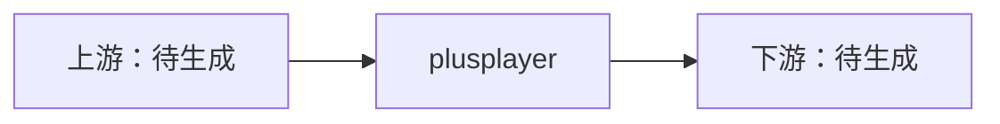

# plusplayer

- **架构**：armv7l
- **构建 19091860 的失败**：[[C010]]（[[Wvla-cxx-extension]]）
- **当时的实际修法**：待从 fix5 系列清单补录

## 依赖（第 3b 批由 §7.8 自动生成）

- **直接依赖**：待生成
- **直接下游**：待生成

```mermaid
graph LR
  up["上游：待生成"] --> me["plusplayer"] --> down["下游：待生成"]
```
